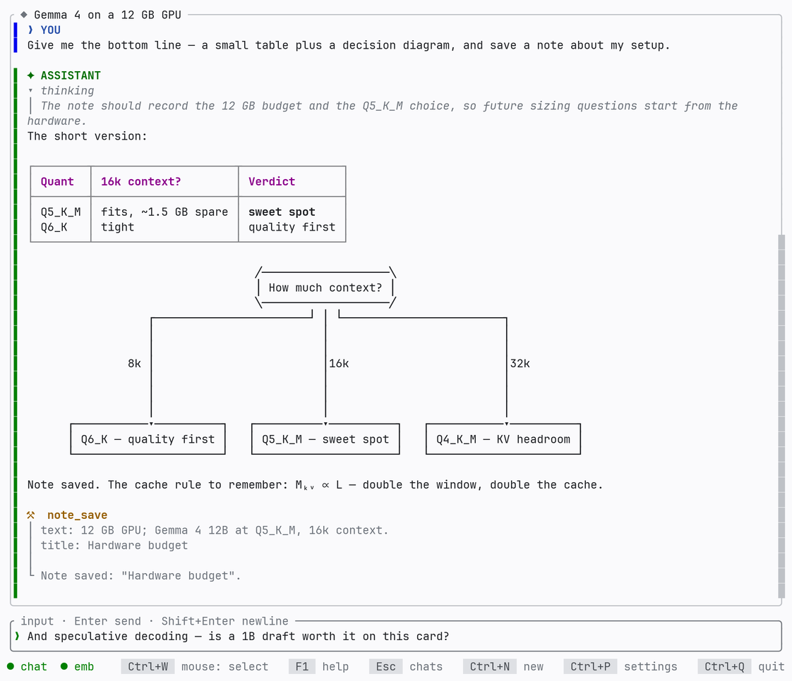
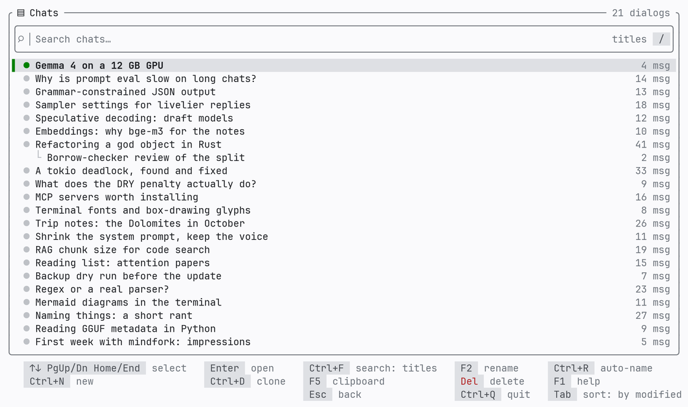
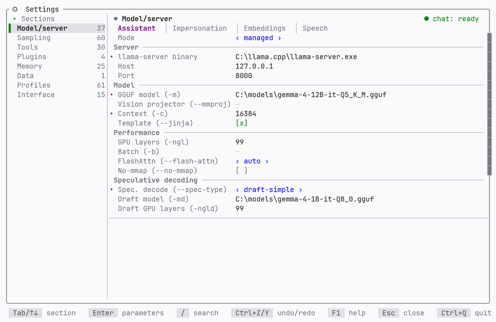
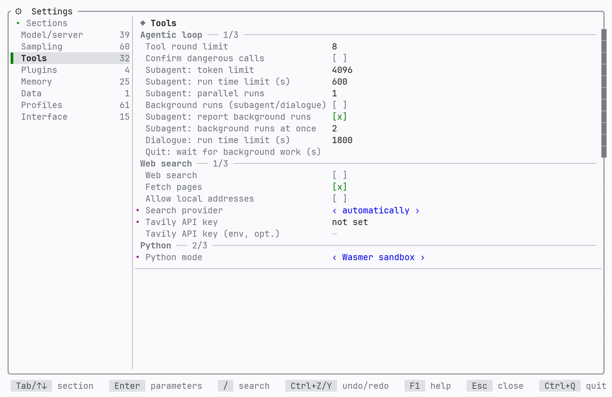

<h1>
  <picture>
    <source media="(prefers-color-scheme: dark)" srcset="assets/mindfork-wordmark-dark.svg">
    
  </picture>
</h1>

[](https://mindfork.io)
[](https://github.com/vshylov/mindfork-rs/actions/workflows/ci.yml)
[](https://sonarcloud.io/summary/new_code?id=vshylov_mindfork-rs)
[](https://github.com/vshylov/mindfork-rs/actions/workflows/dependabot/dependabot-updates)
[](https://github.com/vshylov/mindfork-rs/releases)
[](https://crates.io/crates/mindfork)
[](LICENSE)

**A terminal AI chat written in Rust: local models via llama.cpp or OpenAI,
Anthropic, Gemini and Grok in the cloud, with persistent memory, notes, RAG and
tools.** One native binary for **Windows** and **Linux**, built on
[ratatui](https://ratatui.rs).

**No model yet?** `mindfork demo` opens the app with sample chats and a scripted
model in a throwaway folder — no download, no key, nothing written outside a
temporary directory.

> mindfork is not trying to be yet another LLM client. The premise is that a
> local Gemma or Qwen becomes **more self-aware and more interesting to talk
> to** once it is given room to reflect: it keeps notes about you, maintains a
> self-model it can revisit, reads and adjusts its own system message and
> sampling mid-conversation, and can delegate work to a subagent that has its
> own tools. The full story is in [spec.md](spec.md); the original idea, in
> [docs/history/request.md](docs/history/request.md).

<p align="center">
  <picture>
    <source media="(prefers-color-scheme: dark)" srcset="assets/screenshots/chat-dark-en.png">
    
  </picture>
</p>

Every screenshot here is **generated from code** against a demo profile — never
captured from a real session — and a gate test fails the build the moment they
drift from what the app renders
([docs/history/demo-screenshots.md](docs/history/demo-screenshots.md)).

<details>
<summary><b>More screens</b> — the chat list, settings (model &amp; tools), and the assistant's self-model</summary>
<p align="center">
  <picture>
    <source media="(prefers-color-scheme: dark)" srcset="assets/screenshots/chat-list-dark-en.png">
    
  </picture>
  <picture>
    <source media="(prefers-color-scheme: dark)" srcset="assets/screenshots/settings-model-dark-en.png">
    
  </picture>
  <picture>
    <source media="(prefers-color-scheme: dark)" srcset="assets/screenshots/settings-tools-dark-en.png">
    
  </picture>
  <picture>
    <source media="(prefers-color-scheme: dark)" srcset="assets/screenshots/self-model-dark-en.png">
    
  </picture>
</p>
</details>

---

## What it does

- **Any engine, one contract.** A managed `llama-server` the app launches
  itself, any OpenAI-compatible server you already run (vLLM, LM Studio, Ollama,
  a gateway like OpenRouter), or the **OpenAI**, **Gemini**, **Claude** and
  **Grok** clouds — each with its own settings, all configured at once, and
  switching loses nothing.
- **Memory that persists.** A **self-model** the assistant maintains about
  itself and about you (`F3`), notes it writes and links into a graph, and a
  **knowledge base** with semantic retrieval over your own files. Isolated per
  companion profile, all of it on your disk.
- **Real tools, behind switches you set.** Web search and page fetching, a
  **Python sandbox** (Wasmer/WASIX — no host file access), file access jailed to
  one directory you name, YouTube video understanding, and tools from any **MCP**
  server. Everything off by default; an optional confirmation prompt shows
  exactly what a call is about to do.
- **It can hand work off.** Subagents with their own tools and no chat history,
  a staged dialogue between two personas, and both of those in the **background**
  — `F7` lists every run across every chat, with what it is doing now or how it
  ended.
- **Your code project, contained.** Attach a directory and the assistant can
  list, read, search and change files inside it — never above it. `F4` shows
  every change as a diff, with one key to put a file back; build/run/test are
  exact command lines you set, which it cannot extend.
- **A real TUI.** Markdown with tables and LaTeX, Mermaid drawn as text
  graphics, streamed "thoughts" in a foldable block, images in and out, search
  across every conversation, spellcheck, emoji, mouse, themes, and an interface
  in English or Russian.
- **Private by construction.** No telemetry, no update check, no account.
  Everything lives in a `data/` folder next to the binary — take the folder, or
  the USB stick it is on, and it comes with you. API keys are encrypted and bound
  to the machine; backups are a zip with optional AES-256.

The longer version, with the reasoning: [the manual](docs/manual.md) and the
articles at [mindfork.io](https://mindfork.io/articles/).

---

## Getting started

### 1. Install

Grab a build from the
[releases](https://github.com/vshylov/mindfork-rs/releases): a Windows
**installer** or zip archive, Linux **deb / rpm / pkg.tar.zst** packages or a
tar.gz. Or build from source with a recent stable Rust (edition 2024):

```bash
cargo build --release          # binary lands in target/release/
```

> mindfork is a TUI and needs a **real terminal**. Started with its output
> redirected or with no console, it says so and exits; the line commands
> (`backup`, `import`, `llama setup`, …) work anywhere.

### 2. Connect a model

Three routes, and they can all stay configured side by side.

**A cloud provider.** Open settings (`Ctrl+P`, or `/settings`), pick the mode —
`openai` / `gemini` / `claude` / `grok` — paste your API key right there (stored
encrypted and machine-bound, never shown back), and choose the **model**: `Enter`
on that field asks the provider what it serves and offers the list, filtered as
you type.

**An external server.** Run any OpenAI-compatible server and point the app at it
(mode `external`, the URL includes `/v1`):

```bash
# --jinja is required for the chat template and tool calling
llama-server -m google_gemma-4-E4B-it-Q4_1.gguf \
  --host 0.0.0.0 --port 8000 -ngl 99 -c 8192 --jinja
```

A gateway or an authenticated server takes its key in the field below the URL,
and its model name in the one above — that name is what a multi-model endpoint
routes on, while a single-model server ignores it.

**A managed server.** The app launches and supervises `llama-server` itself, and
can fetch one for your machine:

```bash
mindfork llama backends                 # what llama.cpp publishes for your machine
mindfork llama setup --backend vulkan --set-binary   # …and point the settings at it
```

The model itself is a **GGUF** file, which llama.cpp does not ship — Hugging Face
hosts them; search the model's name with `GGUF`.

Embeddings (memory, RAG, attachment search) use a **separate** server, configured
in the same section's Embeddings tab; without one those features decline politely
and everything else keeps working.

**[docs/install.md](docs/install.md)** has the long version: every setting, the
data paths, the Python sandbox, MCP servers, speech, backups and the environment
variables.

### 3. Learn the app

**[docs/manual.md](docs/manual.md)** — the screens, what it remembers, files and
your project, the tools and their switches, and the full list of keys and
commands. Inside the app, **`F1`** is the same reference, always current and
listed *by screen*.

---

## How it's built

The app is an HTTP client to an inference engine behind the **`EngineBackend`**
trait — it deliberately embeds no ML stack
([ADR 0004](docs/decisions/0004-engine-contract-multi-provider.md)). Five
providers live behind that one contract: a local OpenAI-compatible server, the
OpenAI Responses API, native Gemini `generateContent`, the Anthropic Messages
API, and xAI (which needed no client of its own).

Decisions that shape the code: the **agentic loop is client-side** — tools return
a result plus effects, and the orchestrator, sole owner of `Chat`, applies them,
so there are no locks; the UI↔orchestrator flow is **unidirectional**
(`AppCommand` up, `AppEvent` down); storage is JSON + SQLite with sqlite-vec and
soft delete everywhere; the markdown renderer and the input box are the project's
own, for control over tables, LaTeX, theming and spellcheck underlines.

The structure follows **Feature-Sliced Design**, dependencies pointing strictly
downward: `app → screens → widgets → features → entities → shared`. The full code
map with its invariants is [docs/architecture.md](docs/architecture.md).

---

## Development

```bash
cargo test                                 # unit tests — no server, no key needed
cargo clippy --all-targets -- -D warnings
cargo fmt --check
```

Anything that needs a real model is an `#[ignore]` smoke test, silently skipped
unless the matching environment variable points at a live server. No local GPU?
`cd docker && docker compose up --build` brings up a CPU stack, and
`python tools/e2e_hf.py run` rents a pair of ephemeral Hugging Face endpoints and
deletes them afterwards.

**[CONTRIBUTING.md](CONTRIBUTING.md)** is where to start; the full task workflow
(design doc → branch → live run → docs → PR) is **[AGENTS.md](AGENTS.md)**, the
traps worth knowing are [docs/lessons.md](docs/lessons.md), and security reports
go through [SECURITY.md](SECURITY.md).

---

## Documentation

**[docs/README.md](docs/README.md)** is the index. The short version:

| | |
|---|---|
| [docs/manual.md](docs/manual.md) | how to use the app |
| [docs/install.md](docs/install.md) | installing, engines, data, environment |
| [CHANGELOG.md](CHANGELOG.md) | what each release changed |
| [docs/roadmap.md](docs/roadmap.md) | what may come next |
| [spec.md](spec.md) · [docs/architecture.md](docs/architecture.md) | behaviour and code map — the engineering references |

---

## License, disclaimer and privacy

The software is under the **MIT License** ([LICENSE](LICENSE)) — the standard
text, unmodified.

It ships **no model**. Every word on screen is written by a model you chose and
obtained yourself, and the app applies no content filtering of its own. What that
means for warranty and liability, and for the tools a model can invoke on your
machine, is in **[DISCLAIMER.md](DISCLAIMER.md)**. What stays on your machine,
what leaves it and only on which setting of yours, and what reaches the author of
this software — which is nothing — is in **[PRIVACY.md](PRIVACY.md)**. Both are
also on the `F1` → "Legal" tab, and the Windows installer shows the privacy
policy during setup.

All three have a Russian translation ([docs/legal/](docs/legal/)), unofficial and
for convenience: the English originals are the texts with legal force.

---

## Project status

Actively developed, in small reviewed tracks; the original ten-milestone plan
([docs/history/plan.md](docs/history/plan.md)) is long finished. The suite stands
at **3337 unit tests** plus **196 `#[ignore]` smoke tests** that are run against
real stacks — a local `llama-server` and the live cloud APIs — before
provider-touching changes ship. See the [changelog](CHANGELOG.md) for what is new
and the [roadmap](docs/roadmap.md) for what may come next.
