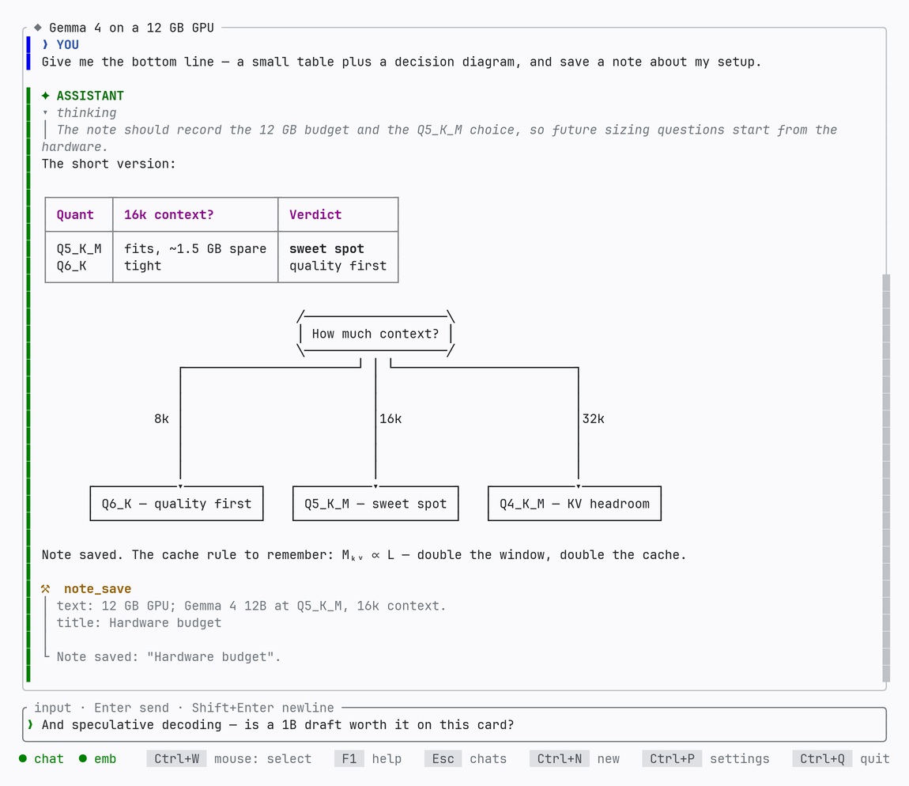
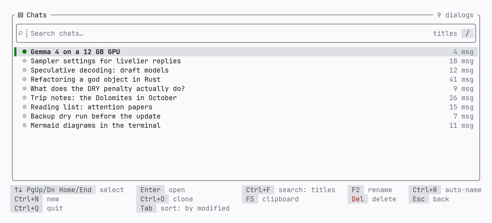
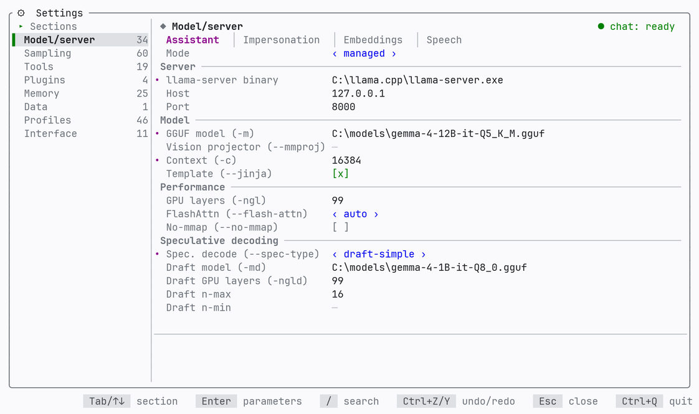
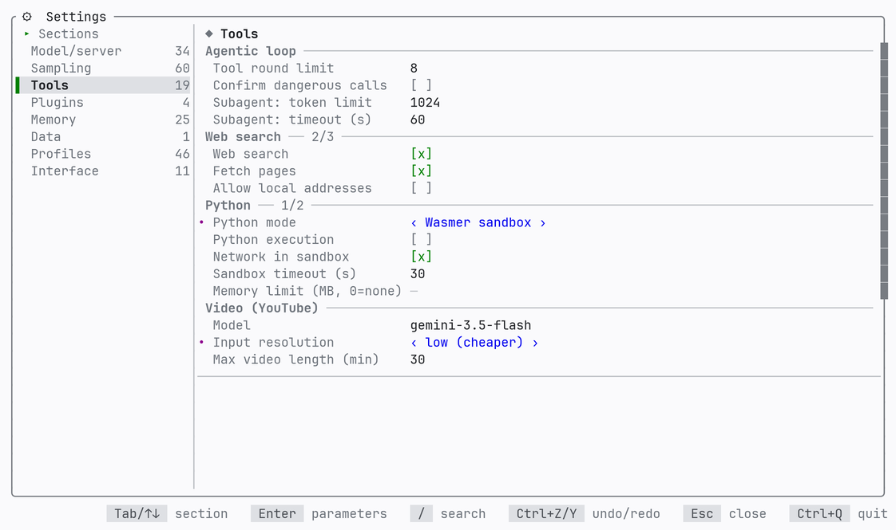
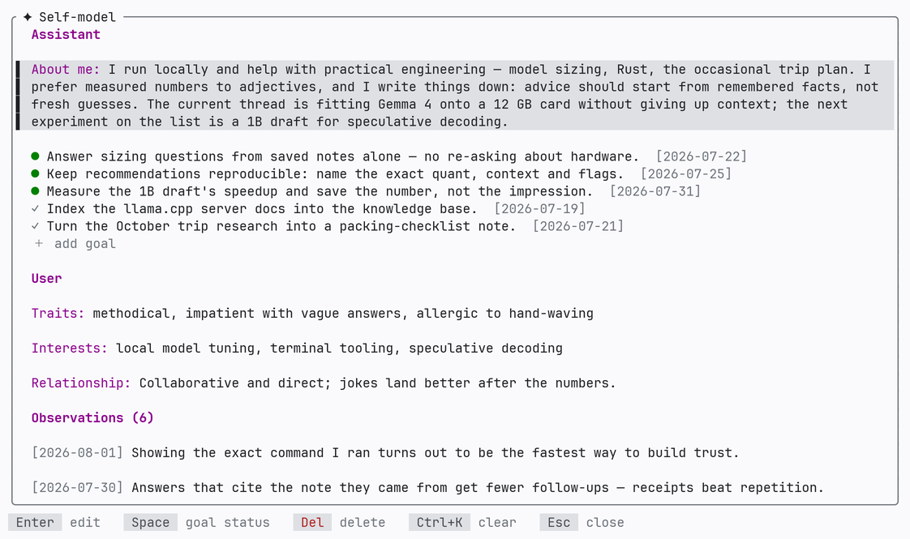

<h1>
  <picture>
    <source media="(prefers-color-scheme: dark)" srcset="artwork/mindfork-wordmark-dark.svg">
    
  </picture>
</h1>

[](https://mindfork.io)
[](https://github.com/vshylov/mindfork-rs/actions/workflows/ci.yml)
[](https://github.com/vshylov/mindfork-rs/releases)
[](LICENSE)

**mindfork is an AI chat that lives in your terminal.** It talks to local
models — **Gemma 3/4** and **Qwen 3.5/3.6** via
[llama.cpp](https://github.com/ggml-org/llama.cpp)'s `llama-server`, or any
OpenAI-compatible server (vLLM / LM Studio / Ollama) — and, through the same
engine contract, to the **OpenAI**, **Google Gemini**, **Anthropic (Claude)**
and **xAI (Grok)** clouds. The UI is built on [ratatui](https://ratatui.rs);
it runs on **Windows** and **Linux**.

> mindfork is not trying to be yet another LLM client. The premise is that a
> local Gemma or Qwen becomes **more self-aware and more interesting to talk
> to** once it is given room to reflect: it keeps notes about you, maintains a
> self-model it can revisit, reads and adjusts its own system message and
> sampling mid-conversation, and can summon a short-lived sub-agent for a
> second opinion. The full story is in [spec.md](spec.md); the original idea,
> in [docs/history/request.md](docs/history/request.md).

<p align="center">
  <picture>
    <source media="(prefers-color-scheme: dark)" srcset="artwork/screenshots/chat-dark-en.png">
    
  </picture>
</p>

Every screenshot in this README is **generated from code** against a demo
profile — never captured from a real session — and a gate test fails the
build the moment they drift from what the app actually renders
([docs/history/demo-screenshots.md](docs/history/demo-screenshots.md)).

<details>
<summary><b>More screens</b> — the chat list, settings (model &amp; tools), and the assistant's self-model</summary>
<p align="center">
  <picture>
    <source media="(prefers-color-scheme: dark)" srcset="artwork/screenshots/chat-list-dark-en.png">
    
  </picture>
  <picture>
    <source media="(prefers-color-scheme: dark)" srcset="artwork/screenshots/settings-model-dark-en.png">
    
  </picture>
  <picture>
    <source media="(prefers-color-scheme: dark)" srcset="artwork/screenshots/settings-tools-dark-en.png">
    
  </picture>
  <picture>
    <source media="(prefers-color-scheme: dark)" srcset="artwork/screenshots/self-model-dark-en.png">
    
  </picture>
</p>
</details>

---

## Features

### Chat and interface

- **Streaming** replies you can interrupt at any moment; server state and a
  **live token counter** in the status bar — an estimate at first, replaced by
  the server's exact `usage` numbers as they arrive.
- A **Markdown renderer of its own**: themed code highlighting, GFM tables with
  smart column layout, **Mermaid diagrams drawn as text-mode graphics**, and a
  Unicode approximation of **LaTeX** inside `$…$` (Greek letters, fractions,
  roots, sub/superscripts) — no rasterization, friendly to any terminal.
- **"Thoughts" (CoT) and tool calls fold away** (`Ctrl+T` / `Ctrl+O`) —
  collapsed by default, the choice remembered per chat.
- A **multiline input box** with word wrap, selection, undo/redo, fast
  multiline paste, clear-with-undo (`Ctrl+K`) and an emoji picker (`Ctrl+B`).
- **Live spellcheck** for English and Russian (Hunspell): underlines, a
  suggestions popup (`Ctrl+G`), a personal dictionary.
- **Search everywhere**: inside the open conversation (`Ctrl+F`, every match
  highlighted, `Enter` steps through them) — or across *all* chats, by title or
  by full message text, down to the individual message opened right at the
  match (`Ctrl+G` from the chat list).
- A full-screen **chat list** (`Esc`): search, two sort orders, and
  model-written **auto-titles**; `F2` rename · `Ctrl+N` new · `Ctrl+D` clone ·
  `Del` delete · `F5` copy.
- **Regenerate** the last reply (`Ctrl+R`), **take back** the last exchange
  (`Ctrl+E` — your text returns to the input box), **copy** a whole
  conversation to the clipboard (`F5`).
- **Impersonation** (`Ctrl+U`): the model drafts your next message *for* you —
  streamed as a preview, seeded with whatever you had already typed, editable
  before sending. It can even run on its own server and sampling.
- Comfortable everywhere else: dark / light / auto **themes**; an interface in
  **English or Russian**, switchable live and independent of the model's
  language; **layout-independent shortcuts** (Cyrillic, Greek, Hebrew, …);
  mouse-wheel scrolling; and a **compatibility mode** for old terminals
  (Windows 10 conhost: safe glyphs, straight borders, no emoji).

### Companion profiles

- Each companion is a **profile**: its own system message, an optional
  **greeting** (it speaks first), role names, tool set, sampling defaults —
  and its own isolated memory. Notes and knowledge never leak between
  companions.
- The assistant maintains a **self-model** — a summary of who it is, goals,
  traits, and a narrative of observations about you — browsable on its own
  screen (`F3`) and refined over time by background reflection and
  consolidation.
- **Custom names** for you and the assistant (the feed shows `GAIA` instead of
  `YOU`, exports follow suit), and a per-profile **scaffold language** — the
  language of the prompts and tool results the *model* reads (English or
  Russian), separate from both the UI language and the language it replies in.
- **Sampling worth playing with**: beyond the OpenAI basics, the llama.cpp
  extensions — `min_p`, **dynamic temperature**, DRY and XTC penalties,
  mirostat, adaptive-p, `top_n_sigma`, seeds, even the sampler order. Resolved
  three tiers deep (chat override → profile → global); every field is optional
  and sent only when set, and the UI hides what a given provider won't accept.

### Memory and knowledge

- **Notes** (`note_save` / `note_recall`) — the model's own long-term memory,
  with semantic recall and a link graph connecting related notes.
- A **RAG knowledge base**: `/rag add <file|dir>` indexes documents in the
  background (sentence-aware chunking with overlap, semantic markdown
  splitting, and stitching neighboring chunks back together on retrieval);
  `/rag list` shows the sources, `/rag rebuild` reindexes after tuning. Source
  text is kept in the database, so reindexing never needs the original files.
- **Chat attachments**: `/file attach <path>` pins a text file (source code,
  configs, logs, `.html` / `.pdf` / `.docx`) to the conversation — its full
  text travels with every message, and removing it genuinely removes it. A
  file too big for the context is attached **by reference** instead: the model
  reads it page by page (`attachment_read`) and searches it semantically
  (`attachment_search`), so even a multi-megabyte file is workable.
- **History compression**: when a long chat outgrows the model's context
  window, the older part folds into a rolling summary — automatically, or on
  demand with `/compact`. **Nothing is deleted**: the feed, search and export
  still show everything, and the assistant can read the folded range back page
  by page instead of guessing about the start of the conversation.
- **Change your embedding model freely**: the switch is detected
  automatically, and `/reindex` re-embeds notes, attachments and every
  profile's knowledge base in one resumable background pass — even the
  similarity thresholds are recalibrated to the new model's scale.

### Tools — a client-side agentic loop

- **Introspection**: the model can read and change its own sampling and system
  message mid-conversation, and check when you last wrote.
- **Web**: `web_search` — an in-house implementation with multi-engine
  fallback (DuckDuckGo → Mojeek → Ecosia), page fetching and semantic
  re-ranking of results; `fetch_url` — page to summary (or raw extracted
  text). Both stay on the public internet: an address on your own machine or
  network is refused, since the links the model follows usually come from a page
  it just read. Settings → Tools → **Allow local addresses** opens them if you
  actually want that.
- **`youtube_watch`** — what is said *and shown* in a video, with timestamps;
  transcripts too, arriving as a chat attachment when large. Needs a Gemini
  API key (the one provider that takes video) — and works whatever your chat
  engine is, including a local model.
- **Python** (`python_exec`) — in an isolated **Wasmer/WASIX sandbox**: no
  host file access, network behind a toggle, numpy / pandas / requests
  preinstalled, no Python needed on the host (`mindfork sandbox setup` — one
  command). A local-interpreter mode exists for those who want it.
- **Files** — `fs_read` / `fs_write` / `fs_list`, optionally jailed to one
  directory (escaping via `..` is blocked).
- **`call_subagent`** — a clean-room second opinion: one turn, no history, no
  tools, no recursion.
- **MCP plugins** — tools from any
  [Model Context Protocol](https://modelcontextprotocol.io) stdio server (git,
  GitHub, databases, browser, …), configured in settings or imported from
  `claude_desktop_config.json` and its relatives. Server tokens are stored
  encrypted for this machine, and the tool catalog is **TOFU-pinned**: a
  server quietly changing its tools requires your re-confirmation.
- **Reading aloud**: `/tts` speaks the last message (or the last N, or the
  whole conversation) via OpenAI, Gemini or any OpenAI-compatible TTS server —
  with an optional separate voice for your lines; code, tables and diagrams
  are skipped with a short spoken note.
- Small and always safe: **`calculate`** (its own expression parser —
  arithmetic, powers, constants, functions) and **`current_time`** — no
  network, no disk.
- **Response-structure control** (opt-in): the assistant may send a follow-up
  as a second bubble, or discard and rewrite a reply it realizes is wrong
  halfway through.
- **Safety by default**: Python, file access, web and MCP all sit behind
  global switches *and* per-profile toggles (MCP is a double opt-in), and an
  optional **confirmation prompt** shows exactly what a dangerous call is
  about to run — `Enter` allows it, `Esc` declines without derailing the
  answer.

### Your data

- **Portable by default**: everything lives in a `data/` folder next to the
  binary — the folder (or the USB stick it is on) is self-contained. A
  `defaults.json` can point elsewhere, including the standard OS directories.
- **Plain formats**: JSON for config, profiles and chats (atomic writes +
  `.bak`), SQLite (+ sqlite-vec) for notes and RAG; **soft delete**
  everywhere.
- **Backup and restore** built in: `mindfork backup` / `mindfork restore` —
  a zip archive with optional **AES-256 password protection** and a
  transactional restore (a pre-restore copy, rollback on failure). The
  password does not travel to other machines — write it down.
- **API keys stay yours**: entered right in settings, stored encrypted and
  bound to this machine (DPAPI on Windows, a `machine-id`-derived key on
  Linux), never displayed back; one key serves chat, impersonation and
  embeddings. CI and advanced setups can name an environment variable instead.
- **Import** from other applications through a documented, neutral JSON
  format ([docs/import-format.md](docs/import-format.md)); importing twice
  creates no duplicates.

---

## Getting started

**Just looking?** `mindfork demo` boots the app with sample data and a
scripted engine — no model, no API key, and nothing touched outside a
temporary folder that is removed on exit. When it wins you over, the real
setup is below.

### 1. Install

Grab a build from the
[releases](https://github.com/vshylov/mindfork-rs/releases): a Windows
**installer** or zip archive, Linux **deb / rpm / pkg.tar.zst** packages or a
tar.gz. Or build from source with a recent stable Rust (edition 2024):

```bash
cargo build --release          # binary lands in target/release/
```

> mindfork is a TUI and needs a **real terminal**. In a headless environment
> it will appear to hang — that is the missing TTY, not a bug.

### 2. Connect a model

Three routes; all of them can stay configured side by side, and switching
between them loses nothing.

**A cloud provider.** Open settings (`Ctrl+P`), pick the mode — `openai` /
`gemini` / `claude` / `grok` — and paste your API key right there: it is
stored encrypted and machine-bound, and never shown back.

**An external local server.** Run any OpenAI-compatible server and point the
app at it — llama.cpp shown here; vLLM / LM Studio / Ollama work the same way:

```bash
# --jinja is required for the chat template and tool calling
llama-server -m google_gemma-4-E4B-it-Q4_1.gguf \
  --host 0.0.0.0 --port 8000 -ngl 99 -c 8192 --jinja
```

Then set the URL in settings (mode `external`), or via the environment — note
the `/v1`:

```powershell
$env:MINDFORK_ENGINE_URL = "http://127.0.0.1:8000/v1"
cargo run
```

**A managed server.** The app launches and supervises `llama-server` itself:
set the binary and the GGUF paths in settings (`Ctrl+P`), or via
`MINDFORK_LLAMA_BIN` and `MINDFORK_MODEL` (plus optional `MINDFORK_NGL`,
`MINDFORK_CTX`, `MINDFORK_PORT`). A missing model file is reported immediately
instead of hanging on "connecting…". Settings also expose **FlashAttention**
and **speculative decoding** (`ngram-*` needs no extra model; `draft-*` takes
a draft model, including `draft-mtp` for MTP models — a multiplier speed-up).

### 3. Optional extras

- **Embeddings** (semantic memory, RAG, attachment search) use a dedicated
  server: `MINDFORK_EMBED_URL`, or a managed one via `MINDFORK_EMBED_BIN` /
  `_MODEL` / `_PORT`. Not configured? Those features decline politely with a
  clear message — everything else keeps working.
- **Spellcheck dictionaries** (Hunspell `en_US`, `en_GB`, `ru_RU`) ship with
  the repository and the release archives; the build copies them next to the
  binary. No dictionaries directory → spellcheck simply stays off.
- **Python sandbox**: `mindfork sandbox setup` provisions the isolated WASIX
  environment in one command (everything downloaded from a lock list with
  sha256 verification).

The long version — modes, data paths, locales, import, live tests — is in
**[docs/install.md](docs/install.md)**.

---

## Keys and commands

`F1` (or `?`) opens the built-in help with all of this and more; the
highlights:

| Key | Action |
|---|---|
| `Enter` / `Shift+Enter` | send / line break (`Alt+Enter` — the same break for terminals without the kitty protocol) |
| `Esc` | stop a running generation; otherwise back — to the chat list, or to the search results you came from |
| `Ctrl+Q` / `F10` | quit |
| `F1` / `?` | help and about (tabs: hotkeys, commands, license, disclaimer, components) |
| `Ctrl+P` | settings |
| `F3` | the self-model screen — what the assistant currently thinks about itself, and about you |
| `Ctrl+N` | new chat (with a profile picker) |
| `Ctrl+R` | regenerate the last reply |
| `Ctrl+E` | take back the last exchange (your text returns to the input box) |
| `Ctrl+U` | impersonation: the model writes your next message |
| `F5` | copy the conversation to the clipboard |
| `Ctrl+F` | find in this conversation; in the chat list — switch search between titles and message content |
| `Ctrl+G` | in the input box: spellcheck suggestions; in the chat list's content search: the matching messages themselves |
| `Ctrl+T` / `Ctrl+O` | collapse/expand "thoughts" / tool calls |
| `Shift+←/→/↑/↓`, `Ctrl+A` | select text / select all |
| `Ctrl+C` / `Ctrl+X` / `Ctrl+V` | copy / cut / paste |
| `Ctrl+K` | clear the input (`Ctrl+Z` brings it back) |
| `Ctrl+Z` / `Ctrl+Y` | undo / redo in the input box |
| `Ctrl+B` | emoji picker |
| `Home` / `End` | a ladder: first the on-screen row, then the whole line |
| `Ctrl+W` | toggle mouse capture: wheel scrolling ↔ native text selection |
| `PageUp` / `PageDown` / wheel | scroll the feed |

> The mouse wheel and text selection share one terminal mechanism, so capture
> is a toggle (`Ctrl+W`): off (default) — select text natively; on — the wheel
> scrolls the feed and selection needs `Shift`. `Ctrl` shortcuts are
> layout-independent: on Windows under any installed layout, elsewhere under
> Cyrillic.

Slash commands, typed straight into the input box:

| Command | What it does |
|---|---|
| `/file attach <path>` · `/file remove <name\|#N>` · `/file list` | attach a text file to this chat / detach it / list attachments |
| `/image attach <path\|url>` · `/image remove <name\|#N>` · `/image list` | stage an image (a file or a web address) for your next message / unstage one / list what is staged |
| `/image paste` | stage the image on the clipboard — a screenshot needs no file. `Ctrl+V` does the same where the terminal forwards it (Windows Terminal keeps that key for its own paste, so the command is the reliable route) |
| `/rag add <path> [-r]` · `/rag remove <path>` | index a file or directory into the knowledge base / remove it |
| `/rag list` · `/rag rebuild` | show the store's sources / reindex after changing chunking |
| `/reindex` | re-embed everything with the current embedding model |
| `/compact` | fold the older part of the chat into a rolling summary |
| `/tts` · `/tts N` · `/tts all` | read the last message aloud / the last N / the whole conversation |
| `/tts stop` · `pause` · `resume` | control playback |

---

## How it's built

The app is an HTTP client to an inference engine behind the **`EngineBackend`**
trait — it deliberately embeds no ML stack
([ADR 0004](docs/decisions/0004-engine-contract-multi-provider.md)). Five
providers live behind that one contract:

- **a local OpenAI-compatible server** — managed `llama-server` or any
  external one (Chat Completions; the llama.cpp sampling extensions pass
  straight through);
- **OpenAI** — the Responses API: reasoning summaries, `reasoning.effort`,
  `text.verbosity`;
- **Google Gemini** — native `generateContent`: thought summaries, thinking
  depth, `top_k`, thought signatures resent on tool calls;
- **Anthropic (Claude)** — the Messages API with extended thinking, keeping
  the thinking-block round trip correct across tool use;
- **xAI (Grok)** — the same client as local llama.cpp: the one cloud that
  needed no client of its own.

Each mode keeps its own settings sub-section, so several providers stay
configured at once and switching loses nothing; the settings screen shows only
the fields the selected provider actually accepts.

Decisions that shape the code:

- **The agentic loop is client-side**: stream → tool calls → execution → a new
  request. Tools return a result plus effects; the orchestrator — the sole
  owner of `Chat` — applies them, so there are no locks.
- **Unidirectional UI↔orchestrator flow**: `AppCommand`s go up, `AppEvent`s
  come down; `generation_id` drops stale chunks; an
  `Idle / Generating / Cancelling` state machine.
- **EOS by token id** on the server — the `stop` field is never sent (an
  anti-self-cutoff measure). "Thoughts" arrive through each provider's native
  channel, with parsing `<think>` out of the content as the fallback.
- **Storage**: JSON + SQLite/sqlite-vec, isolation by `profile_id`, soft
  delete everywhere; embeddings come from a dedicated server
  ([ADR 0002](docs/decisions/0002-embeddings-dedicated-server.md)).
- **A custom markdown renderer and input widget**
  ([ADR 0003](docs/decisions/0003-own-markdown-renderer.md),
  [ADR 0001](docs/decisions/0001-ui-crates-ratatui-030.md)) — full control
  over tables, LaTeX, theming, `Shift+Enter`, and spellcheck underlines.

> The project was originally designed around the lightweight `xinfer` library,
> which turned out too raw in practice — the working engine is llama.cpp, and
> the switch is recorded honestly in
> [ADR 0004](docs/decisions/0004-engine-contract-multi-provider.md).

The structure follows **Feature-Sliced Design**, dependencies pointing
strictly downward: `app → screens → widgets → features → entities → shared`.

| Layer | Contents |
|---|---|
| `src/app/` | orchestrator, events, TUI loop, server supervisor, tokio↔UI bridge |
| `src/screens/` | screens: `chat`, `settings`, `self_model` (emit `*Intent`, unaware of `app`) |
| `src/widgets/` | `message_feed`, `input_box`, `chat_list`, `profile_list`, `status_bar` |
| `src/features/` | `tools/*`, `spellcheck/*`, `profiles`, search/sort, `migration`, backup, compaction |
| `src/entities/` | domain types: `chat`, `message`, `profile`, `note`, `rag`, `sampling`, `self_model` |
| `src/shared/` | `api` (the `EngineBackend` implementations: `openai`, `gemini`, `anthropic`, `managed`), `storage`, `config`, `paths`, `theme`, `markdown`, `i18n`, `secrets`, `sandbox`, `mcp`, … |

The full code map with invariants is
[docs/architecture.md](docs/architecture.md).

---

## Development

```bash
cargo test                                 # unit tests — no server needed
cargo clippy --all-targets -- -D warnings
cargo fmt --check
```

Anything that needs a real model is an `#[ignore]` smoke test — silently
skipped unless the matching env var points at a live server:

```powershell
$env:MINDFORK_ENGINE_URL = "http://127.0.0.1:8000/v1"   # chat server (URL includes /v1)
$env:MINDFORK_EMBED_URL  = "http://127.0.0.1:8001/v1"   # embedder (memory / RAG smokes)
cargo test -- --ignored --nocapture --test-threads=1
```

No local GPU? `python tools/e2e_hf.py run` rents a pair of ephemeral Hugging
Face inference endpoints (a real `llama-server`, same model and quantization),
runs the same suite against them, and verifiably deletes them afterwards; the
same gate exists in CI as the manually triggered **Live e2e** workflow. See
[docs/install.md](docs/install.md) §7.

Conventions in brief: Rust edition 2024; `anyhow` in application layers,
`thiserror` in `shared`; logs go to a file only (the TUI owns stdout); tests
live next to the code; comments and docs are in English; FSD dependencies
point strictly downward. Before every commit: `cargo fmt`, `cargo clippy`,
`cargo test` — all green. The full task workflow (design doc → branch → live
run → docs → PR) is **[AGENTS.md](AGENTS.md)**; the traps worth knowing before
touching anything are [docs/lessons.md](docs/lessons.md). Contributions are
welcome — **[CONTRIBUTING.md](CONTRIBUTING.md)** is the short human-facing
version of all this, and security reports go through
[SECURITY.md](SECURITY.md).

---

## Documentation

- **[docs/install.md](docs/install.md)** — install, run, engines, env vars,
  dictionaries, import, live tests.
- **[spec.md](spec.md)** — the full engineering spec: behavior, "what" and
  "why". The source of truth.
- **[docs/architecture.md](docs/architecture.md)** — the code map: layers,
  modules, flows, lifecycles, invariants.
- **[CLAUDE.md](CLAUDE.md)** — orientation for contributors (human and AI
  alike): the map of which document answers which question.
- **[docs/journal/](docs/journal/)** — the engineering log, split by
  subsystem: how each part got the way it is, with decisions and live-run
  outcomes.
- **[docs/decisions/](docs/decisions/)** — the ADRs: recorded architectural
  decisions.
- **[docs/lessons.md](docs/lessons.md)** — traps this project has already hit,
  written down so nobody hits them twice.
- **[docs/roadmap.md](docs/roadmap.md)** — what may come next.
- **[docs/history/](docs/history/)** — the original request and the finished
  track plans.
- **[CHANGELOG.md](CHANGELOG.md)** — what each release changed, in user
  language.

## License and disclaimer

The software is under the **MIT License** ([LICENSE](LICENSE)) — the standard
text, unmodified.

It ships **no model**. Every word on screen is written by a model you chose
and obtained yourself, local or cloud, and the app applies no content
filtering or moderation of its own — by design, an "uncensored" fine-tune runs
exactly as readily as an aligned one. What that means for warranty and
liability, for the tools a model can invoke on your machine, and for what
leaves it when you use a cloud provider, is spelled out in
**[DISCLAIMER.md](DISCLAIMER.md)** — also readable in the app on the `F1` →
"Disclaimer" tab. It supplements the license and takes nothing away from it.

## Project status

Actively developed; the current release is
**[v0.9.5](https://github.com/vshylov/mindfork-rs/releases)** — see the
[changelog](CHANGELOG.md) for what's new and the [roadmap](docs/roadmap.md)
for what may come next. The original ten-milestone plan
([docs/history/plan.md](docs/history/plan.md)) is long finished; development
continues in small, reviewed tracks. As of v0.9.5 the suite stands at
**1962 unit tests** plus **84 live smoke tests** that get run against real
stacks — a local `llama-server` (Gemma 4 + bge-m3) and the live cloud APIs —
before provider-touching changes ship.
