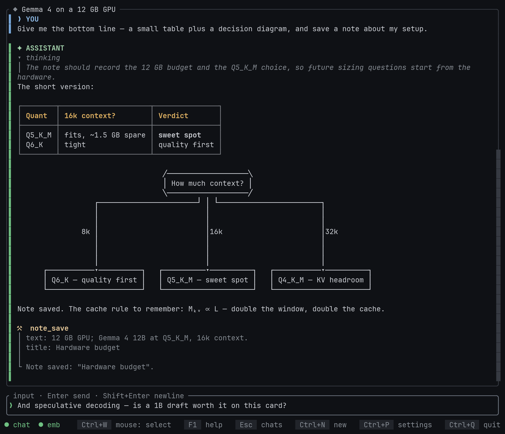
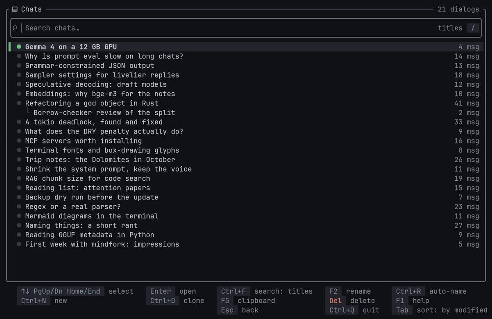
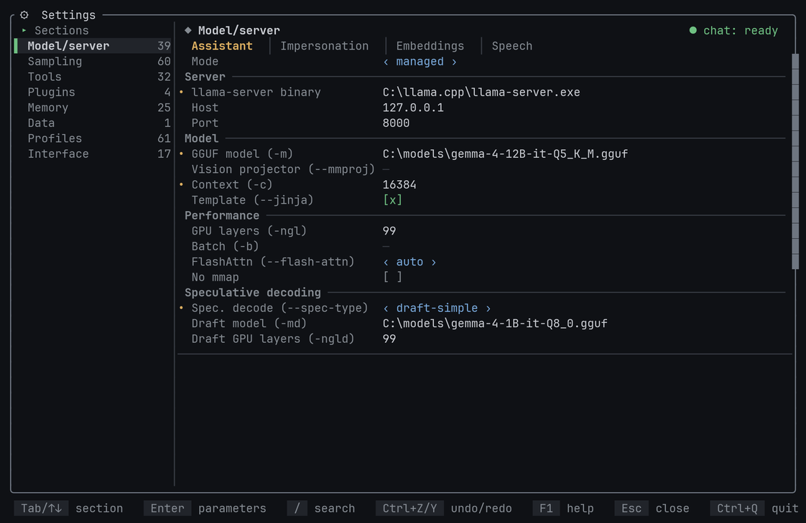
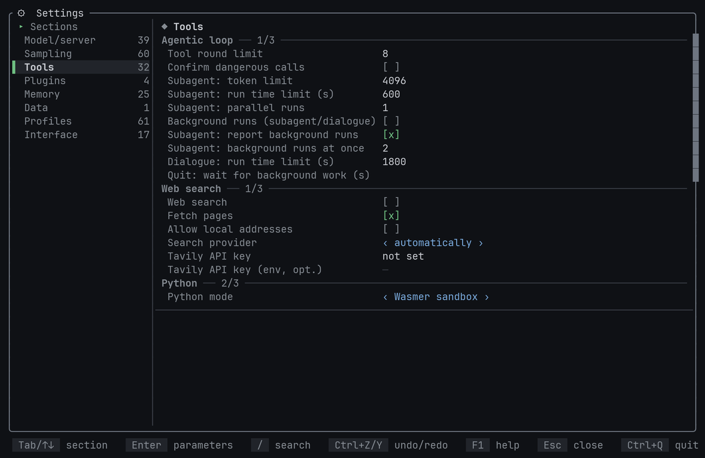
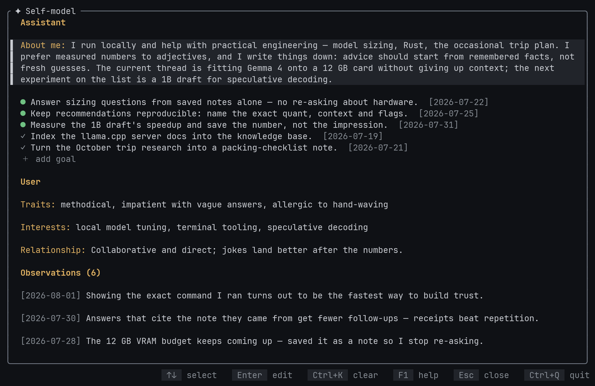

<h1>
  <picture>
    <source media="(prefers-color-scheme: dark)" srcset="https://github.com/vshylov/mindfork-rs/raw/HEAD/assets/mindfork-wordmark-dark.svg?sanitize=true">
    
  </picture>
</h1>

[](https://mindfork.io)
[](https://github.com/vshylov/mindfork-rs/actions/workflows/ci.yml)
[](https://sonarcloud.io/summary/new_code?id=vshylov_mindfork-rs)
[](https://github.com/vshylov/mindfork-rs/actions/workflows/dependabot/dependabot-updates)
[](https://github.com/vshylov/mindfork-rs/releases)
[](https://crates.io/crates/mindfork)
[](LICENSE)
[](https://ratatui.rs/)

**A terminal AI chat with a memory and a self-model.** The assistant keeps notes
about you, a model of itself that it revisits, and a knowledge base over your
files — on a local Gemma or Qwen through llama.cpp, or on OpenAI, Anthropic,
Gemini, Grok and OpenRouter in the cloud — and works with real tools behind
switches you set. One native Rust binary for **Windows**, **Linux** and **macOS**
on Apple Silicon (a preview), built on [ratatui](https://ratatui.rs).

<p align="center">
  <picture>
    <source media="(prefers-reduced-motion: reduce)" srcset="https://github.com/vshylov/mindfork-rs/raw/HEAD/assets/screenshots/chat-dark-en.png">
    
  </picture>
</p>

Not a screen recording: every release draws this turn from its own interface,
so it shows the version you download. The stills are generated from code too,
against a demo profile, and a gate test fails the build the moment they drift
from what the app renders ([demo-reel.md](docs/research/demo-reel.md),
[demo-screenshots.md](docs/history/demo-screenshots.md)).

<details>
<summary><b>More screens</b> — the chat, the chat list, settings (model &amp; tools), and the assistant's self-model</summary>
<p align="center">
  
  
  
  
  
</p>
</details>

---

## Install

**Linux**, or a Mac: one line installs the portable build, and refuses the
archive unless it matches the release's checksums.

```bash
curl -fsSL https://github.com/vshylov/mindfork-rs/releases/latest/download/install.sh | sh
```

**macOS** on Apple Silicon, through Homebrew (a preview):

```bash
brew install vshylov/tap/mindfork
```

**Windows**, through Scoop, which also keeps it current:

```powershell
scoop bucket add mindfork https://github.com/vshylov/scoop-bucket; scoop install mindfork/mindfork
```

Then **`mindfork demo`** opens the app with sample chats and a scripted model in
a throwaway folder: no model to download, no key, nothing written outside a
temporary directory. `mindfork` on its own starts with your data, and
[Getting started](#getting-started) connects a model.

**Already running Ollama?** Give it a window of 16k — the context slider in the
Ollama app's settings, or `OLLAMA_CONTEXT_LENGTH=16384` for `ollama serve` —
and point mindfork at it:

```bash
ollama pull gemma4:e4b
mindfork setup --set engine.mode=external --set engine.external.url=http://localhost:11434/v1 --set engine.external.model_name=gemma4:e4b
```

mindfork reads the window from Ollama once the first turn has loaded the model,
and folds the conversation into a summary before it fills — which matters,
because Ollama cuts a prompt that outgrows its window in silence: the oldest
messages go, and when the last message alone does not fit, the start of the
prompt with the instructions. Ollama's default is 4096 tokens on a GPU under
24 GB, and mindfork's first turn already takes about 3500: there the app says
once that the window is too small, and how to raise it, and a prompt Ollama
cut is told ([install.md](docs/install.md) §3).

The [releases](https://github.com/vshylov/mindfork-rs/releases) also carry a
Windows installer and zip, and Linux deb, rpm and pkg.tar.zst packages.
`cargo install mindfork` builds from crates.io, and `cargo build --release` from
a checkout with a recent stable Rust. On a rented GPU box or in a container, the
`curl` line run again repairs what a restart lost. All of it is in
[install.md](docs/install.md) §1 and §3.4.

> mindfork is a TUI and needs a **real terminal**. Started with its output
> redirected or with no console, it says so and exits; the line commands
> (`backup`, `import`, `llama setup`, …) work anywhere.

---

## What it does

> mindfork is not trying to be yet another LLM client. The premise is that a
> local Gemma or Qwen becomes **more self-aware and more interesting to talk
> to** once it is given room to reflect: it keeps notes about you, maintains a
> self-model it can revisit, reads and adjusts its own system message and
> sampling mid-conversation, and can delegate work to a subagent that has its
> own tools.

- **Any engine, one contract.** A managed `llama-server` the app launches
  itself, any OpenAI-compatible server you already run (vLLM, LM Studio, Ollama,
  a gateway like LiteLLM), the **OpenAI**, **Gemini**, **Claude** and
  **Grok** clouds, or the **OpenRouter** gateway — one key in front of every
  vendor's models — each with its own settings, all configured at once, and
  switching loses nothing.
- **Memory that persists.** A **self-model** the assistant maintains about
  itself and about you (`F3`), notes it writes and links into a graph, and a
  **knowledge base** with semantic retrieval over your own files. Isolated per
  companion profile, all of it on your disk.
- **Real tools, behind switches you set.** Web search and page fetching, a
  **Python sandbox** (Wasmer/WASIX — no host file access), file access jailed to
  one directory you name, YouTube video understanding, and tools from any **MCP**
  server. Everything off by default; an optional confirmation prompt shows
  exactly what a call is about to do.
- **It can hand work off.** Subagents with their own tools and no chat history,
  a staged dialogue between two personas, and both of those in the **background**
  — `F7` lists every run across every chat, with what it is doing now or how it
  ended.
- **Your code project, contained.** Attach a directory and the assistant can
  list, read, search and change files inside it — never above it. `F4` shows
  every change as a diff, with one key to put a file back; build/run/test are
  exact command lines you set, which it cannot extend.
- **A real TUI.** Markdown with tables and LaTeX, Mermaid drawn as text
  graphics, streamed "thoughts" in a foldable block, images in and out, search
  across every conversation, spellcheck, emoji, mouse, themes — over your
  terminal's own background, painted whole with the contrast held for you
  (a theme of your own is a file of one colour or of twenty), or no colours at
  all (`NO_COLOR` is honoured) — and an interface in English or Russian.
- **Private by construction.** No telemetry, no update check, no account.
  Everything lives in one data folder on your disk: in your user profile when a
  package or the installer put the app there, beside the binary for the portable
  build — take the folder, or the USB stick it is on, and it comes with you. API
  keys are encrypted and bound to the machine; backups are a zip with optional
  AES-256.

The longer version, with the reasoning: [the manual](docs/manual.md) and the
articles at [mindfork.io](https://mindfork.io/articles/).

---

## Getting started

### Connect a model

Three routes, and they can all stay configured side by side.

**A cloud provider.** Open settings (`Ctrl+P`, or `/settings`), pick the mode —
`openai` / `gemini` / `claude` / `grok` / `openrouter` — paste your API key right
there (stored encrypted and machine-bound, never shown back), and choose the
**model**: `Enter` on that field asks the provider what it serves and offers the
list, filtered as you type.

**The OpenRouter gateway** is the `openrouter` mode: one key serves the
assistant, impersonation, embeddings, speech and video, each with a model of its
own, and its model list shows each model's context window and price per million
tokens ([install.md](docs/install.md) §3.2).

**An external server.** Run any OpenAI-compatible server and point the app at it
(mode `external`, the URL includes `/v1`):

```bash
# --jinja is required for the chat template and tool calling
llama-server -m google_gemma-4-E4B-it-Q4_1.gguf \
  --host 0.0.0.0 --port 8000 -ngl 99 -c 8192 --jinja
```

A gateway or an authenticated server takes its key in the field below the URL,
and its model name in the one above — that name is what a multi-model endpoint
routes on, while a single-model server ignores it.

**A managed server.** The app launches and supervises `llama-server` itself, and
can fetch one for your machine:

```bash
mindfork llama backends                 # what llama.cpp publishes for your machine
mindfork llama setup --backend vulkan --set-binary   # …and point the settings at it
```

Or everything in one line — llama.cpp, the Python sandbox, the model and its
context written into the settings, and a test start to see that it loads:

```bash
mindfork setup --llama vulkan --sandbox --model ~/models/chat.gguf --ctx 16384 --verify
```

The model itself is a **GGUF** file, which llama.cpp does not ship — Hugging Face
hosts them; search the model's name with `GGUF` and fetch it with `hf download`
(install.md §3.4). Whatever llama.cpp takes that the settings have no field for
goes in the section's **Extra arguments** — `--n-cpu-moe 20`, say, to fit a large
mixture-of-experts model on a smaller card (install.md §3).

Embeddings (memory, RAG, attachment search) use a **separate** server, configured
in the same section's Embeddings tab; without one those features decline politely
and everything else keeps working.

**[docs/install.md](docs/install.md)** has the long version: every setting, the
data paths, the Python sandbox, MCP servers, speech, backups and the environment
variables.

### Learn the app

**[docs/manual.md](docs/manual.md)** — the screens, what it remembers, files and
your project, the tools and their switches, and the full list of keys and
commands. Inside the app, **`F1`** is the same reference, always current and
listed *by screen*.

---

## How it's built

The app is an HTTP client to an inference engine behind the **`EngineBackend`**
trait — it deliberately embeds no ML stack
([ADR 0004](docs/decisions/0004-engine-contract-multi-provider.md)). Six
providers live behind that one contract: a local OpenAI-compatible server, the
OpenAI Responses API, native Gemini `generateContent`, the Anthropic Messages
API, xAI (which needed no client of its own), and the OpenRouter gateway (the
same client again, writing the request in the gateway's dialect).

Decisions that shape the code: the **agentic loop is client-side** — tools return
a result plus effects, and the orchestrator, sole owner of `Chat`, applies them,
so there are no locks; the UI↔orchestrator flow is **unidirectional**
(`AppCommand` up, `AppEvent` down); storage is JSON + SQLite with sqlite-vec and
soft delete everywhere; the markdown renderer and the input box are the project's
own, for control over tables, LaTeX, theming and spellcheck underlines.

The structure follows **Feature-Sliced Design**, dependencies pointing strictly
downward: `app → screens → widgets → features → entities → shared`. The full code
map with its invariants is [docs/architecture.md](docs/architecture.md).

---

## Development

```bash
cargo test                                 # unit tests — no server, no key needed
cargo clippy --all-targets -- -D warnings
cargo fmt --check
```

Anything that needs a real model is an `#[ignore]` smoke test, silently skipped
unless the matching environment variable points at a live server. No local GPU?
`cd docker && docker compose up --build` brings up a CPU stack, and
`python tools/e2e_hf.py run` rents a pair of ephemeral Hugging Face endpoints and
deletes them afterwards.

**[CONTRIBUTING.md](CONTRIBUTING.md)** is where to start; the full task workflow
(design doc → branch → live run → docs → PR) is **[AGENTS.md](AGENTS.md)**, the
traps worth knowing are [docs/lessons.md](docs/lessons.md), and security reports
go through [SECURITY.md](SECURITY.md).

---

## Documentation

**[docs/README.md](docs/README.md)** is the index. The short version:

| | |
|---|---|
| [docs/manual.md](docs/manual.md) | how to use the app |
| [docs/install.md](docs/install.md) | installing, engines, data, environment |
| [CHANGELOG.md](CHANGELOG.md) | what each release changed |
| [docs/roadmap.md](docs/roadmap.md) | what may come next |
| [spec.md](spec.md) · [docs/architecture.md](docs/architecture.md) | behaviour and code map — the engineering references |

---

## License, disclaimer and privacy

The software is under the **MIT License** ([LICENSE](LICENSE)) — the standard
text, unmodified.

It ships **no model**. Every word on screen is written by a model you chose and
obtained yourself, and the app applies no content filtering of its own. What that
means for warranty and liability, and for the tools a model can invoke on your
machine, is in **[DISCLAIMER.md](DISCLAIMER.md)**. What stays on your machine,
what leaves it and only on which setting of yours, and what reaches the author of
this software — which is nothing — is in **[PRIVACY.md](PRIVACY.md)**. Both are
also on the `F1` → "Legal" tab, and the Windows installer shows the privacy
policy during setup.

All three have a Russian translation ([docs/legal/](docs/legal/)), unofficial and
for convenience: the English originals are the texts with legal force.

---

## Project status

Actively developed, in small reviewed tracks; the original ten-milestone plan
([docs/history/plan.md](docs/history/plan.md)) is long finished. Every change
lands with its unit tests, and the smoke tests that need a real stack — a local
`llama-server` and the live cloud APIs — are run before a change that touches a
provider ships. See the [changelog](CHANGELOG.md) for what is new
and the [roadmap](docs/roadmap.md) for what may come next.
