# Архитектура mindfork-rs

Документ описывает **как устроен** `mindfork-rs` — консольное (TUI) приложение
ИИ-чата на Rust. Это карта кода и потоков данных: слои, модули, контракты,
жизненные циклы и инварианты. Дополняет, но не заменяет источники истины:

- **[spec.md](../spec.md)** — инженерная спецификация («что» и «почему»);
- **[CLAUDE.md](../CLAUDE.md)** — ориентир и журнал реализованного (M0–M9 + пост-M9);
- **[docs/decisions/](decisions/)** — ADR (зафиксированные технические решения),
  включая [0004](decisions/0004-engine-contract-multi-provider.md) — границы
  `shared/api` и мульти-провайдерный инференс без крейт-сплита;
- **[docs/install.md](install.md)** — установка/запуск, движок, env.

> Терминология: **движок** = провайдер инференса за трейтом `EngineBackend` —
> локальный OpenAI-совместимый сервер (llama.cpp `llama-server`) **или** облако
> (OpenAI / Gemini / Anthropic, [ADR 0004](decisions/0004-engine-contract-multi-provider.md));
> **приложение** = `mindfork-rs`, HTTP-клиент движка. Agentic-loop **клиентский** —
> его исполняет оркестратор приложения.

---

## 1. Картина в целом

`mindfork-rs` — единый бинарный крейт на Rust (edition 2024), организованный по
**Feature-Sliced Design (FSD)**. Приложение само по себе **не содержит ML-стека**:
инференс делает внешний движок — локальный процесс `llama-server` (managed-подпроцесс
или external) либо облачный API (OpenAI / Gemini / Anthropic), — а приложение
общается с ним по HTTP (SSE-стриминг, `/v1/embeddings` для RAG; см. §6 и ADR 0004).

Три «оси», вокруг которых построена система:

1. **Один владелец состояния.** Оркестратор (`app/orchestrator.rs`) единолично
   владеет доменным состоянием (профили, чаты, `Storage`) и единственный пишет на
   диск. UI держит только read-only-проекцию.
2. **Однонаправленный поток.** UI шлёт вверх команды `AppCommand`, оркестратор
   шлёт вниз события `AppEvent`. Никаких разделяемых мутабельных локов на `Chat` —
   значит, дедлок невозможен по построению.
3. **Транспорт за трейтом.** Всё, что зависит от сервера инференса, спрятано за
   `EngineBackend`/`Embedder` (`shared/api`) — отсюда тестируемость (mock/replay)
   и заменяемость движка.

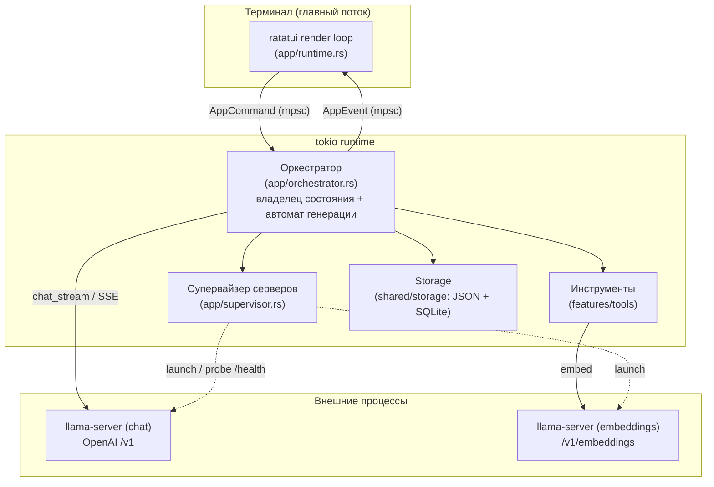

---

## 2. Слои FSD

Зависимости направлены **строго вниз**: `app → screens → widgets → features →
entities → shared`. Слой не импортирует «вбок» и «вверх». Кросс-срезовая
инфраструктура (движок, хранилище) живёт в `shared` за трейтами.

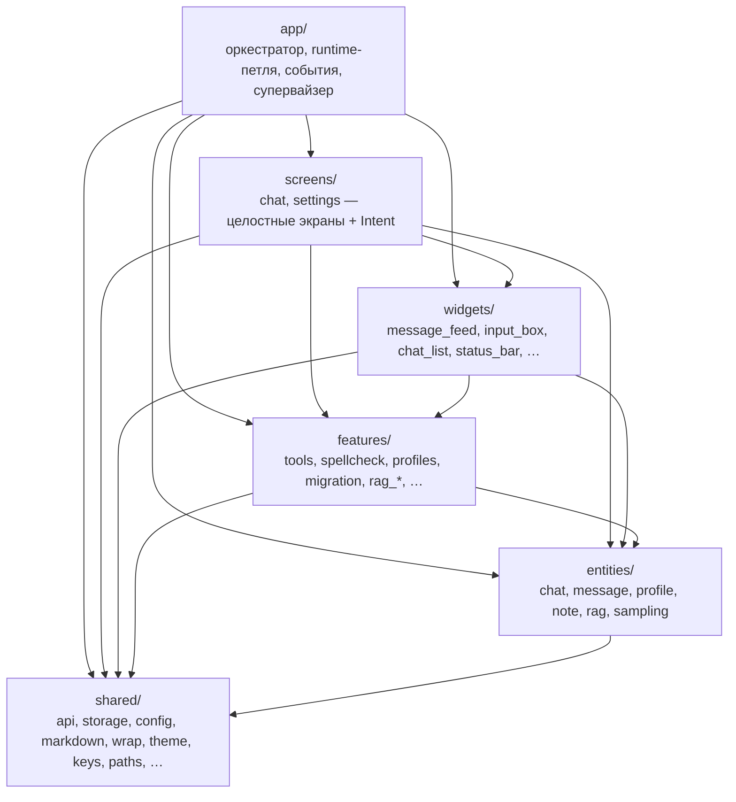

**Ключевой инвариант FSD в коде:** `screens`/`widgets` **не импортируют `app`**.
Экран не знает про `AppCommand` — он возвращает собственное намерение
(`ChatIntent`/`ChatListIntent`/`SettingsIntent`; виджет списка отдаёт экрану
`ChatListAction`), а `app/runtime.rs` транслирует его в `AppCommand`. Аналогично терминальные side-effect'ы (захват мыши, запись в
буфер обмена) экран не делает сам — он сигнализирует намерением, исполняет
`runtime`.

### Соответствие слоям попытки №1 (`lamellama-rs`)

| lamellama-rs (крейт) | mindfork-rs (слой/модуль)        |
|----------------------|----------------------------------|
| `llama-core`         | `entities/`                      |
| `llama-app`          | `app/orchestrator.rs` + `features/` |
| `llama-engine`       | `shared/api/` (`OpenAiClient`)   |
| `llama-tools`        | `features/tools/`                |
| `llama-storage`      | `shared/storage/`                |
| `llama-spell`        | `features/spellcheck/`           |
| `llama-ui` (`gpui`)  | `screens/` + `widgets/`          |

---

## 3. Карта модулей

```
src/
├─ main.rs                  тонкая точка входа: конфиг, env-overrides, single-instance,
│                           tokio, ratatui::init, импорт LameLLaMA (CLI-флаг)
│
├─ app/                     композиция: оркестрация, петля TUI, контракт, серверы
│  ├─ orchestrator/         владелец состояния, расслоён по фичам (god-объект разбит,
│  │  │                     владелец `Chat` остался один — см. ниже §10):
│  │  ├─ mod.rs             каркас: Orchestrator (16 полей), петля run(), диспетчер
│  │  │                     команд, общие хелперы (эмиттеры, chat_mut, mark_dirty)
│  │  ├─ engines.rs         EngineManager: жизненный цикл серверов, готовность,
│  │  │                     apply_chat/embed/impersonation, backend_if_ready
│  │  ├─ save_queue.rs      SaveQueue: дебаунс-очередь отложенного сохранения чатов
│  │  ├─ generation.rs      отправка/перегенерация/удаление обмена + задача agentic-loop
│  │  ├─ chats.rs           список чатов (new/switch/rename/clone/copy/delete) + черновик
│  │  ├─ profiles.rs        создание/правка/удаление профилей
│  │  ├─ settings.rs        конфиг + (пере)запуск серверов через супервайзер
│  │  ├─ title.rs           авто-название чата (фоновая задача)
│  │  ├─ impersonation.rs   реплика «за пользователя» (фоновая задача)
│  │  ├─ rag.rs             индексация/удаление файлов в базе знаний
│  │  └─ request.rs         маппинг доменных сообщений в формат движка
│  ├─ gen_state.rs          GenState: чистый автомат Idle/Generating/Cancelling
│  │                        (переходы begin/request_cancel/finish, без I/O)
│  ├─ events.rs             AppCommand (UI→оркестр.) и AppEvent (оркестр.→UI)
│  ├─ runtime.rs            мост tokio↔TUI: батчинг ввода, dirty-перерисовка,
│  │                        трансляция Intent→AppCommand, side-effect'ы (мышь/буфер)
│  └─ supervisor.rs         ServerSupervisor: (пере)запуск managed / подключение external
│
├─ screens/                 целостные экраны (FSD "pages"); НЕ зависят от app
│  ├─ chat.rs               ChatScreen: всё состояние UI чата, handle_key→ChatIntent
│  ├─ chat_list.rs          ChatListScreen: полноэкранный список чатов (Esc), → ChatListIntent
│  └─ settings.rs           SettingsScreen: секции/поля, подсекции Ассистент/Имперсонация
│
├─ widgets/                 составные UI-блоки (FSD "widgets")
│  ├─ message_feed.rs       лента: markdown, мысли, инлайн tool-блоки, скролл, перенос
│  ├─ input_box.rs          свой multiline-ввод (ADR 0001): курсор, перенос, спелл-чек,
│  │                        однострочный режим (поля настроек), визуальная навигация
│  ├─ chat_list.rs          виджет списка чатов (поиск/сортировка/F2/F5); обёрнут ChatListScreen
│  ├─ status_bar.rs         модель/токены/профиль/состояние сервера/режим мыши
│  ├─ profile_list.rs       оверлей выбора профиля при создании чата
│  └─ impersonation_preview.rs  потоковый предпросмотр реплики (Ctrl+U)
│
├─ features/                пользовательские сценарии (FSD "features")
│  ├─ tools/                реестр и реализации инструментов (client-side)
│  │  ├─ mod.rs             Tool, ToolContext, ToolOutcome/ChatEffect, ToolRegistry, ToolConfig
│  │  ├─ rag.rs             rag_add/rag_search: чанкинг, эмбеддинг, kNN, склейка
│  │  ├─ notes.rs           note_save/note_recall
│  │  ├─ introspection.rs   get/set_sampling, get/set_system_message, get_last_user_message_time
│  │  ├─ python.rs          python_exec (subprocess, таймаут)
│  │  ├─ web.rs             web_search (мульти-провайдер DDG/Mojeek/Ecosia + анти-бот)
│  │  ├─ fetch.rs           fetch_url (загрузка страницы + саммаризация через движок)
│  │  ├─ calc.rs            calculate (свой вычислитель математических выражений)
│  │  ├─ datetime.rs        current_time (дата/время, chrono)
│  │  ├─ fs.rs              fs_read/fs_write/fs_list (файлы; гейт fs_enabled + песочница)
│  │  └─ subagent.rs        call_subagent (без истории/инструментов, запрет вложенности)
│  ├─ spellcheck/           check, segment, dict, mod — Hunspell + сегментатор + личн. словарь
│  ├─ profiles.rs           чистые операции над профилями (sanitize_name, ProfileEdit)
│  ├─ chat_search_sort.rs   фильтр/сортировка списка чатов
│  ├─ rename_chat.rs        авто-название (digest, чистка), переименование
│  ├─ chat_export.rs        format_conversation (копирование переписки)
│  ├─ rag_command.rs        парсер /rag add|remove|list|rebuild
│  ├─ rag_ingest.rs         scan, read_text, RagProgress (типы прогресса индексации)
│  └─ migration.rs          импортёр LameLLaMA (.NET): профили + чаты
│
├─ entities/                доменные типы (без I/O); serde-сериализуемы
│  ├─ chat.rs               Chat, ChatSummary, CharacterNames, Chat::from_profile, draft
│  ├─ message.rs            Message, MessageRole, ToolCallRecord, MessageMetadata
│  ├─ profile.rs            Profile, ProfileSummary, ToolId
│  ├─ note.rs               Note
│  ├─ rag.rs                RagDocument / RagHit
│  └─ sampling.rs           SamplingConfig, ReasoningEffort, resolve (трёхуровневый приоритет)
│
└─ shared/                  инфраструктура и утилиты (FSD "shared")
   ├─ api/                  слой движка инференса (контракт + реализации по семействам, ADR 0004)
   │  ├─ contract.rs        EngineBackend, Embedder, ChatRequest/Chunk, ToolCallAccumulator (агностичный)
   │  ├─ openai/            OpenAI-протокол: client.rs (reqwest+SSE, probe /health, embed) + wire.rs (WireDialect)
   │  ├─ anthropic/         Anthropic Messages API: client.rs + wire.rs (Claude, /v1/messages)
   │  ├─ managed.rs         ServerHandle (managed-процесс llama-server), ManagedConfig, wait_until_ready
   │  ├─ thoughts.rs        потоковый парсер <think> (fallback к reasoning_content)
   │  └─ mock.rs            mock-движок для тестов (#[cfg(test)])
   ├─ storage/              хранилище
   │  ├─ json.rs            атомарная запись (write-rename + .bak) конфиг/профили/чаты
   │  ├─ db.rs              SQLite + sqlite-vec: notes/RAG, изоляция по profile_id
   │  └─ mod.rs             фасад Storage (потокобезопасный)
   ├─ config.rs            AppConfig и секции (Engine/Embed/Tool/Interface/Impersonation…)
   ├─ markdown.rs          свой рендерер на pulldown-cmark (ADR 0003): таблицы + LaTeX + тема
   ├─ wrap.rs              перенос слов по колонкам (unicode-width)
   ├─ theme.rs             Palette (роли user/assistant/tool/…), auto/dark/light
   ├─ keys.rs              раскладко-независимые Ctrl-шорткаты (ЙЦУКЕН→латиница)
   ├─ server.rs            ServerStatus (статус сервера для UI)
   ├─ paths.rs             портативные пути рядом с бинарником
   ├─ instance.rs          single-instance
   └─ logging.rs           tracing в файл (stdout занят TUI)
```

---

## 4. Поток данных UI ↔ оркестратор

Сердце архитектуры — однонаправленный поток через два `mpsc`-канала. Контракт
описан в [`app/events.rs`](../src/app/events.rs).

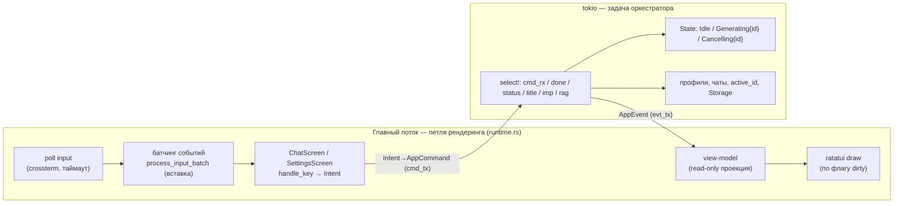

### Команды и события (контракт)

`AppCommand` (UI → оркестратор) включает: `SendMessage`, `SetDraft`,
`RegenerateLast`, `DeleteLastExchange`, `Cancel`, `Impersonate`/
`CancelImpersonation`, `NewChat`, `SwitchChat`, `RenameChat`/`AutoRenameChat`,
`CloneChat`, `CopyChat`, `DeleteChat`, `CreateProfile`/`DeleteProfile`,
`UpdateConfig`/`UpdateProfile`, `RagAdd`/`RagDelete`, `Quit`.

`AppEvent` (оркестратор → UI) включает: `ServerStatus`, `ChatList`,
`ChatRenamed`, `ChatListError`, `CopyToClipboard`, `ProfileList`, `Settings`,
`ChatActivated`, `UserMessage`, `RestoreInput`, `GenerationStarted`, `Chunk`,
`Thoughts`, `TokenUsage`, `ToolCall`, `AssistantContinue`/`AssistantRewrite`
(управляющие инструменты беседы — §8), `Finished`,
`Impersonation{Started,Chunk,Finished}`, `RagProgress`, `Error`.

`TokenUsage { completion, context, context_exact }` — live-счётчик токенов: ответ
(`completion`, накопительно по раундам agentic-loop) и переписка/промпт (`context`).
Источник двойной: live-приближение по числу потоковых дельт + точное число из блока
`usage` сервера (его просим через `stream_options.include_usage=true`; приходит
финальным чанком как `ChatChunk::Usage`). До прихода `usage` переписка показывается
клиентской оценкой (`shared/tokens.rs`, эвристика «байты UTF-8 / 4»), помеченной `~`;
точное `prompt_tokens` её заменяет. Статус-бар показывает сумму одним числом.

### Инварианты потока

- **Сериализация команд.** Оркестратор — одна `tokio`-задача с `select!` по
  каналам; команды обрабатываются строго последовательно. Гонок памяти нет —
  через каналы передаются владеемые значения (клоны/снимки).
- **`generation_id`.** Каждый запуск генерации получает `Uuid`; все стрим-события
  несут его. События с неактуальным id UI отбрасывает — классическая гонка «Stop →
  сразу Send/Regenerate → долетели хвосты старого стрима» закрыта.
- **dirty-перерисовка.** `runtime.rs` рисует кадр только по изменениям
  (применённое событие, ввод/мышь/ресайз, перезагрузка словаря, пересчёт
  орфографии). На простое экран не перерисовывается — иначе `ratatui` каждый тик
  переставлял бы курсор и сбивал фазу его мигания. Тело петли при этом крутится
  каждый тик и пробуждает отложенные по дебаунсу действия (перепроверку
  орфографии, анимацию спиннеров RAG/имперсонации).
- **Батчинг ввода.** Крупная вставка из буфера на Windows приходит обычными
  `KeyEvent` посимвольно (bracketed paste у crossterm работает только на unix);
  `process_input_batch` коалесит серию текстовых клавиш (≥2) в `Chunk::Paste`,
  чиня и торможение, и ложную отправку по `Enter` внутри вставки.

---

## 5. Жизненный цикл генерации и клиентский agentic-loop

Автомат на активный чат — выделен в `GenState` ([`app/gen_state.rs`](../src/app/gen_state.rs)):
чистый тип с валидными по построению переходами (`begin`/`request_cancel`/
`finish`), оркестратор лишь вызывает их и исполняет side-effect'ы вокруг.

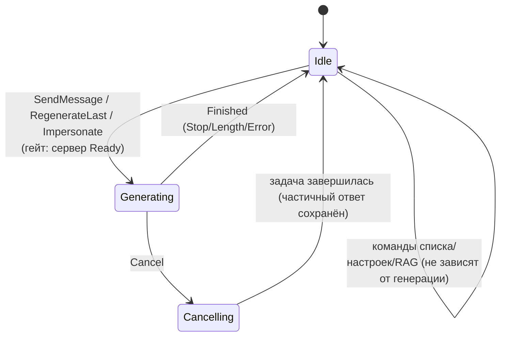

Сама генерация исполняется в **отдельной `tokio`-задаче**, которая стримит
`AppEvent` в UI напрямую, а итог (новые доменные сообщения + эффекты инструментов)
возвращает оркестратору через внутренний канал `done_tx` (тип `GenResult`).
Оркестратор — единственный владелец `Chat` — дописывает сообщения и применяет
эффекты сам.

**Клиентский agentic-loop** (spec §6.3): сервер не исполняет наши инструменты,
цикл ведёт оркестратор между HTTP-раундами.

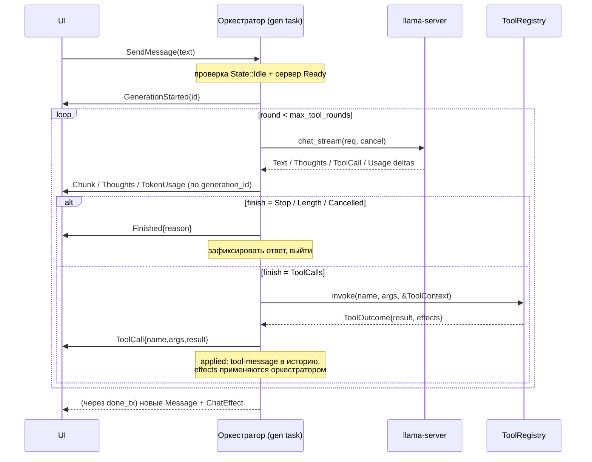

Детали:

- `max_tool_rounds` (по умолчанию **8**) — защита от зацикливания.
- **Гейт готовности сервера.** Отправка/регенерация/имперсонация стартуют только в
  `ServerStatus::Ready`. Проба бьёт в `/health` (вне `/v1`): `200` — готов, `503
  Loading model` — ещё грузится (не готов), `404` — сервер без `/health`, считаем
  живым. Это не даёт первому запросу уйти на ещё загружающийся managed-сервер и
  упасть на `503`. При неготовности отправки текст возвращается в поле ввода
  (`RestoreInput`).
- **«Мысли» (CoT).** llama.cpp: `delta.reasoning_content` (`llama-server
  --reasoning-format`) → `ChatChunk::Thoughts`; запасной путь — потоковый парсер
  `<think>…</think>` (`shared/api/thoughts.rs`), склеивающий теги на границе чанка.
  **Anthropic (Claude):** `wire::build_request` шлёт `thinking:{type:"adaptive",
  display:"summarized"}` при `sampling.thinking==Some(true)` (+ `output_config.effort`
  из `reasoning_effort`); `budget_tokens`/`reasoning_budget` **не шлём** — модели 4.x
  их отвергают (`400`). `thinking_delta`→`Thoughts`, `signature_delta`→
  `ChatChunk::ThoughtsSignature`. **При tool-use** Anthropic требует возвращать
  thinking-блок **с подписью** в assistant-ходе с `tool_use` того же хода (иначе
  `400`): agentic-loop копит подпись раунда и крепит `ApiMessage.thinking`
  (`with_thinking`) к ходу с вызовами; `build_messages` ставит `AntBlock::Thinking`
  первым. Подпись живёт только в памяти хода (между ходами Anthropic авто-отбрасывает
  старые thinking → не персистится). `supported_sampling_fields(Claude)` =
  `max_tokens`+`thinking`+`reasoning_effort`.
- **EOS.** Остановка строго по token-id спец-токенов модели (на стороне сервера);
  строковые `stop` по тексту EOS приложение **не отправляет** (анти-самообрыв).
- **Регенерация** усекает историю по последнее сообщение пользователя
  включительно и перезапускает `start_generation`; **удаление последнего обмена**
  снимает последний user+assistant и возвращает текст пользователя в ввод.

---

## 6. Слой движка (`shared/api`)

Транспорт спрятан за двумя трейтами — это даёт замену движка, мульти-провайдерность
и mock в тестах. Модуль разложен по семействам ([ADR 0004](decisions/0004-engine-contract-multi-provider.md)):
**`contract`** (провайдеро-агностичные трейты и типы), **`openai`** (OpenAI-протокол:
локальный/external `llama-server`, облако OpenAI/Gemini), **`anthropic`** (Claude,
Messages API), **`managed`** (запуск дочернего `llama-server`).

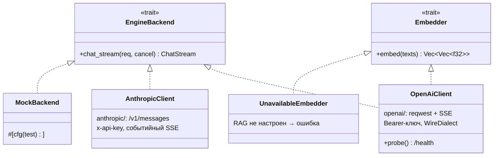

Провайдер выбирается в настройках единым селектором режима (`managed`/`external`/
`openai`/`gemini`/`claude`); API-ключ хранится **именем env-переменной** (секрет не
на диске). Поле `model` для облака обязательно — его подставляет сам бэкенд (доменный
`ChatRequest` модель не несёт). **Диалект сэмплинга** ([`openai::WireDialect`]):
`LlamaCpp` шлёт все расширения, `OpenAi`/`Gemini` чистят незнакомое (иначе `400`;
OpenAI требует `max_completion_tokens` вместо `max_tokens`), `AnthropicClient` из
сэмплинга шлёт `max_tokens` + extended thinking (`thinking`/`reasoning_effort` →
adaptive; Claude 4.x отвергает temperature/top_p/top_k и `budget_tokens` — см. «Мысли
(CoT)» выше). У Anthropic нет embeddings — `Embedder` он не реализует (RAG берёт
отдельный, ADR 0002).

- **`ChatRequest`** = `system` + `messages` (user/assistant/tool, включая
  `tool_calls` и tool-результаты) + `sampling` + `tools`. История append-only →
  локальный сервер переиспользует prefix cache. Каждый бэкенд транслирует в свой
  wire-формат (OpenAI Chat Completions либо Anthropic Messages: system → top-level,
  tool-результаты → `tool_result`-блоки в user, склейка соседних ролей).
- **`ChatChunk`** = `Text` | `Thoughts` | `ThoughtsSignature` | `ToolCall(ToolCallDelta)` |
  `Usage(TokenUsage)` | `Finished`. `ToolCallAccumulator` собирает разрезанные по
  чанкам вызовы по `index`; `Usage` (`prompt_tokens`/`completion_tokens`) приходит
  финальным чанком при `stream_options.include_usage=true` — счётчик токенов.
  `ThoughtsSignature` эмитит только Anthropic (подпись thinking-блока для переотправки
  при tool-use); прочие бэкенды его не шлют.
- **`ServerHandle`** (`managed.rs`) владеет дочерним `llama-server`: `Child` отдан
  **монитор-задаче** (`spawn_monitor`), которая `select!`-ит между его выходом (взвод
  `exited`-токена) и сигналом `kill` (взводится в `Drop` хэндла → `start_kill`;
  `kill_on_drop` оставлен подстраховкой). `build_args` собирает CLI (`-m`, `-ngl`,
  `-c`, `--jinja`, `--no-mmap`, `--flash-attn`; спекулятивное декодирование
  `--spec-type` + черновые `-md`/`-ngld`/`--spec-draft-n-max`/`-n-min`; для
  эмбеддингов — `--embeddings -ub <ctx> -b <ctx>`). Опциональные флаги добавляются
  только когда заданы (незаданное → дефолт llama.cpp); `FlashAttn`/`SpecType` —
  enum'ы в `shared/config`, в `ManagedConfig` приходят примитивами (как
  `reasoning_format`), enum→строку конвертирует супервайзер.
  **Предполёт:** если `model_path` (или черновой `-md`) задан, но файла нет — `bail!` до `spawn`.
  **Ранний выход:** если файл валиден, но процесс умирает уже *в ходе* загрузки
  (битый GGUF, OOM), монитор взводит `exited`, а `wait_until_ready(..., exited)`
  прекращает поллинг сразу с понятной ошибкой — не ждёт таймаут (иначе зависание в
  «подключение…» до `MANAGED_READY_TIMEOUT=600с`).

### Управление серверами — `ServerSupervisor` (`app/supervisor.rs`)

Супервайзер живёт в `app` (композиционный клей, знающий и про `shared/config`, и
про `shared/api`). За трейтом — ради `MockSupervisor` в тестах (отдаёт `Ready`
синхронно, чтобы тесты не зависели от гонки статуса).

Со стороны оркестратора жизненный цикл серверов инкапсулирован в **`EngineManager`**
(`app/orchestrator/engines.rs`, Фаза 3): владеет движками (`backend`/`imp_backend`/
`embedder`), опорами на managed-процессы, статусами готовности и каналами probe;
экспонирует `apply_chat/embed/impersonation`, `backend_if_ready`,
`impersonation_backend_if_ready`, `embedder()`. Это убрало ~11 полей из
`Orchestrator` (27 → 16), не затронув инвариант «единственный владелец `Chat`».

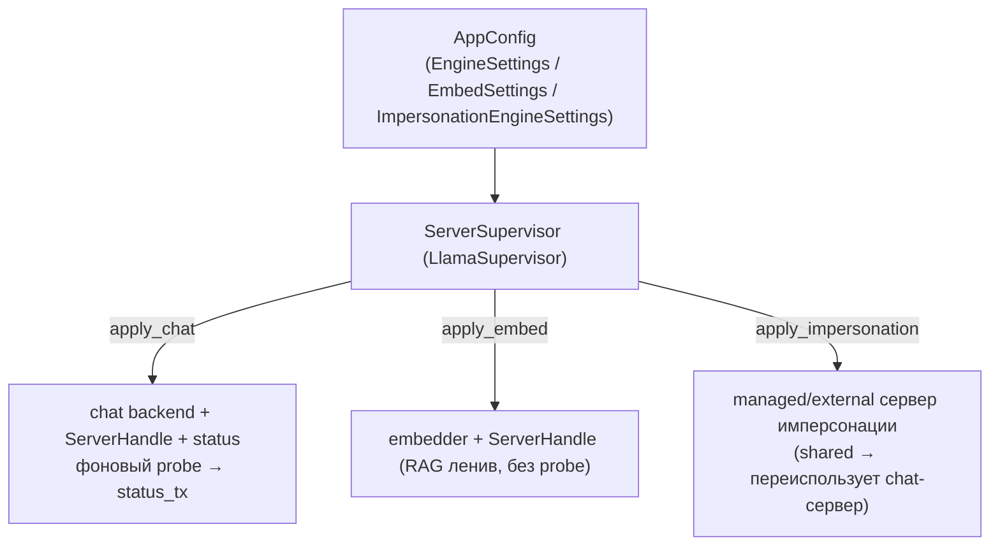

Два режима из настроек: **managed** (приложение запускает дочерний `llama-server`,
ждёт `/health`, при выходе — kill) и **external** (подключение к уже запущенному
любому OpenAI-совместимому серверу). Смена модели в настройках = перезапуск
сервера; смена настроек эмбеддингов — пере-поднятие embedding-сервера.

**Эмбеддинги — выделенный сервер** ([ADR 0002](decisions/0002-embeddings-dedicated-server.md)):
отдельный процесс/порт, трейт `Embedder` отделён от `EngineBackend`. Не настроен →
`UnavailableEmbedder` (RAG отдаёт понятную ошибку, не падает).

---

## 7. Доменная модель и хранение

Доменные типы (`entities/`) — без I/O, serde-сериализуемы.

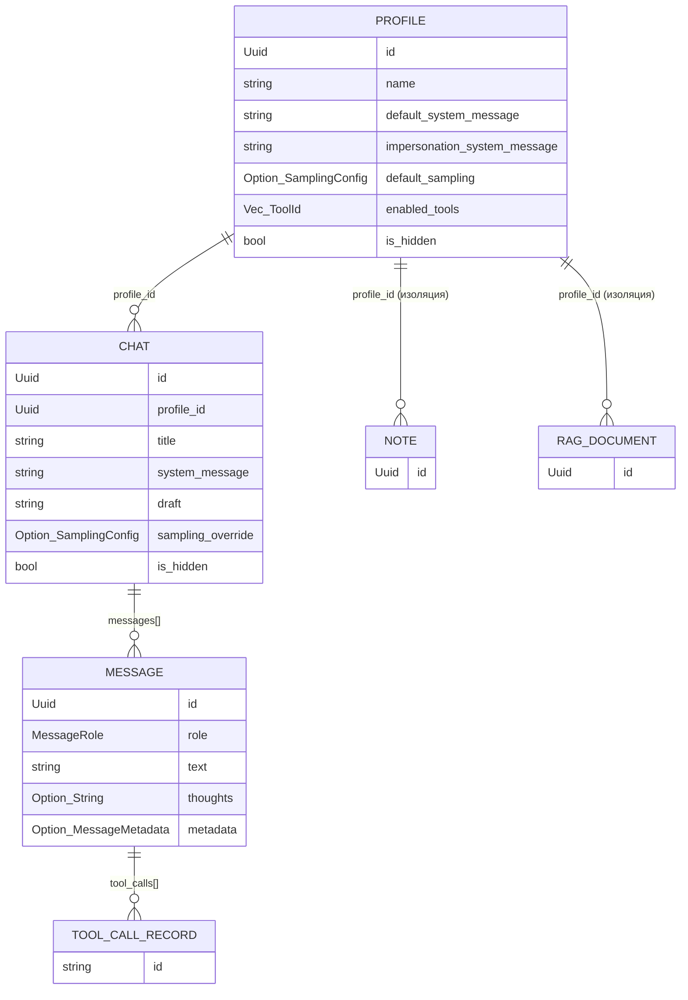

### Двухуровневое хранение (`shared/storage`)

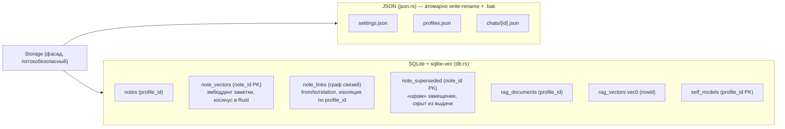

Инварианты хранения:

- **Изоляция по `profile_id`** — обязательный `WHERE profile_id = ?` во всех
  запросах notes/RAG (покрыто негативными тестами).
- **Мягкое удаление** (`is_hidden`) везде: скрытие профиля каскадно скрывает его
  чаты и исключает заметки/RAG из выборок. Физического удаления нет.
- **Один писатель** — оркестратор. Чаты сохраняются с дебаунсом (800 мс,
  `save_deadline` + множество `dirty`); запись атомарна (write-rename), бэкап `.bak`.
- **Размерность эмбеддингов** фиксируется по первому ответу `/v1/embeddings` и
  хранится в схеме sqlite-vec (`meta.rag_dim`).

### Трёхуровневый семплинг (`entities/sampling.rs`)

`resolve` разрешает приоритет **во время запроса** (не снимком при создании):
`Chat.sampling_override` → `Profile.default_sampling` → глобальный
`settings.json`. Снимок фактически применённого — в `Message.metadata`.

---

## 8. Система инструментов (`features/tools`)

Контракт инструмента — read-only-снимок + возврат эффектов (без локов на `Chat`).

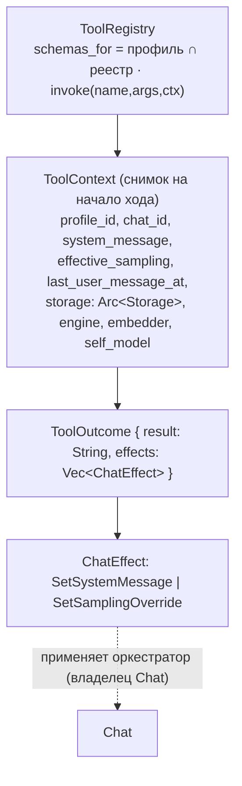

Реестр строится из `ToolConfig` (`standard_registry(&ToolConfig)`) и
пересобирается при правках `config.tools`. Эффективный набор инструментов =
`Profile.enabled_tools` ∩ глобальные выключатели (`effective_tool_ids`);
agentic-loop **гейтит и сам вызов** (выключенный инструмент отклоняется).

| Группа         | Инструменты                                                   |
|----------------|---------------------------------------------------------------|
| Память/знания  | `note_save` (эмбеддит + ворота совместимости), `note_recall` (семантический поиск + spreading activation по графу, откат на подстроку), `note_revise` (правка на месте), `note_link`/`note_neighbors` (типизированный граф связей), `note_supersede`/`note_merge` (замещение со «шрамом» / консолидация), `rag_add`, `rag_search`. Связность заметок (накопление → интеграция): см. [docs/notes-connectivity.md](notes-connectivity.md) |
| Интроспекция   | `get_sampling`, `set_sampling`, `get_system_message`, `set_system_message`, `get_last_user_message_time` |
| Внешние        | `web_search` (мульти-провайдер + анти-бот), `fetch_url` (загрузка+саммаризация), `python_exec` (subprocess) — гейтятся `web_enabled`/`python_enabled` |
| Файлы          | `fs_read`, `fs_write`, `fs_list` — гейтятся `fs_enabled`, опциональная песочница `fs_root` |
| Утилиты        | `calculate` (свой вычислитель выражений), `current_time` (chrono) — без I/O, не гейтятся |
| Осознанность   | `call_subagent` (без истории/инструментов, запрет вложенности) |
| Управление беседой | `send_followup_message` / `rewrite_current_message` — **control-flow** (опц., по умолч. выкл): распознаются agentic-loop'ом, а не `Tool::invoke` |
| Модель себя    | `get_self_model`, `reflect`, `update_self_model`, `update_user_model`, `add_insight` — **опц., по умолч. выкл**: пер-профильная «модель себя» в SQLite (описание + цели + модель собеседника + нарратив инсайтов), пишут напрямую через `storage` (не через `ChatEffect`), см. [docs/self-model-mvp.md](self-model-mvp.md) |

Особенности реализации:

- **`call_subagent`** — независимый одно-ходовый запрос через `ctx.engine`:
  заданное `system`, единственное `user`-сообщение, `tools: []` (запрет
  рекурсии), лимит токенов и таймаут.
- **Управляющие инструменты беседы** (`send_followup_message` / `rewrite_current_message`,
  `features/tools/control.rs`) — не обычные инструменты, а **control-flow**: их
  распознаёт сам agentic-loop (`generation.rs`), а `Tool`-реализации нужны лишь для
  схемы/регистрации/гейтинга. `send_followup_message` начинает второе сообщение
  отдельным пузырём (флаг `Message.new_bubble`); `rewrite_current_message` отбрасывает
  начатый раунд в `Chat.deleted` и пишет ответ заново. Опциональны (нет в
  `default_tool_ids`, есть в каталоге `all_tool_ids` — тумблеры профиля). Live-стрим
  ↔ перезагрузка синхронизируются событиями `AppEvent::AssistantContinue`/
  `AssistantRewrite`. См. spec §9.3.3.
- **`web_search`** — фоллбэк по провайдерам (DDG lite → DDG html → Mojeek →
  Ecosia); распознаёт анти-бот троттлинг (HTTP 202/403/429) и переключает
  провайдера, а не парсит пустую выдачу.
- **RAG** — умный чанкинг с перекрытием (`chunk_text`/`chunk_markdown`, размеры
  конфигурируемы через `config.rag`/`ChunkParams`), при извлечении — склейка соседних
  чанков по дословному перекрытию (`stitch_hits`). Команды `/rag add|remove|list|
  rebuild`: загрузка/удаление файлов (фоновая индексация, отменяемая), просмотр
  источников (счётчик чанков+дата) и реиндексация. Исходный текст источников хранится
  в `rag_sources` → `/rag rebuild` перечанковывает/переэмбеддивает без файлов на диске
  (смена размеров чанка или embedding-модели; при смене размерности вектора таблица
  векторов пересоздаётся, если базу не делят другие профили). Всё с изоляцией по
  профилю.
- **Модель себя (SelfModel)** — пер-профильная «модель себя» агента
  (`entities/self_model.rs`: свободный `summary` + `goals` + `user_model` + `narrative`
  инсайтов) в таблице `self_models` SQLite. Инструменты
  `update_self_model`/`update_user_model`/`add_insight` пишут **напрямую** через
  `ctx.storage` (как `note_save`), **без `ChatEffect`** — это не состояние `Chat`;
  `get_self_model`/`reflect` — чтение/рубрика. Противоречия фиксируются нарративом
  прозой (без отдельного типа). Оркестратор в начале хода читает снимок и
  **компактно** подмешивает его в `system`-промпт (`generation::inject_self_model`;
  гейт: профиль включил `get_self_model`). Размеры нарратива и объём инъекции —
  настраиваемы (`config.self_model: SelfModelSettings` → `SelfModelParams`, аналог
  `ChunkParams` у RAG; поля в экране настроек). Опциональны (нет в `default_tool_ids`).
  **Авто-рефлексия** (`orchestrator/reflection.rs`, `config.self_model.
  auto_reflect_every` > 0): каждые N ответов фоновая задача — **мини agentic-loop** с
  теми же инструментами — просит модель самой обновить «модель себя» (исполняет её
  вызовы, пишущие в `Storage`; чат/лента не трогаются). Гейты: профиль включил
  инструменты, сервер `Ready`, одна рефлексия за раз. См.
  [docs/self-model-mvp.md](self-model-mvp.md).

---

## 9. UI: экраны, виджеты, рендеринг

`runtime.rs` держит один базовый `ChatScreen` (лента/генерация/ввод) и enum
`ActiveScreen { Chat | ChatList | Settings | SelfModel }` — экран, открытый поверх
чата. Открытый список/настройки/просмотр получают ввод и рисуются вместо чата;
событие `OpenChatList`/`OpenSettings` от чата создаёт их, `Close` (Esc) — возвращает
к `Chat`. Список чатов держит снимок актуальным через `AppEvent::ChatList` (его
`app` применяет и к чату, и к открытому списку). **«Модель себя»** (`F3`,
просмотр+правка) — данными владеет оркестратор, поэтому `OpenSelfModel` не открывает
экран сразу, а шлёт `AppCommand::RequestSelfModel`; экран создаётся по ответному
событию `AppEvent::SelfModelView` (снимок модели активного профиля). Правки экран
отдаёт `SelfModelIntent::Edit` → `AppCommand::UpdateSelfModel`; оркестратор применяет,
сохраняет и **переэмитит** `SelfModelView` — открытый экран обновляется на месте
(`set_model`, выделение сохраняется). См. [docs/self-model-mvp.md](self-model-mvp.md).

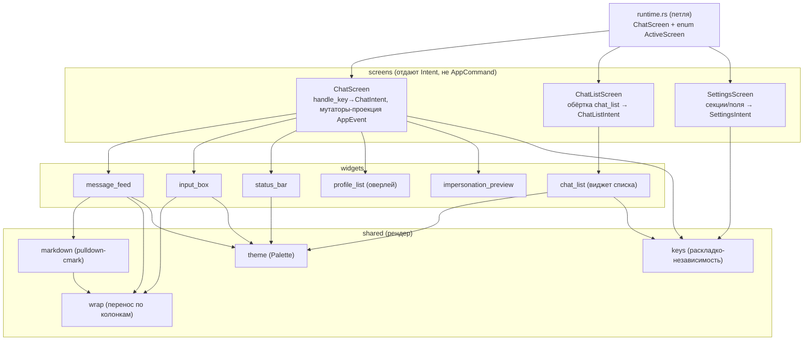

Решения, закреплённые ADR:

- **Свой `InputBox`** ([ADR 0001](decisions/0001-ui-crates-ratatui-030.md)):
  `tui-textarea`/`ratatui-textarea` несовместимы с ratatui 0.30 и не дают
  подсветки произвольных диапазонов. Свой виджет даёт полный контроль над
  `Enter`/`Shift+Enter`, скроллом, подчёркиванием орфографии (per-span
  `UNDERLINED`), визуальной навигацией `↑/↓` по рядам переноса, однострочным
  режимом для полей настроек.
- **Свой markdown-рендерер** ([ADR 0003](decisions/0003-own-markdown-renderer.md)):
  walker по событиям `pulldown-cmark` (`render(input, width, palette)`).
  Поддерживает таблицы (box-drawing, раскладка колонок «водоналивом»),
  delimiter-scoped LaTeX→unicode (только внутри `$…$`/`$$…$$`), тему (`Palette`),
  подсветку кода (`syntect` + `ansi-to-tui`).
- **Перенос слов** (`shared/wrap.rs`) считается **до** `Paragraph` (ширина в
  колонках через `unicode-width`) — это сохраняет row-based скролл/«хвост» в ленте
  и точный маппинг курсора во вводе. `Paragraph::wrap` сознательно не используется.
- **Спелл-чек** (`features/spellcheck`): Hunspell (`spellbook`) + свой сегментатор
  + личный словарь; слово верно, если принято хотя бы одним активным словарём;
  загрузка словарей — в фоне по настройкам интерфейса.
- **Раскладко-независимость** (`shared/keys.rs`): Ctrl-символ нормализуется в
  «физическую» латинскую клавишу (таблица ЙЦУКЕН), поэтому шорткаты работают и при
  кириллической раскладке.

---

## 10. Конкурентность и владение

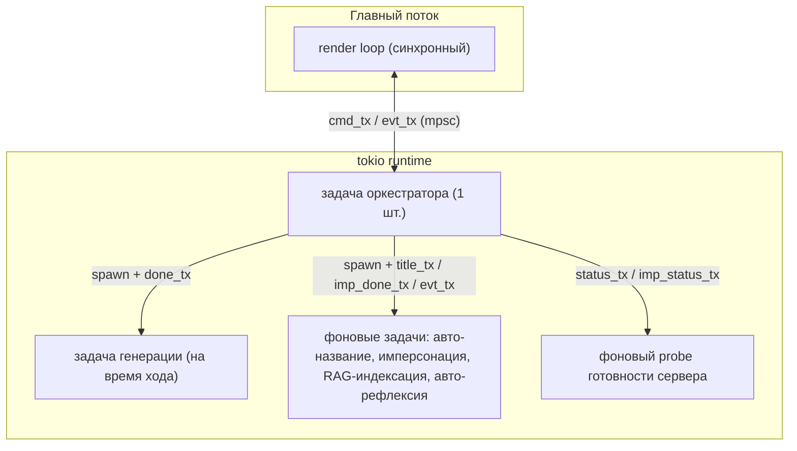

Принципы:

- **Единственный владелец `Chat`** — оркестратор. Инструменты получают
  неизменяемый снимок (`ToolContext`) и возвращают `effects` значением; никакого
  канала `ChatEffect` и реентерабельных локов — дедлок невозможен по построению
  (упрощение относительно серверного agentic-loop попытки №1).
- **Внутренние каналы** оркестратора (`done_tx`, `status_tx`, `title_tx`,
  `imp_done_tx`, `imp_status_tx`) собирают результаты фоновых задач обратно в
  главный `select!`-цикл, сохраняя единую точку записи состояния.
- **Отмена** — `CancellationToken` прерывает HTTP-стрим/фоновую задачу; частичный
  ответ фиксируется; новая задача того же рода отменяет предыдущую (RAG,
  имперсонация).
- **Восстановление терминала** — `ratatui::init` ставит panic-hook; захват мыши
  всегда снимается на выходе и при панике. `panic = "unwind"` в релизе сохранён
  намеренно ради drop-guard'ов.

---

## 11. Точка входа, конфигурация, сборка

- **`main.rs`** — тонкая: грузит `AppConfig`, сеет его env-переменными
  (`apply_env_overrides` — dev-workflow), проверяет single-instance, инициализирует
  логирование (в файл) и `tokio`, поднимает `ratatui`, запускает оркестратор и
  петлю. CLI-флаг `--import-lamellama <dir>` запускает импортёр и выходит.
- **Конфигурация** (`shared/config.rs`): `AppConfig` с секциями `EngineSettings`,
  `EmbedSettings`, `ToolSettings`, `InterfaceSettings`, `ImpersonationEngineSettings`,
  `impersonation_sampling`, глобальный семплинг. Все поля под `#[serde(default)]` —
  старые `settings.json` читаются без миграции. Выбор бэкенда — через настройки или
  env (`MINDFORK_ENGINE_URL` external / `MINDFORK_LLAMA_BIN` + `MINDFORK_MODEL`…
  managed; аналогично `MINDFORK_EMBED_*`).
  - **Конфиг движка вложенный по режимам/провайдерам:** `EngineSettings`/
    `ImpersonationEngineSettings`/`EmbedSettings` несут `mode` + под-секции
    `managed: ManagedSettings`, `external: ExternalSettings` и по `CloudSettings` на
    каждого облачного провайдера (`openai`/`gemini`/`claude`; у эмбеддингов managed —
    `ManagedEmbedSettings`). У каждого режима свои поля, поэтому переключение режима/
    провайдера не теряет чужих значений. Аксессоры `cloud()`/`cloud_mut()` отдают
    активную облачную под-структуру по `mode`. Экран настроек показывает поля только
    выбранного режима и скрывает неподдержанные облаком параметры сэмплинга (фильтр
    `cloud_supported_param`; значения сохраняются для локальных моделей). Шапка чата
    (`screens/chat::model_meta`) показывает модель активного режима. См. ADR 0004.
    `ManagedSettings` дополнительно несёт `flash_attn: FlashAttn` (`--flash-attn`) и
    поля спекулятивного декодирования (`spec_type: SpecType` + `draft_model`/
    `draft_gpu_layers`/`draft_n_max`/`draft_n_min`); черновые поля в UI видны только
    для типов `draft-*` — для MTP-моделей (`mtp-gemma-…`) это `draft-mtp`.
- **Портативность** (`shared/paths.rs`): все данные — рядом с бинарником (в dev —
  `target/debug/`): `settings.json`, `profiles.json`, `chats/`, `data.db`,
  `personal_dictionary.txt`, `dictionaries/`, `logs/`.
- **Зависимости** (см. [Cargo.toml](../Cargo.toml)): `ratatui` 0.30 + `crossterm`,
  `tokio`, `reqwest` (rustls), `rusqlite` (bundled) + `sqlite-vec`,
  `pulldown-cmark` + `syntect` + `ansi-to-tui`, `spellbook`, `arboard`, `scraper`,
  `serde`/`serde_json`, `uuid`, `chrono`, `tracing`. Приложение **не зависит от
  ML-стека** — это ключевое упрощение сборки.
- **Релиз**: `[profile.release]` с LTO/strip/`opt-level=3`, `panic=unwind`.

---

## 12. Тестируемость

Архитектура спроектирована тестируемой без сервера/GPU/сети:

- **Движок** — за трейтом `EngineBackend`; в тестах `MockBackend` (replay потока
  чанков). Реальный сервер — `#[ignore]`-смоуки (анти-самообрыв, tool-calling,
  «мысли» — проверены на Gemma 4 и Qwen).
- **Инструменты** — на `MockEmbedder` (bag-of-chars + L2) и mock-`Storage`:
  корректность результата, возврат `effects` (а не мутация), валидность JSON-схем.
- **Хранилище** — `tempfile` + SQLite `:memory:`: изоляция по `profile_id`
  (негативные тесты), мягкое удаление/каскад, атомарность, kNN.
- **Оркестратор** — без UI и модели: автомат, гонки (spam Send, Stop→Send,
  отбрасывание по `generation_id`), agentic-loop, `max_tool_rounds`, приоритеты
  семплинга, логика «удалить последнее».
- **UI** — чистая логика: применение последовательности `AppEvent` к проекции,
  рендер markdown/LaTeX, чистые функции (`chunk_batch`, `format_conversation`,
  `rag_command::parse`, перенос слов).

Статус (CLAUDE.md): план M0–M9 + пост-M9 выполнен; **333+ тестов зелёные**, 6
`#[ignore]`-смоуков на живом сервере.

---

*Документ описывает реализацию `mindfork-rs`. Источник истины по «что/почему» —
[spec.md](../spec.md); зафиксированные решения — [ADR](decisions/); журнал
реализации и актуальный статус — [CLAUDE.md](../CLAUDE.md).*
