# mindfork-rs architecture

This document describes **how `mindfork-rs` is built** — a console (TUI) AI chat
application in Rust. It's a map of the code and data flows: layers, modules,
contracts, lifecycles, and invariants. It complements, but does not replace, the
sources of truth:

- **[spec.md](../spec.md)** — engineering specification ("what" and "why");
- **[CLAUDE.md](../CLAUDE.md)** — orientation guide and the map of the other documents;
- **[docs/journal/](journal/)** — the implementation log (M0–M9 + post-M9), split by
  subsystem: how each part got the way it is, with its decisions and live-run outcomes;
- **[docs/decisions/](decisions/)** — ADRs (recorded technical decisions),
  including [0004](decisions/0004-engine-contract-multi-provider.md) — `shared/api`
  boundaries and multi-provider inference without a crate split;
  [0005](decisions/0005-python-sandbox-wasmer.md) — Python sandbox via a
  `wasmer`/WASIX sidecar behind `shared/sandbox.rs`;
  [0006](decisions/0006-data-schema-versioning.md) — data schema versioning and the
  JSON migration scaffold; [0007](decisions/0007-plugins-mcp-host-import-format.md) —
  plugins: MCP tool host + neutral import exchange format;
  [0008](decisions/0008-api-key-storage.md) — API key entry in settings with
  machine-bound encryption in the config; and
  [0009](decisions/0009-tts-speech-synthesis.md) — speech synthesis (TTS): cloud
  provider, our own speakable-text extractor, in-process `rodio` player;
- **[docs/install.md](install.md)** — install/run, engine, env.

> Terminology: **engine** = the inference provider behind the `EngineBackend`
> trait — a local OpenAI-compatible server (llama.cpp `llama-server`) **or** the
> cloud (OpenAI / Gemini / Anthropic, [ADR 0004](decisions/0004-engine-contract-multi-provider.md));
> **application** = `mindfork-rs`, the engine's HTTP client. The agentic loop is
> **client-side** — the application's orchestrator runs it.

---

## 1. The big picture

`mindfork-rs` is a single Rust binary crate (edition 2024) organized by
**Feature-Sliced Design (FSD)**. The application itself **contains no ML stack**:
inference is done by an external engine — a local `llama-server` process (managed
subprocess or external) or a cloud API (OpenAI / Gemini / Anthropic) — and the
application talks to it over HTTP (SSE streaming, `/v1/embeddings` for RAG; see
§6 and ADR 0004).

Three "axes" the system is built around:

1. **A single owner of state.** The orchestrator (`app/orchestrator.rs`) solely
   owns the domain state (profiles, chats, `Storage`) and is the only writer to
   disk. The UI holds only a read-only projection.
2. **Unidirectional flow.** The UI sends `AppCommand`s upward, the orchestrator
   sends `AppEvent`s downward. No shared mutable locks on `Chat` — so deadlock is
   impossible by construction.
3. **Transport behind a trait.** Everything that depends on the inference server
   is hidden behind `EngineBackend`/`Embedder` (`shared/api`) — hence testability
   (mock/replay) and engine swappability.

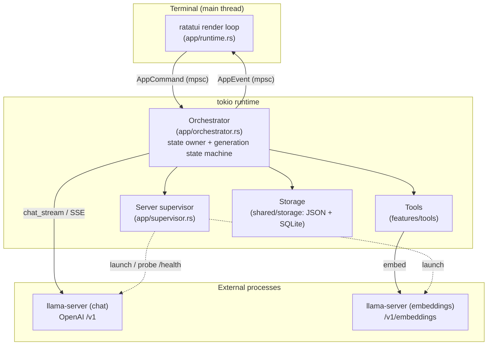

---

## 2. FSD layers

Dependencies point **strictly downward**: `app → screens → widgets → features →
entities → shared`. A layer never imports "sideways" or "upward". Cross-cutting
infrastructure (engine, storage) lives in `shared` behind traits.

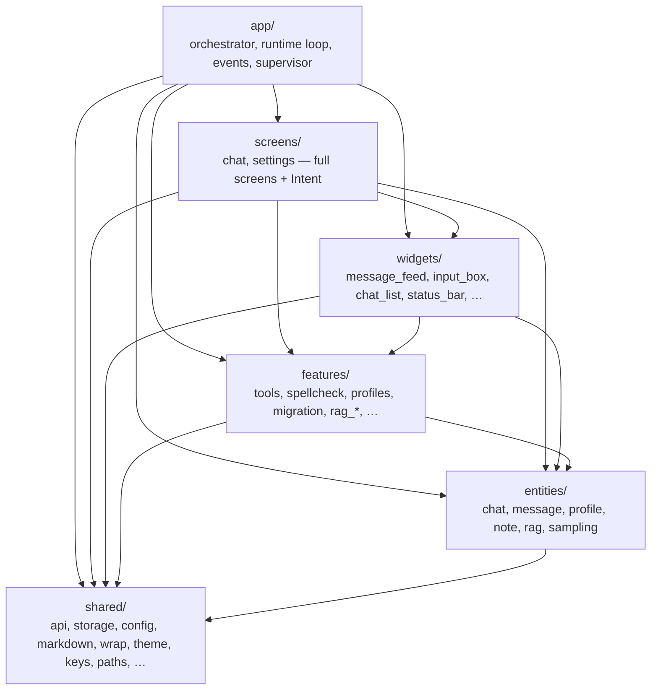

**Key FSD invariant in the code:** `screens`/`widgets` **never import `app`**.
A screen doesn't know about `AppCommand` — it returns its own intent
(`ChatIntent`/`ChatListIntent`/`SettingsIntent`; the chat list widget hands the
screen a `ChatListAction`), and `app/runtime.rs` translates it into an
`AppCommand`. Likewise, a screen never performs terminal side effects (mouse
capture, clipboard writes) itself — it signals an intent, and `runtime` executes
it.

### Layer mapping from attempt #1 (`lamellama-rs`)

| lamellama-rs (crate) | mindfork-rs (layer/module)       |
|----------------------|----------------------------------|
| `llama-core`         | `entities/`                      |
| `llama-app`          | `app/orchestrator.rs` + `features/` |
| `llama-engine`       | `shared/api/` (`OpenAiClient`)   |
| `llama-tools`        | `features/tools/`                |
| `llama-storage`      | `shared/storage/`                |
| `llama-spell`        | `features/spellcheck/`           |
| `llama-ui` (`gpui`)  | `screens/` + `widgets/`          |

---

## 3. Module map

```
src/
├─ main.rs                  thin entry point: "peek" phase (language/root before
│                           parsing), CLI parsing (features/cli), single-instance,
│                           tokio, ratatui::init; main() -> ExitCode with localized
│                           error printing
│
├─ app/                     composition: orchestration, TUI loop, contract, servers
│  ├─ orchestrator/         state owner, split by feature (god object broken up,
│  │  │                     `Chat` still has a single owner — see §11 below):
│  │  ├─ mod.rs             scaffold: Orchestrator (17 fields), run() loop, command
│  │  │                     dispatcher, shared helpers (emitters, chat_mut, mark_dirty)
│  │  ├─ engines.rs         EngineManager: server lifecycle, readiness,
│  │  │                     apply_chat/embed/impersonation, backend_if_ready
│  │  ├─ embed_guard.rs     EmbedGuard: Embedder decorator detecting an embedding-
│  │  │                     model change (canary, lazy on first use) and retiring the
│  │  │                     vectors it orphans — bumps the embedding generation, deletes
│  │  │                     nothing — see spec §9.3.4
│  │  ├─ reembed.rs         `/reindex`: DB-global background job re-embedding every
│  │  │                     foreign-generation vector in place from the text already
│  │  │                     stored (batched, cancellable, resumable) — spec §9.3.4
│  │  ├─ save_queue.rs      SaveQueue: debounced queue for deferred chat saves
│  │  ├─ restart_queue.rs   RestartQueue: debounces server (re)starts on engine
│  │  │                     settings edits (a series of edits → one restart)
│  │  ├─ generation.rs      send/regenerate/delete exchange + the agentic-loop task
│  │  ├─ chats.rs           chat list (new/switch/rename/clone/copy/delete) + draft
│  │  ├─ compaction.rs      history compression (`/compact` and the automatic
│  │  │                     trigger): one single-turn roll (the title.rs shape —
│  │  │                     its text comes back on a typed channel), the boundary
│  │  │                     re-found by message id, plus `ContextDiscovery` — what
│  │  │                     is known about the engine's context window (asked once
│  │  │                     per applied engine, epoch-guarded against a stale
│  │  │                     answer). Never edits `chat.messages` — only what a
│  │  │                     request carries, spec §6.7
│  │  ├─ profiles.rs        create/edit/delete profiles
│  │  ├─ settings.rs        config + server (re)start via the supervisor
│  │  ├─ title.rs           chat auto-title (background task)
│  │  ├─ impersonation.rs   "on behalf of the user" reply (background task)
│  │  ├─ rag.rs             indexing/removing files in the knowledge base
│  │  ├─ attachments.rs     chat file attachments (`/file attach`): background
│  │  │                     read/extract → mode by budget → the chat; background
│  │  │                     indexing of a by-reference file into the chat-scoped
│  │  │                     semantic index (best-effort, spec §9.7)
│  │  ├─ images.rs          images staged for the next message (`/image attach`):
│  │  │                     capability probe + background decode/downscale → staging
│  │  │                     (session-only, per chat), consumed by the send (spec §9.10)
│  │  ├─ search.rs          chat content search (`Ctrl+F` in the list): indexes a
│  │  │                     chat right after it is saved + the startup reconciliation
│  │  │                     pass (stat-only walk of `chats/`), and answers a query —
│  │  │                     escaping it here, since `shared` may not use `features`
│  │  ├─ tts.rs             speech synthesis: conversation snapshot → chunks →
│  │  │                     synth/playback pipeline, stop points (§11.9)
│  │  ├─ mcp.rs             McpManager: MCP server lifecycle (spawn/status/
│  │  │                     restart budget/TOFU catalog pinning), epoch-tagged events
│  │  ├─ reflection.rs      self-model auto-reflection (window/watermark, signals)
│  │  ├─ consolidation.rs   note auto-consolidation ("sleep")
│  │  ├─ tool_loop.rs       shared "silent" agentic loop for background tasks (reflection/consolidation)
│  │  ├─ background.rs      slot registry for silent background tasks (BgSlot by BackgroundKind)
│  │  ├─ request.rs         mapping domain messages to the engine wire format
│  │  └─ tests/             orchestrator tests, split by feature (mod.rs — fixtures;
│  │                        generation/chats/profiles/settings/title/impersonation/
│  │                        self_model/reflection/rag/request + live.rs #[ignore])
│  ├─ gen_state.rs          GenState: pure Idle/Generating/Cancelling state machine
│  │                        (begin/request_cancel/finish transitions, no I/O)
│  ├─ events.rs             AppCommand (UI→orchestrator) and AppEvent (orchestrator→UI)
│  ├─ runtime/              tokio↔TUI bridge. God object broken up (docs/refactoring-god-
│  │  │                     objects.md, stage 7; external surface — only run):
│  │  ├─ mod.rs             run/run_loop (the loop, dirty redraw), ActiveScreen, SpellLoader
│  │  ├─ input.rs           input batching + clipboard paste (Windows path): Chunk, coalescing
│  │  ├─ dispatch.rs        apply_event (AppEvent→screen) + Intent→AppCommand translation
│  │  └─ clipboard.rs       read/write the system clipboard (arboard)
│  └─ supervisor.rs         ServerSupervisor: (re)start managed / connect to external
│
├─ screens/                 full screens (FSD "pages"); do NOT depend on app
│  ├─ chat/                 ChatScreen: chat UI state. God object broken up
│  │  │                     (docs/history/refactoring-god-objects.md, stage 2):
│  │  ├─ mod.rs             ChatIntent, popup types, struct ChatScreen, accessors
│  │  ├─ feed.rs            projects AppEvent into the feed (messages/generation/tool/tokens)
│  │  ├─ input.rs           key/mouse/paste handling, draft, spellcheck, commands
│  │  ├─ popups.rs          popups: spellcheck, confirmation, emoji, help. The help
│  │  │                     dialog's tabs (spec §11.7); "Disclaimer" renders
│  │  │                     DISCLAIMER.md through shared::markdown (ADR 0003)
│  │  ├─ impersonation.rs   preview of the reply written on the user's behalf (Ctrl+U)
│  │  ├─ rag.rs             RAG indexing progress banner
│  │  └─ render.rs          screen rendering
│  ├─ chat_list.rs          ChatListScreen: full-screen chat list (Esc), → ChatListIntent
│  ├─ search.rs             SearchScreen: message-level content search results (Ctrl+G in
│  │                        the list's content mode), grouped by chat with a highlighted
│  │                        snippet; Enter → a jump into the feed, → SearchIntent
│  └─ settings/             SettingsScreen: sections (Model/Sampling/Tools/Plugins/
│     │                     Memory/Data/Profiles/Interface) with field groups; "Plugins" is the
│     │                     MCP host — master switch, server editor (Ctrl+N/Ctrl+D over
│     │                     config.mcp.servers) and live statuses, spec §9.6;
│     │                     Assistant/Impersonation subsections
│     │                     ("Profiles": the two subsections edit different lists — assistant
│     │                     profiles vs. impersonation personas, spec §11.8).
│     │                     God object broken up (docs/history/refactoring-god-objects.md, stage 1):
│     ├─ mod.rs             SettingsIntent, section/subsection enums, field types
│     │                     (FieldId/FieldRow/Editor/…), struct SettingsScreen
│     ├─ catalog.rs         section/subsection field builders + availability gates
│     ├─ apply.rs           key handling, field editor, toggles/cycles, saving
│     ├─ spec.rs            field_spec: access table for a config field's value (get/set/cycle/num)
│     ├─ choice.rs          Choice-field selection popup + reset field to default
│     ├─ search.rs          field search overlay (`/`): index/filter/jump
│     ├─ render.rs          rendering: menu, tab strip, field list, popups
│     └─ helpers.rs         free functions: row builders, descriptions, parsers
│
├─ widgets/                 composite UI blocks (FSD "widgets")
│  ├─ message_feed.rs       feed: markdown, collapsible thoughts (Ctrl+T) and tool
│  │                        cards (Ctrl+O) — both collapsed by default, the state
│  │                        per chat (`FeedView`, spec §11.3), scroll, wrap,
│  │                        jump to a message (pending_focus/anchor/marker, §4),
│  │                        in-feed search (Ctrl+F): highlight scope, match list and
│  │                        next/prev to the matched line — see the invariant in §4
│  ├─ input_box.rs          our own multiline input (ADR 0001): cursor, wrap, spellcheck,
│  │                        single-line mode (settings fields), visual navigation
│  ├─ logo.rs               brand mark drawn with terminal cells (half blocks
│  │                        `▀`/`▄`/`█`): 10×6 glyph + wordmark in our own pixel
│  │                        font → 65×6 horizontal lockup, left-aligned in the
│  │                        help overlay header. Brand colors (except `mind` —
│  │                        theme-dependent per the brand), docs/branding.md §5
│  ├─ chat_list.rs          chat list widget (search/sort/F2/F5); wrapped by ChatListScreen
│  ├─ status_bar.rs         model/tokens/profile/server status/mouse mode
│  ├─ profile_list.rs       profile selection overlay when creating a chat
│  └─ impersonation_preview.rs  streaming preview of the reply (Ctrl+U)
│
├─ features/                user-facing scenarios (FSD "features")
│  ├─ tools/                tool registry and implementations (client-side)
│  │  ├─ mod.rs             Tool, ToolContext, ToolOutcome/ChatEffect, ToolRegistry, ToolConfig
│  │  ├─ meta.rs            catalog metadata for the UI: tool group/description/gate
│  │  ├─ confirm.rs         ToolDecision (allow / allow for this turn / deny). In `features`
│  │  │                     rather than next to AppCommand: `screens` produces it and may
│  │  │                     not import `app` (same reason as RagProgress). See spec §9.8
│  │  ├─ mcp.rs             McpTool: wrapper for an MCP server tool (id mcp__srv__tool,
│  │  │                     clip/timeout/cancel) + McpSnapshot/catalog_hash (TOFU)
│  │  ├─ present.rs         call presentation for the feed (ToolPresentation): highlighted
│  │  │                     code / python console / compact header instead of raw JSON.
│  │  │                     `ArgDetail` picks the presentation: Compact (a collapsed card,
│  │  │                     the confirmation popup) folds what fits into the header; Full
│  │  │                     (an expanded card) puts the name alone there and enumerates
│  │  │                     every argument below, one `key: value` line each
│  │  ├─ rag.rs             rag_add/rag_search: chunking, embedding, kNN, stitching
│  │  ├─ notes/             notes. God object broken up (docs/history/refactoring-god-objects.md,
│  │  │                     stage 4; external surface `notes::*` preserved via re-export
│  │  │                     `pub(crate) use <submod>::*` from mod.rs):
│  │  │  ├─ mod.rs          ID constants, thresholds, SELF_NOTE_TAG, is_self_note/parse_*/
│  │  │  │                  clip/cosine, re-exports
│  │  │  ├─ save.rs         note_save + create_note/ensure_note_vectors/similarity gate
│  │  │  ├─ recall.rs       note_recall + semantic path, related blocks, formatting
│  │  │  ├─ edit.rs         note_revise/note_supersede/note_merge
│  │  │  ├─ graph.rs        note_link/note_neighbors (typed link graph)
│  │  │  ├─ cite.rs         note_cite_source (note→RAG source citation)
│  │  │  ├─ overview.rs     consolidate_notes + consolidation overviews (user/@self)
│  │  │  └─ self_notes.rs   self-note (@self) subsystem: recent/relevant, graph
│  │  ├─ introspection.rs   get/set_sampling, get/set_system_message, get_last_user_message_time
│  │  ├─ python.rs          python_exec (subprocess, timeout)
│  │  ├─ web.rs             web_search (multi-provider DDG/Mojeek/Ecosia + anti-bot,
│  │  │                     incl. a captcha served behind HTTP 200) + two
│  │  │                     extractions: extract_readable (prose, for ranking)
│  │  │                     and extract_rich (+headings/code, for fetch_url)
│  │  ├─ fetch.rs           fetch_url (page fetch + summarization via the engine;
│  │  │                     a page over the attachment budget is attached to the
│  │  │                     chat instead of being cut — ChatEffect::AddAttachment;
│  │  │                     a YouTube link is answered with metadata + a pointer
│  │  │                     to youtube_watch instead of "no readable text")
│  │  ├─ youtube.rs         youtube_watch: what a video says and shows. Free
│  │  │                     metadata (watch page/oEmbed, pure parse) + the video
│  │  │                     call via shared/video; degrades to metadata when no
│  │  │                     provider is configured. transcript: true adds the
│  │  │                     words — one call, split on a marker; a large one
│  │  │                     becomes a chat attachment — spec §9.9
│  │  ├─ calc.rs            calculate (our own math expression evaluator)
│  │  ├─ datetime.rs        current_time (date/time, chrono)
│  │  ├─ fs.rs              fs_read/fs_write/fs_list (files; fs_enabled gate + sandbox)
│  │  ├─ attachment.rs      attachment_read (one page of an attached file) +
│  │  │                     attachment_search (by meaning, chat-scoped index);
│  │  │                     both read the snapshot/index, never the disk — spec §9.7
│  │  ├─ history.rs         history_read (one page of the folded-away part of this
│  │  │                     conversation) + history_search (over `cache.db`'s
│  │  │                     full-text index, no embedder — the local 8k user is who
│  │  │                     compression is for). Offered only while the chat has a
│  │  │                     folded range, the same condition that puts the summary
│  │  │                     block in the prompt — spec §6.7
│  │  └─ subagent.rs        call_subagent (no history/tools, nesting forbidden)
│  ├─ spellcheck/           check, segment, dict, mod — Hunspell + segmenter + personal dictionary
│  ├─ profiles.rs           pure profile operations (sanitize_name, ProfileEdit)
│  ├─ chat_search_sort.rs   chat list filter/sort
│  ├─ chat_search.rs        to_fts_query: raw input → a *literal* FTS5 MATCH (every
│  │                        token quoted, inner quotes doubled; tokens under the
│  │                        trigram 3-char floor dropped). Pure, tested without a DB
│  ├─ rename_chat.rs        auto-title (digest, cleanup), renaming
│  ├─ chat_export.rs        format_conversation (copy the conversation)
│  ├─ rag_command.rs        /rag add|remove|list|rebuild parser
│  ├─ compaction.rs        history compression, pure part: one renderer of a
│  │                       message range (parameterized by the tool-result clip,
│  │                       so what the summarizer saw is what the reader can
│  │                       re-read) feeding both the digest — which, unlike the
│  │                       title one, carries tool activity, the invisible bulk of
│  │                       a long chat — and `HistoryView`, the paginated view the
│  │                       read-back tools serve; plus the cut planner (snapped to
│  │                       a User boundary), the two prompts and the overflow
│  │                       detector behind the "the window is full" hint
│  ├─ compact_command.rs   /compact parser
│  ├─ reindex_command.rs    /reindex parser (top-level, not a /rag subcommand: it
│  │                        spans notes, attachments and every profile's base)
│  ├─ file_command.rs       /file attach|remove|list parser + FileProgress
│  │                        (chat attachments, spec §9.7, docs/file-attachments.md)
│  ├─ image_command.rs      /image attach|remove|list parser + ImageProgress
│  │                        (images staged for the next message, spec §9.10)
│  ├─ image_prepare.rs      decode/downscale/normalize an attached image to png|jpeg
│  │                        (the `image` crate; a png already within the ceiling is
│  │                        passed through byte for byte)
│  ├─ tts_command.rs        /tts [N|all|stop] parser (speech synthesis, spec §11.9)
│  ├─ rag_ingest.rs         scan, read_text, RagProgress (indexing progress types)
│  ├─ cli.rs                our own micro CLI argument parser (all text lives in locale bundles)
│  ├─ backup.rs             data backup/restore (zip, transactional, optional AES-256
│  │                        password — spec §12.3); reports phase progress through a
│  │                        callback, the CLI prints it (sandbox_setup's shape)
│  ├─ data_migration.rs     schema migration orchestration at startup (ADR 0006): downgrade/
│  │                        corruption gates, pre-migration backup, control-parse
│  ├─ terminal_input.rs     CLI terminal input: the hidden backup-password prompt, and
│  │                        discarding keys typed while a long command was running
│  ├─ sandbox_setup.rs      Python sandbox provisioning (mindfork sandbox setup): wasmer +
│  │                        python.webc + wheels from a lock list (sha256); cache warmup
│  └─ import.rs             import from the neutral mindfork-import format
│                           (docs/import-format.md): profiles + chats from external
│                           converters, idempotent (UUIDv5 from keys)
│
├─ entities/                domain types (no I/O); serde-serializable
│  ├─ attachment.rs         Attachment/AttachMode/AttachmentInfo — a file attached
│  │                        to a chat (text snapshot, budget in estimated tokens);
│  │                        AttachmentChunk/AttachmentHit — its semantic index
│  ├─ chat.rs               Chat, ChatSummary, CharacterNames, Chat::from_profile, draft,
│  │                        FeedView (per-chat collapse state of the feed's foldable blocks)
│  ├─ message.rs            Message, MessageRole, ToolCallRecord, MessageMetadata
│  ├─ message_image.rs      MessageImage/ImageInfo — an image carried BY A MESSAGE
│  │                        (base64 payload in the chat file, patch-formula estimate);
│  │                        message-scoped, unlike attachment.rs (spec §9.10)
│  ├─ profile.rs            Profile, ProfileSummary, ToolId
│  ├─ note.rs               Note
│  ├─ rag.rs                RagDocument / RagHit
│  └─ sampling.rs           SamplingConfig, ReasoningEffort, resolve (three-tier priority)
│
└─ shared/                  infrastructure and utilities (FSD "shared")
   ├─ api/                  inference engine layer (contract + per-family implementations, ADR 0004)
   │  ├─ contract.rs        EngineBackend, Embedder, ChatRequest/Chunk, ThinkingRef, ToolCallAccumulator (agnostic)
   │  ├─ openai/            OpenAI family:
   │  │  ├─ client.rs+wire.rs   Chat Completions: OpenAiClient (reqwest+SSE, /health probe, embed; local/external/proxy; no dialect — sampling sent as-is)
   │  │  └─ responses/          Responses API: ResponsesClient + wire (OpenAI cloud, /v1/responses — reasoning summaries, effort, verbosity)
   │  ├─ gemini/            native Gemini: client.rs + wire.rs (generateContent, x-goog-api-key — thought summaries, thinkingLevel/Budget, per-tool-call thoughtSignature)
   │  ├─ anthropic/         Anthropic Messages API: client.rs + wire.rs (Claude, /v1/messages)
   │  ├─ managed.rs         ServerHandle (managed llama-server process), ManagedConfig, wait_until_ready
   │  ├─ thoughts.rs        streaming <think> parser (falls back to reasoning_content)
   │  └─ mock.rs            mock engine for tests (#[cfg(test)])
   ├─ storage/              storage
   │  ├─ schema.rs          schema versions (SETTINGS/PROFILES/CHAT/DB_SCHEMA) + pure
   │  │                     JSON migration scaffold (Step/JsonArtifact/Assessment, ADR 0006)
   │  ├─ json.rs            atomic write (write-rename + .bak) for config/profiles/chats
   │  ├─ db/               SQLite + sqlite-vec: notes/RAG, isolated by profile_id.
   │  │  │                 God object broken up by domain (docs/history/refactoring-god-objects.md,
   │  │  │                 stage 5; `impl Db` — several blocks, schema/helpers in mod.rs;
   │  │  │                 domain tests — in that submodule's `mod tests`, local `db()`):
   │  │  ├─ mod.rs         struct Db, open/from_conn, version-aware migrate() (baseline_ddl
   │  │  │                 every time + user_version + DB_STEPS inside transactions), ensure_dim
   │  │  │                 (shared by both vec0 tables)/ensure_*_vec_table/vec_dim/table_exists,
   │  │  │                 shared helpers (row_to_note/parse_uuid/parse_dt/cosine)
   │  │  ├─ notes.rs       notes: insert/list/edit/delete + embeddings/semantics
   │  │  ├─ graph.rs       link graph + supersession + source citation
   │  │  ├─ self_model.rs  self-model: get/upsert/atomic update
   │  │  ├─ attachments.rs chat-scoped semantic index over `/file attach` files
   │  │  │                 (vec0 partitioned by chat_id; dimensionality shared with
   │  │  │                 RAG, reset together — spec §9.7)
   │  │  ├─ embed_gen.rs   embedding generations: the counter, the re-embed work
   │  │  │                 queue (global — one embedder invalidates every profile
   │  │  │                 at once) and in-place vector replacement; plus the active
   │  │  │                 model's similarity calibration (same once-per-model fact:
   │  │  │                 embed_calibration/set_embed_calibration, the infallible
   │  │  │                 similarity_scale()) — spec §9.3.4
   │  │  └─ rag.rs         RAG: documents/search/sources/dimensionality + delete by path
   │  ├─ cache/             CacheDb (`cache.db`) — the disposable full-text index over
   │  │                     chat message text: external-content FTS5, tokenize='trigram',
   │  │                     diffed per message (a streaming save rewrites one row) +
   │  │                     `indexed_chats` bookkeeping for the startup pass. Derived
   │  │                     data, so open() self-heals: a corrupt file or a foreign
   │  │                     schema is deleted and started empty, never migrated
   │  └─ mod.rs             Storage facade (thread-safe)
   ├─ embed_identity.rs    identity of the embedding model that produced the stored
   │                       vectors: CANARY_TEXT/CANARY_MATCH + EmbedFingerprint
   │                       (canary vector + display name, matches()). See spec §9.3.4
   ├─ embed_calibration.rs per-model calibration of the similarity gates: probe_texts/
   │                       measure → Calibration (two means) → SimilarityScale (affine
   │                       map anchored on the bge-m3 reference constants; identity when
   │                       nothing is calibrated). Corpus — embed_probes.json, a fixed
   │                       measurement fixture (include_str!, bilingual, DO NOT EDIT:
   │                       it defines the reference constants; allowlisted in
   │                       tools/cyrillic_scan.py). See spec §9.3.4
   ├─ embed_prefix.rs      per-model input prefixes: EmbedConvention (none/e5/e5-instruct)
   │                       + PrefixedEmbedder, an Embedder decorator marking each text
   │                       by its EmbedRole. Installed INSIDE EmbedGuard, so the canary
   │                       and the calibration probes go through it. Default `none` —
   │                       a no-op. See docs/research/embedding-input-prefixes.md
   ├─ config.rs            AppConfig and its sections (Engine/Embed/Tool/Interface/Impersonation…)
   ├─ credits.rs           app metadata for the "About" dialog (F1): brand name,
   │                       author, links, license text (MIT), the model-output
   │                       disclaimer (DISCLAIMER.md — a supplement, kept OUT of
   │                       LICENSE so the MIT text stays byte-identical), components
   │                       (name/version/license) + gates (names ↔ Cargo.toml,
   │                       versions ↔ Cargo.lock, LICENSE carries nothing but MIT)
   ├─ markdown/            our own pulldown-cmark renderer (ADR 0003): tables + LaTeX +
   │  │                    theme. God object broken up by subsystem (docs/refactoring-god-
   │  │                    objects.md, stage 6; internal wiring via re-export; subsystem
   │  │                    tests in each submodule's `mod tests`, shared helpers in `mod testkit`):
   │  ├─ mod.rs            render/render_with + highlight_code (highlighting without ``` —
   │  │                    for feed tool cards) + styles from the palette
   │  ├─ writer.rs         Writer: pulldown-cmark event walker → lines
   │  ├─ code.rs           code block highlighting (syntect: syntax + theme from the palette).
   │  │                    SYNTAX_SET = the dump build.rs assembles from syntect's bundled
   │  │                    syntaxes + the grammars vendored in syntaxes/ (its SOURCES.md,
   │  │                    docs/history/vendored-syntaxes.md); canonical_lang maps only what
   │  │                    no grammar answers — an alias shadows a real grammar
   │  ├─ table.rs          TableBuilder + render_table (table layout/rendering)
   │  ├─ latex.rs          LaTeX→unicode: delimiter normalization + command converter
   │  ├─ html.rs           text of raw HTML blocks (pulldown gives them as opaque chunks
   │  │                    with no Text events, so they used to render as nothing):
   │  │                    tags stripped, script/style dropped, entities decoded (§11.4)
   │  ├─ mermaid.rs        ```mermaid → text graphics, whitelist + hard fallback to source
   │  └─ speak.rs          speakable_text: TTS-ready text (code/mermaid/tables/
   │                       display-math → a spoken-aside note; §11.9)
   ├─ mcp.rs               minimal MCP client (stdio, tools-only, 2025-11-25 revision):
   │                       McpConnection (transport, testable over a duplex) + McpClient
   │                       (subprocess: kill/exited monitor, Job Object kill-on-close,
   │                       .bat/.cmd forbidden). See spec §9.6, ADR 0007
   ├─ ui.rs                small rendering helpers: dim_background, scrollbar,
   │                       prime_full_redraw (full-redraw sentinel — space +
   │                       marker modifier, doesn't touch wide-glyph tail cells)
   ├─ wrap.rs              word wrap by column (unicode-width)
   ├─ i18n.rs              agent scaffold language (axis A) + UI (axis B): Lang(Ru/En/Ext)/
   │                       Locale/t/tf, built-in locales/{ru,en}.json + external
   │                       data/locales/*.json (init/registry, docs/history/i18n-external-locales.md)
   ├─ theme.rs             Palette (user/assistant/tool/… roles), auto/dark/light
   ├─ keys.rs              layout-independent Ctrl shortcuts (`hotkey_char`: Windows
   │                       keyboard-layout resolution → JCUKEN table → pass-through)
   ├─ server.rs            ServerStatus (server status for the UI)
   ├─ video/               video understanding for `youtube_watch`: the
   │                       `VideoUnderstanding` contract + `GeminiVideo`
   │                       (`generateContent` with a `file_data` YouTube URL).
   │                       A slot of its own, like TTS — only Gemini takes video,
   │                       so routing it through the chat engine would deny it to
   │                       local-model users. Key — the shared Gemini provider key
   │                       (ADR 0008); `VideoConfig`'s `Debug` redacts it. Spec §9.9
   ├─ tts/                 speech synthesis (TTS): `TtsEngine` + `AudioClip` contract,
   │                       `openai` client (`/audio/speech`, also used for external) and
   │                       `gemini` client (generateContent + AUDIO), `playback` (rodio
   │                       queue, lazy device open). See spec §11.9
   ├─ sandbox.rs           SandboxRunner (behind a trait) + WasmerSandbox: `wasmer`
   │                       sidecar for `python_exec` in sandbox mode (WASIX isolation, §8)
   ├─ secrets.rs           machine-bound secret storage: cloud API keys + the backup
   │                       password (ApiKeyEntry — one record
   │                       per machine, put_key/stored_key/is_ours): DPAPI (Windows) and
   │                       HKDF(machine-id)+ChaCha20-Poly1305 (Linux). See §12
   ├─ paths.rs             data location (defaults.json) + scaffold/interface language
   │                       (Option<Lang>: explicit or from the OS locale) + dictionary fallback next to the binary
   ├─ instance.rs          single-instance
   └─ logging.rs           tracing to a file (stdout is used by the TUI)
```

---

## 4. UI ↔ orchestrator data flow

The heart of the architecture is a unidirectional flow through two `mpsc`
channels. The contract is described in
[`app/events.rs`](../src/app/events.rs).

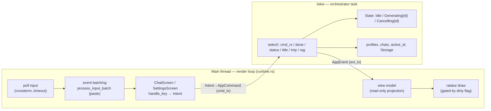

### Commands and events (the contract)

`AppCommand` (UI → orchestrator) includes: `SendMessage`, `SetDraft`,
`SetFeedView` (which of the feed's foldable blocks are expanded — stored per
chat, the `SetDraft` playbook, §11.3 of the spec),
`RegenerateLast`, `DeleteLastExchange`, `Cancel`, `Impersonate`/
`CancelImpersonation`, `NewChat`, `SwitchChat`, `RenameChat`/`AutoRenameChat`,
`CloneChat`, `CopyChat`, `DeleteChat`, `CreateProfile`/`DeleteProfile`,
`UpdateConfig`/`UpdateProfile`, `RagAdd`/`RagDelete`,
`FileAttach`/`FileRemove`/`FileList`, `SearchChats` (a **raw** content query from
the chat list — escaping it is the orchestrator's job, so that rule lives in one
place), `SearchMessages` (the same raw query answered at **message** level — the
`Ctrl+G` screen), `OpenChatAt { chat, message }` (activate a chat **and put the
feed on one of its messages** — a jump from a search hit) and
`OpenChatAtFirstMatch { chat, query }` (`Enter` in the list's content mode; the
orchestrator resolves *which* message, since only it holds both the index and the
chat and can therefore order the matches by real chat position),
`Tts`/`TtsStop`, `Compact` (fold the earlier part of the active chat into a
rolling summary — §6.7 of the spec), `Quit`.

`AppEvent` (orchestrator → UI) includes: `ServerStatus`, `ChatList`,
`ChatRenamed`, `ChatSearchResults` (the reply to `SearchChats`: the chats with at
least one matching message, plus the query echoed back; `chat_ids: None` means
"not a searchable query — do not filter", deliberately an `Option` so the event
can never claim that *every* chat matched), `MessageSearchResults` (the reply to
`SearchMessages`: the matching messages **grouped by chat** — chats in the list's
order, messages in chat order — each with a snippet built in Rust and the matched
byte ranges to highlight, plus the echoed query and a `total` that may exceed the
hits carried, since they are capped at `HIT_CAP`; the screen shows "showing N of
M" rather than truncating silently), `ChatListError`, `CopyToClipboard`,
`ProfileList`, `Settings`,
`ChatActivated` (which carries `feed_view` — the chat's stored collapse state,
the counterpart of `draft` for the view — and an optional `focus: Option<Uuid>` — the message to
put the feed on; `None` for every activation but a jump), `CharacterNames` (the active chat profile's role names for the
feed's headers — sent on activation and after a profile edit, §10 of the spec),
`UserMessage`, `RestoreInput`, `GenerationStarted`, `Chunk`,
`Thoughts`, `TokenUsage`, `ToolCall`, `AssistantContinue`/`AssistantRewrite`
(conversation control tools — §8), `Finished`,
`Impersonation{Started,Chunk,Finished}`, `RagProgress`, `FileProgress`
(the outcome of a `/file` command) and `Attachments` (the active chat's
attachment cards for the status-bar chip — §9.7 of the spec), `SelfModelView`,
`SelfModelChanged` (a lightweight "self-model changed" signal — an open `F3`
screen re-requests the snapshot; §9.7), `BackgroundTask{kind,active}` (a quiet
status-bar indicator for background reflection/consolidation/compression), `TtsActive`
(speech synthesis is running — a "♪ speaking" chip in the status bar; §11.9),
`Error`, `Notice` (a plain informational note in the feed — the
counterpart of `Error` for an outcome that is not a failure) and `Compacted`
(a rolling summary was made: the feed draws its boundary divider; `chat.messages`
is unchanged, so nothing else moves).

`TokenUsage { completion, context, context_exact, reasoning }` — the live token
counter: the reply (`completion`, accumulated across agentic-loop rounds) and the
conversation/prompt (`context`). Dual source: a live approximation from the number
of streamed deltas, plus an exact count from the server's `usage` block (requested
via `stream_options.include_usage=true`; arrives as a final `ChatChunk::Usage`
chunk). Before `usage` arrives, the conversation count is shown as a client-side
estimate (`shared/tokens.rs`, a "UTF-8 bytes / 4" heuristic) marked `~`; the exact
`prompt_tokens` replaces it. The status bar shows the sum as a single number.
`reasoning` is the reasoning-token count for "thoughts" (included in `completion`),
known only from `usage` (`None` — leave the previous value alone); reasoning
providers supply it (OpenAI Responses `output_tokens_details.reasoning_tokens`,
OpenAI-compat/llama.cpp `completion_tokens_details.reasoning_tokens`; Anthropic
doesn't split it out → `0`). When `>0` the status bar shows a "(reasoning N)" note
next to the sum.

### Flow invariants

- **Command serialization.** The orchestrator is a single `tokio` task with a
  `select!` over its channels; commands are processed strictly sequentially. No
  memory races — owned values (clones/snapshots) are passed through the channels.
- **`generation_id`.** Every generation run gets a `Uuid`; every streaming event
  carries it. The UI drops events with a stale id — closing the classic race
  "Stop → immediately Send/Regenerate → the old stream's tail arrives late".
- **dirty redraw.** `runtime.rs` draws a frame only on change (an applied event,
  input/mouse/resize, a dictionary reload, a spellcheck recompute). Nothing is
  redrawn while idle — otherwise `ratatui` would reposition the cursor every tick
  and throw off its blink phase. The loop body still spins every tick and wakes
  debounced deferred actions (spellcheck recheck, RAG/impersonation spinner
  animation).
- **Atomic frame (DEC 2026).** Every `terminal.draw` is wrapped in
  `BeginSynchronizedUpdate`/`EndSynchronizedUpdate` (CSI `?2026h`/`?2026l`): the
  terminal applies the frame as a whole, so the hardware cursor is never visible
  in an intermediate state while the diff is being written. Without this, during
  streaming/animations it would "jump" between the input box and the last written
  cell (the token counter / RAG spinner) — ratatui repositions the cursor with
  separate writes after the diff. Terminals without 2026 support (conhost) ignore
  the mode — a graceful degradation; `?2026l` is duplicated in the panic hook and
  on exit. See spec §4.4.1.
- **Feed positions are derived, never stored.** A jump and in-feed search both
  need a scroll row, and a row is only knowable inside `MessageFeed::render`: the
  per-block cache it is measured against is filled by `build_lines` at the current
  width, so nothing outside can compute one (see docs/history/chat-search-stage2.md
  §1.1). Both therefore work as **pending requests consumed by the next render**,
  and both re-derive their row on every frame rather than keeping it — which is what
  lets them survive the rewrap a resize forces. The jump anchors to a *message*
  (fork S6 refused to store an intra-block offset); in-feed search resolves the
  *matched line*, which is only affordable because it is re-derived rather than
  stored. Both accumulate the row **through the wrap**, so they stay correct if the
  second wrap ever stops being an identity.
- **The searched query is deliberately not in `CacheKey`.** It used to be, and a
  key mismatch clears every block — so changing it re-ran markdown + syntect over
  the whole chat. Since in-feed search types into a field, that would have been the
  price of each keystroke; the highlight is applied *after* the cache instead, to
  the lines handed to the renderer. Measured on the largest real chat: 17 ms (a warm
  frame) against 39 ms. The **marker** stays in the key, correctly — it changes the
  rail colour, which is baked into the block. See docs/history/in-feed-search.md §1.2.
- **Full redraw (wide glyphs).** A wide emoji occupies two cells — its own and a
  **tail** cell, which `ratatui` resets to default. When the glyph disappears, the
  tail stays a default space in both buffers, the diff considers it unchanged and
  skips it, and conhost doesn't clear the second half itself → a "dangling"
  artifact. Fixed by a full redraw: `prime_full_redraw` (`shared/ui.rs`) marks the
  buffer, and the loop rewrites every cell. Triggers are: a feed change/scroll
  involving risk-group glyphs (`ChatScreen::mark_feed_changed`,
  `feed::is_risky_glyph`) and **closing** the emoji/spellcheck popups.
  **Boundary with upstream:** `ratatui-core` 0.1.2 (ratatui#2585) sends the tail
  itself, but only when a wide glyph is replaced by narrower content AND it carried
  a style visible on an empty cell (background, `REVERSED`/`UNDERLINED`/`BLINK`/
  `CROSSED_OUT`) — unstyled glyphs remain our responsibility. We don't trigger a
  redraw on **selection move**: the glyph stays wide, and the sentinel can't write
  into its tail (the backend would print the second half without a `MoveTo` and
  shift the row — open ratatui#2651), so there's no benefit there — reprinting the
  glyph itself clears the background. Both boundaries are pinned by the canary
  `widgets::emoji_picker::upstream_repaints_styled_tail_on_close_but_not_on_selection_move`:
  if it fails, upstream moved the boundary and the workaround needs revisiting.
- **A feed jump can only be applied inside `render`.** Turning a feed index into a
  scroll row needs the per-block render cache measured at the current panel width,
  and neither the width nor the cache exists outside `MessageFeed::render` — the
  cache is filled by `build_lines`, keyed on width and palette. So "put the view on
  message N" cannot be a scroll setter called from `activate_chat`: it is
  necessarily a **deferred request consumed by the next render**
  (`pending_focus`). The row is then accumulated *through* the wrap pass rather
  than read off the cache, so it stays correct if the second pass ever stops being
  an identity. The link back from a feed position to a `Message` is
  `FeedMessage::message_ids`, recorded inside `from_messages` **at the merge site**:
  that projection folds an agentic round's assistant messages many-to-one and drops
  `Tool`/`System` messages, so the mapping is unrecoverable after the fact (the live
  streaming path pushes `FeedMessage` literals and never goes through
  `from_messages`, so the in-flight bubble has no id by construction).
- **Anchor and marker are separate fields, deliberately.** A jump sets three:
  `pending_focus` (consumed by the next render), `anchor` — the feed index the view
  position is tied to, used to re-derive the row after a rewrap invalidates every
  row offset (resize, theme, `Ctrl+T`), released by a manual scroll — and `marker`,
  the accent rail saying where you landed, which **survives scrolling** and is
  dropped only on a chat change or another jump. Only `marker` is in the feed's
  `CacheKey`, because its color is baked into the cached block. Merging the two was
  measured and rejected: keying the cache on something a manual scroll clears cost a
  full markdown+syntect rebuild on the first scroll after a jump (38 ms against
  17 ms on the largest real chat, scaling linearly with chat size) — and since
  `scroll_to_bottom` would have been what cleared it, **every send** would have
  re-rendered the whole chat. Anchoring to an index rather than a row is what makes
  a jumped-to position survive a resize; today only tail-following survives one
  otherwise (`src/app/` has no `Resize` arm — the cache is wiped and `scroll` keeps
  a stale number that is merely re-clamped). See
  [docs/history/chat-search-stage2.md](history/chat-search-stage2.md) §1.
- **Input batching.** A large clipboard paste on Windows arrives as ordinary
  character-by-character `KeyEvent`s (crossterm's bracketed paste only works on
  unix); `process_input_batch` coalesces a run of text keys (≥2) into
  `Chunk::Paste`, fixing both the slowdown and a spurious send on `Enter` inside a
  paste.

---

## 5. Generation lifecycle and the client-side agentic loop

The per-active-chat state machine lives in `GenState`
([`app/gen_state.rs`](../src/app/gen_state.rs)): a pure type with
correct-by-construction transitions (`begin`/`request_cancel`/`finish`); the
orchestrator only calls them and runs the side effects around them.

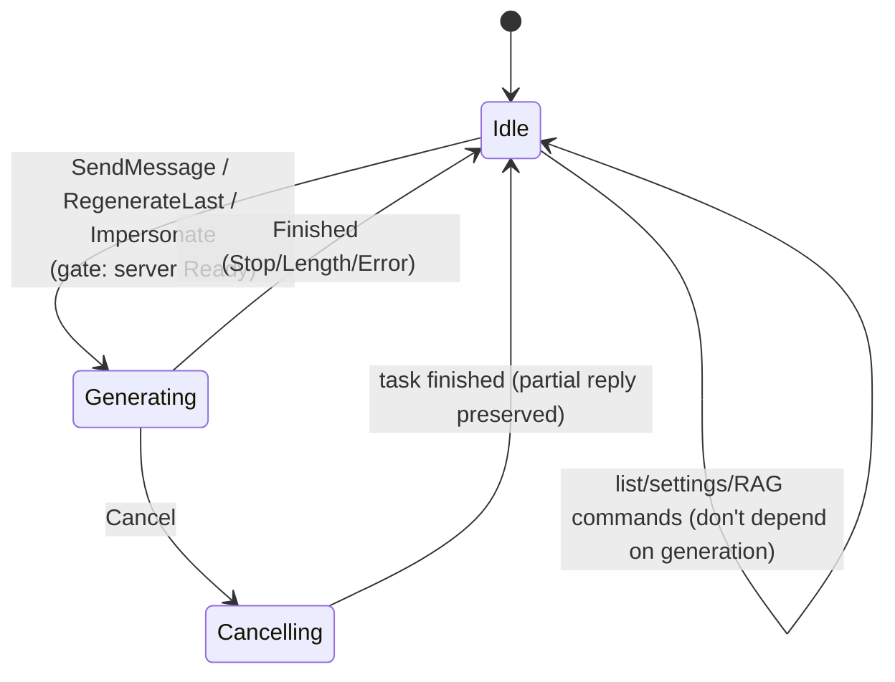

Generation itself runs in a **separate `tokio` task**, which streams
`AppEvent`s to the UI directly and returns the result (new domain messages +
tool effects) to the orchestrator through an internal `done_tx` channel (type
`GenResult`). The orchestrator — the sole owner of `Chat` — appends the
messages and applies the effects itself.

**Client-side agentic loop** (spec §6.3): the server doesn't execute our tools,
so the orchestrator drives the loop between HTTP rounds.

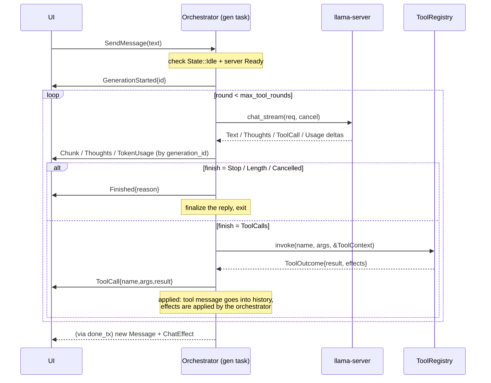

Details:

- `max_tool_rounds` (default **8**) — protects against looping forever.
- **Server readiness gate.** Sending/regenerating/impersonating only start in
  `ServerStatus::Ready`. The probe hits `/health` (outside `/v1`): `200` —
  ready, `503 Loading model` — still loading (not ready), `404` — a server
  without `/health`, treated as alive. This keeps the first request from going
  to a still-loading managed server and failing with `503`. When not ready, the
  text is put back into the input box
  (`RestoreInput`).
- **"Thoughts" (CoT).** llama.cpp: `delta.reasoning_content` (`llama-server
  --reasoning-format`) → `ChatChunk::Thoughts`; the fallback path is a streaming
  parser for `<think>…</think>` (`shared/api/thoughts.rs`), which stitches the
  tags across chunk boundaries. **Anthropic (Claude):** `wire::build_request`
  sends `thinking:{type:"adaptive", display:"summarized"}` when
  `sampling.thinking==Some(true)` (+ `output_config.effort` from
  `reasoning_effort`); we **don't** send `budget_tokens`/`reasoning_budget` — the
  4.x models reject them (`400`). `thinking_delta`→`Thoughts`,
  `signature_delta`→`ChatChunk::ThoughtsSignature`. **OpenAI Responses:**
  `reasoning.summary` (we send `"detailed"` — more reliable than `"auto"`) →
  `response.reasoning_summary_text.delta` (and `response.reasoning_text.delta`) →
  `Thoughts`; depth is set via `reasoning.effort` (`ReasoningEffort` includes
  `minimal`/`xhigh`). **Summaries are only delivered to verified OpenAI
  organizations** — otherwise the "thoughts" stream is empty (raw CoT is never
  delivered). `supported_sampling_fields(OpenAi)` =
  `max_tokens`+`thinking`+`reasoning_effort`+`verbosity`.
  **Gemini (native `generateContent`):** `generationConfig.thinkingConfig.
  includeThoughts:true` → parts `{text, thought:true}` → `Thoughts`; depth is
  `thinkingLevel` (3.x: `minimal/low/medium/high`) or `thinkingBudget` (2.5,
  tokens), generation inferred from the model name; `reasoning_budget==0` mutes it
  (2.5 Flash — `0`, 2.5 Pro — minimum `128`, 3.x — `minimal`).
  `usageMetadata.thoughtsTokenCount` → `reasoning_tokens`.
  `supported_sampling_fields(Gemini)` = `temperature`/`top_p`/`top_k`/`max_tokens`/
  `seed`/`frequency_penalty`/`presence_penalty`+`thinking`/`reasoning_effort`.
  Blocks (`promptFeedback.blockReason`, a `finishReason` like `SAFETY`/
  `RECITATION`) surface as a note in the feed, instead of a silently empty `Stop`.
- **Reasoning re-send on tool use** (a shared mechanism for Anthropic and OpenAI
  Responses). Both providers require the reasoning to be sent back along with the
  tool call in the same turn (otherwise `400`/quality drop):
  `ChatChunk::ThoughtsSignature(ThinkingRef{id, signature})` — only OpenAI carries
  an `id` (the `rs_…` reasoning element); Anthropic's is `None`. The agentic loop
  accumulates the round's `ThinkingRef` and attaches `ApiMessage.thinking`
  (`with_thinking`, `ThinkingBlock{text,signature,id}`) to the turn with the calls.
  Anthropic: `build_messages` puts `AntBlock::Thinking` **first** in the assistant
  turn; OpenAI Responses: `build_input` puts the reasoning element
  (`id`+`encrypted_content`) **before** its `function_call`. It only lives in the
  turn's memory (between turns both providers auto-drop old thinking → not
  persisted). `supported_sampling_fields(Claude)` = `max_tokens`+`thinking`+
  `reasoning_effort`.
- **Gemini thought signatures are per-tool-call and persisted** (unlike the
  mechanism above). For Gemini, `thoughtSignature` is bound to a **specific**
  `functionCall`, not one per turn, and for Gemini 3 it's **required** on
  historical calls (otherwise `400`). So `ThinkingRef`/`ThinkingBlock` aren't used
  — instead a `thought_signature` field lives on the call itself:
  `ToolCallDelta`→`ApiToolCall` (the client fills it from the part, the
  accumulator collects it by index) and it's **persisted** in `ToolCallRecord`
  (`#[serde(default,skip_serializing_if)]`, no migration). Within one generation
  the signature travels through `out.calls`; between generations, through
  persistence (`record_to_api`); `wire::build_contents` resends it alongside
  `functionCall`. Confirmed against live Gemini 3.1 Pro (round trip without
  `400`).
- **Engine failures reach the feed** (spec §6.8). `stream_round` handles both paths
  — the pre-stream `Err` and the in-stream `ChatChunk::Error` — through one
  `engine_error_key`/`engine_error_note` pair, so they cannot describe the same
  condition differently. Four answers: the two overflow messages of §6.7,
  `ui.err.generation_interrupted` when text or "thoughts" had already been
  streamed (the reply is a fragment — say so and name `Ctrl+R`), and
  `ui.err.generation_failed` otherwise. The partial reply is still finalized and
  persisted, as before; what is new is that the feed says why it stopped.
- **EOS.** Stopping is strictly by the model's special-token id (server-side); the
  application **doesn't send** a text-based EOS `stop` string (anti-self-abort).
- **Regeneration** truncates history through the last user message inclusive
  and restarts `start_generation`; **deleting the last exchange** removes the
  last user+assistant pair and returns the user's text to the input box.

---

## 6. Engine layer (`shared/api`)

The transport is hidden behind two traits — this gives engine swappability,
multi-provider support, and mocking in tests. Three modules are shared by
every client: **`error`** (`EngineError` — status, `Retry-After` and the
provider's body kept as fields; `check_status`; the transient/permanent
classification), **`http`** (one `reqwest::Client` with a 10 s **connect**
timeout, and `send_cancellable`, which puts the initial POST inside the
cancellation token's reach) and **`retry`** (`RetryBackend`, below) — see
spec §6.8. The rest is laid out by family
([ADR 0004](decisions/0004-engine-contract-multi-provider.md)): **`contract`**
(provider-agnostic traits and types), **`openai`** (two protocols in the
family: `client`+`wire` — Chat Completions for local/external `llama-server`/
a proxy **and for the xAI Grok cloud**; `responses` — the Responses API for the
OpenAI cloud), **`gemini`** (native `generateContent` for the Google Gemini
cloud), **`anthropic`** (Claude, Messages API), **`managed`** (launching a child
`llama-server`).

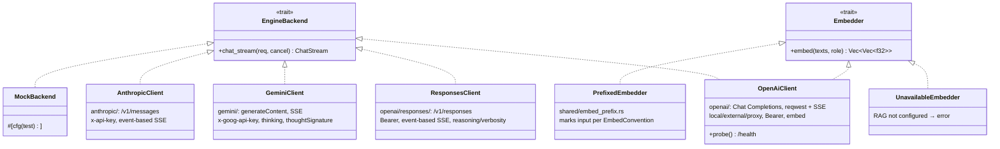

The provider is picked in settings via a single mode selector (`managed`/
`external`/`openai`/`gemini`/`claude`); the API key is either **entered in
settings** (stored encrypted with the machine key, `shared/secrets.rs` — see
§12) or given as an **env-variable name** (fallback); the secret never lands on
disk in plaintext. The `model` field is required for the cloud — the backend
itself fills it in (the domain `ChatRequest` doesn't carry a model). Mapping
between mode and backend/protocol:

| Mode | Backend | Protocol | Sampling (`supported_sampling_fields`) |
|---|---|---|---|
| managed / external | `OpenAiClient` | Chat Completions | the full set (llama.cpp extensions) |
| **gemini** | **`GeminiClient`** | **native `generateContent`** | `temperature`/`top_p`/`top_k`/penalties/`seed`/`max_tokens`+`thinking`/`reasoning_effort` |
| **openai** | **`ResponsesClient`** | **Responses (`/v1/responses`)** | `max_tokens`+`thinking`+`reasoning_effort`+`verbosity` |
| claude | `AnthropicClient` | Messages (`/v1/messages`) | `max_tokens`+`thinking`+`reasoning_effort` |

**Chat Completions sampling** (`OpenAiClient`): there's no more dialect/filtering
— all fields are sent as-is (llama.cpp ignores what it doesn't know; the clouds
moved to their own protocols, `WireDialect` was removed). The **OpenAI** cloud
runs on Responses (`ResponsesClient`): the system message → top-level
`instructions`, history → an `input` array of elements,
`max_tokens`→`max_output_tokens`, `store:false`, a flat function-tool with
`strict:false`; reasoning summary/`effort`/`verbosity` (see "Thoughts (CoT)").
The **Gemini** cloud runs on native `generateContent` (`GeminiClient`): system →
top-level `systemInstruction`, `user`/`model` roles (a tool result →
`functionResponse` in user), a call → `functionCall` (an args object, no
`call_id`), `thinkingConfig`; the `thoughtSignature` thought signature is
per-tool-call (persisted). `AnthropicClient` sends only `max_tokens` from
sampling + extended thinking (`thinking`/`reasoning_effort` → adaptive; Claude
4.x rejects temperature/top_p/top_k and `budget_tokens`). The **Grok** cloud
(xAI) is the exception that needs no client of its own: its Chat Completions
endpoint already streams reasoning in `delta.reasoning_content` — the field
`OpenAiClient` parses for llama.cpp — and takes a tool result back with no
thinking signature at all, so `cloud_chat_setup` hands it a plain `OpenAiClient`
(key + model + `with_effort_none_omitted`, since xAI rejects the *value*
`reasoning_effort:"none"` the auxiliary turns ask for). `supported_sampling_fields(Grok)`
= `temperature`/`top_p`/`max_tokens`/`seed` + reasoning: the penalties are a hard
`400` there and `top_k`/`min_p` are dropped silently. See
docs/research/grok-xai-provider.md. Anthropic, xAI and Responses have no
embeddings — only `OpenAiClient` implements `Embedder` (RAG uses a separate one,
ADR 0002). External gained an optional `api_key_env` (a Bearer key for an
OpenAI-compatible proxy/gateway).

- **`ChatRequest`** = `system` + `messages` (user/assistant/tool, including
  `tool_calls` and tool results) + `sampling` + `tools`. History is append-only →
  a local server reuses the prefix cache. Each backend translates it into its
  own wire format (OpenAI Chat Completions or Anthropic Messages: system →
  top-level, tool results → `tool_result` blocks in user, adjacent roles
  merged).
- **`ApiMessage.images`** (`Vec<ApiImage>`: mime + base64 `Arc<str>` + a label
  part) carries image input (spec §9.10). `Arc` because `RetryBackend` clones the
  whole request per attempt. In the Chat Completions family (llama.cpp **and**
  xAI, whose shapes are byte-identical) `WireMessage.content` is an untagged
  `Text(String) | Parts(Vec<Value>)`, and **parts are emitted only when a message
  has images** — a text-only request stays byte-identical to what the client sent
  before the feature, which the prefix cache and Gemma's two template branches
  both depend on (pinned by `a_text_only_request_is_unchanged_by_the_image_support`).
  The other three formats follow the same rule in their own dialects:
  `AntBlock::Image{source:{type:"base64",media_type,data}}` (Anthropic),
  an `inline_data` part (Gemini), and `input_image` with a `data:` URI inside a
  `content` array (Responses) — each with its own "text-only is unchanged" test.
  Every backend puts **images before text**, and each image behind a label part
  built in the app layer (axis A), so one prompt behaves the same wherever it
  goes. A **tool result** may carry images too (spec §9.10): there the result
  text leads and the images follow it, inside the tool result itself — except on
  **Gemini**, whose multimodal `functionResponse` is a hard `400`, so its builder
  emits them as user parts immediately after the response. The choice is static
  per provider; a request with no images serializes byte-identically to before in
  all four formats, each with its own test.
- **`EngineBackend::vision() -> VisionSupport`** (`Unknown` by default,
  `Supported`/`Unsupported`) — the same "engine knowledge belongs on the engine
  contract" shape as `context_budget`, and delegated by `RetryBackend` for the
  same reason. `OpenAiClient` answers from the `/props` fetch it already makes
  (`modalities.vision`); the clouds answer statically; anything without `/props`
  stays `Unknown`, which the orchestrator treats optimistically. Managed servers
  gain `--mmproj` (`ManagedConfig`, with the missing-file preflight `-md` has).
- **`ChatChunk`** = `Text` | `Thoughts` | `ThoughtsSignature(ThinkingRef)` |
  `ToolCall(ToolCallDelta)` | `Usage(TokenUsage)` | `Error{message,transient}` |
  `Finished`. `Error` is the stream's error channel: a failure that arrives after
  the response cannot be an `Err` (the caller holds the stream), so each client
  yields it right before `Finished(Error)` — Anthropic's in-stream `error` event,
  a Gemini error payload, an OpenAI-shaped error object inside a llama.cpp `200`
  stream, or a dropped connection. `transient` is the retry verdict (spec §6.8);
  nothing consumes it until the retry decorator lands.
  `ToolCallAccumulator` collects calls split across chunks by `index`; `Usage`
  (`prompt_tokens`/`completion_tokens`) arrives as a final chunk when
  `stream_options.include_usage=true` — the token counter. `ThoughtsSignature`
  is emitted by **Anthropic** (a thinking-block signature) and **OpenAI
  Responses** (a reasoning element `id`+`encrypted_content`) — one signature per
  turn. **Gemini** doesn't send its signature through `ThoughtsSignature`: it's
  per-tool-call, riding the `ToolCallDelta.thought_signature`→`ApiToolCall`→
  `ToolCallRecord` field (persisted). Other backends don't emit signatures.
- **`RetryBackend`** (`retry.rs`) is an `EngineBackend` **decorator**, applied by
  the supervisor to the **cloud** and **external** backends only (`cloud_chat_setup`
  and `external_chat_setup`; managed is left bare — the health monitor and
  `RestartBudget` own its recovery). It re-issues a request only while the turn is
  *uncommitted* — nothing but `Usage` has been yielded — so a round that emitted a
  tool call can never be replayed, and tool effects cannot double-fire. Attempt 1
  runs **eagerly**, before the stream is returned, which is what preserves the
  pre-decorator contract: a failure that will not be retried is still an `Err` for a
  pre-stream failure and an `Error` chunk for an in-stream one. Only once a wait is
  unavoidable does it return the stream and continue inside it, emitting
  `ChatChunk::Retry` *before* sleeping (interruptibly, via the turn's
  `CancellationToken`) so the UI can show the wait while it happens. Policy —
  constants in the module: 3 attempts, ~1 s/~2 s with downward jitter,
  `Retry-After` honoured up to 30 s. `context_budget` is delegated, which
  auto-compaction depends on (spec §6.7). See spec §6.8 and
  docs/research/cloud-retry-backoff.md.
- **`ServerHandle`** (`managed.rs`) owns the child `llama-server`: the `Child`
  is handed to a **monitor task** (`spawn_monitor`), which `select!`s between
  its exit (raising an `exited` token) and a `kill` signal (raised in the
  handle's `Drop` → `start_kill`; `kill_on_drop` is kept as a backstop).
  `build_args` assembles the CLI (`-m`, `-ngl`, `-c`, `--jinja`, `--no-mmap`,
  `--flash-attn`; speculative decoding `--spec-type` + draft `-md`/`-ngld`/
  `--spec-draft-n-max`/`-n-min`; for embeddings — `--embeddings -ub <ctx> -b
  <ctx>`). Optional flags are added only when set (unset → llama.cpp default);
  `FlashAttn`/`SpecType` are enums in `shared/config`, arriving in
  `ManagedConfig` as primitives (like `reasoning_format`) — the supervisor
  converts the enum to a string.
  **Preflight:** if `model_path` (or the draft `-md`) is set but the file
  doesn't exist — `bail!` before `spawn`.
  **Early exit:** if the file is valid but the process dies *while* loading
  (a corrupt GGUF, OOM), the monitor raises `exited`, and
  `wait_until_ready(..., exited)` stops polling right away with a clear error —
  instead of waiting out the timeout (which would otherwise hang in
  "connecting…" until `MANAGED_READY_TIMEOUT=600s`).

### Server management — `ServerSupervisor` (`app/supervisor.rs`)

The supervisor lives in `app` (composition glue that knows about both
`shared/config` and `shared/api`). It's behind a trait for `MockSupervisor` in
tests (returns `Ready` synchronously, so tests don't depend on a status race).

On the orchestrator side, server lifecycle is encapsulated in
**`EngineManager`** (`app/orchestrator/engines.rs`, Phase 3): it owns the
engines (`backend`/`imp_backend`/`embedder`), handles for managed processes,
readiness statuses and probe channels; it exposes `apply_chat/embed/
impersonation`, `backend_if_ready`, `impersonation_backend_if_ready`,
`embedder()`. This removed ~11 fields from `Orchestrator` (27 → 16) without
affecting the "sole owner of `Chat`" invariant.

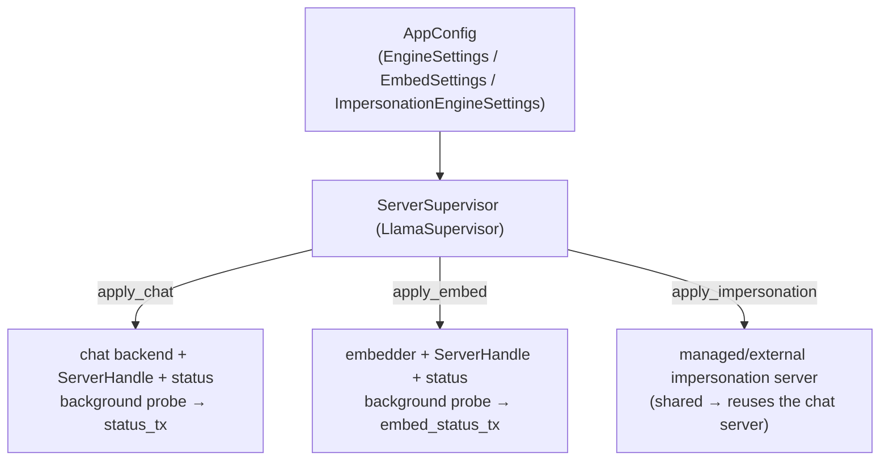

Two modes from settings: **managed** (the application launches a child
`llama-server`, waits for `/health`, kills it on exit) and **external**
(connects to any already-running OpenAI-compatible server). Changing the model
in settings = restarting the server; changing embeddings settings re-launches
the embedding server. Restarts are **debounced**
(`orchestrator/restart_queue.rs`, 1.2s of quiet): the settings screen applies
an edit on every field commit, and a series of "binary → model → -ngl" edits
coalesces into one restart with the final values; the config is still saved
and re-emitted to the UI right away. The initial server startup is immediate,
no debounce.

**Embeddings run on a dedicated server**
([ADR 0002](decisions/0002-embeddings-dedicated-server.md)): a separate
process/port, with the `Embedder` trait split off from `EngineBackend`. Not
configured → `UnavailableEmbedder` (RAG returns a clear error instead of
crashing).

All three servers are probed the same way: `apply_*` returns an **immediate**
status (`Connecting`, or `Disconnected` when the launch itself fails) and a
background monitor posts the real one to its own channel — the orchestrator's
`run` loop translates each into `AppEvent::ServerStatus`. Stale monitors are
invalidated by a per-server `CancellationToken` (a quick sequence of settings
edits mustn't let the previous server's late verdict overwrite the new one's).
The **cloud** has nothing to load and no `/health` — it's `Ready` at once, with
no monitor.

The monitor doesn't stop at the first verdict — it keeps watching, so a status
describes the present rather than the moment the server was configured
(docs/server-health-monitoring.md):

- **Cadence** — `HEALTHY_POLL` 60 s while healthy, `RECHECK_POLL` 5 s while down
  *or* while a failure streak is pending. Asymmetric because the stakes are: while
  healthy a poll buys little (the next real request would reveal a failure anyway),
  while down the poll **is** the recovery mechanism.
- **Hysteresis** — `Ready` → `Disconnected` takes `FAILURES_TO_UNHEALTHY` = 3
  consecutive failures; the way back takes one success. A single missed poll isn't
  evidence, and a chip that flickers teaches the user to ignore it; a success is
  self-proving. Only a *flip* is published, so a steady server never wakes the UI.
- **Managed child death** — the monitor also watches the `exited` token, so a
  crashed child is reported in ~150 ms instead of after a poll (measured).
- **Recovery** — this is the half users feel: before it, a server that wasn't up
  when the app started stayed unusable (the chat gate reads this status) until a
  restart or a settings edit.
- **Relaunch** — a dead *managed* child can only be revived by launching a new
  process, so `Orchestrator::relaunch_dead_managed_servers` re-`apply`s it under a
  crash-loop budget (`RestartBudget`: ≤3 per 5 min, reset on reaching `Ready`),
  mirroring `McpManager`. External/cloud servers are never relaunched — we don't
  own the process, and their monitor recovers them by itself.

The embeddings probe **doesn't** make RAG eager (ADR 0002): it's a `/health`
GET, and the embedder itself is still first touched on a real call. Without it
the status was derived from configuration alone and read `Ready` for an
unreachable host, so the failure only surfaced on the first `rag_search`. Unlike
the chat status, it **gates nothing** — it's informational (the chip in the
status bar and in the settings "Model" section); RAG's real degradation path is
still the error from the call itself. A probe also can't tell *which model*
answers — that's the canary's job (`embed_guard.rs`, spec §9.3.4).

---

## 7. Domain model and storage

Domain types (`entities/`) — no I/O, serde-serializable.

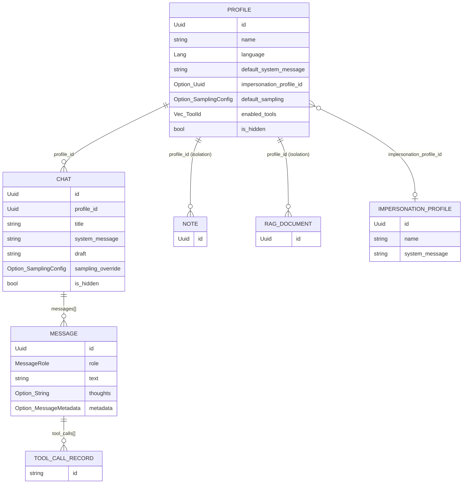

`IMPERSONATION_PROFILE` (the user persona for `Ctrl+U`, spec §11.8) is the one
domain list that lives **outside** `profiles.json` — in `AppConfig.
impersonation_profiles` (`settings.json`), next to the rest of the globally
configured impersonation (engine + sampling). Consequences: the settings screen
edits it through the ordinary config-save path (no dedicated commands/events, no
storage artifact), and the reference from `Profile` crosses files — a dangling id
is legal and reads as "not set" (falling back to the shared default text).

### Two-tier storage (`shared/storage`)

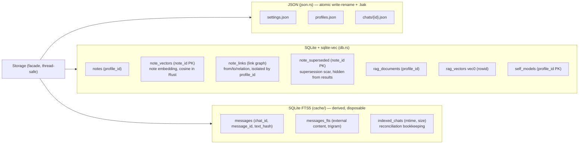

**A third file, and deliberately a separate one — `cache.db`** (`storage/cache/`,
spec §11.2): the full-text index behind the chat list's content search. It is a
second *database* rather than more tables in `data.db` because it is **derived
data, and that changes the rules.** `data.db` holds notes, the self-model and RAG
— irreplaceable content, hence the machinery below (steps inside transactions,
downgrade guards, pre-migration backups). An index needs **none** of it: a version
mismatch (`PRAGMA user_version` ≠ `CACHE_SCHEMA`), an unreadable file or a corrupt
schema is answered by *deleting the file and starting empty*, so `CacheDb::open`
self-heals instead of bailing — a disposable index must not be able to block
startup — and `CACHE_SCHEMA` is bumped freely, with no step and no ADR 0006
machinery at all. The separation pays elsewhere too: `features/backup.rs` includes
by **allowlist**, so a new file at the root stays out of archives with no code
change (a restore lands without an index and rebuilds it), and deleting it is a
documented repair rather than data loss. See
[docs/research/chat-content-search.md](research/chat-content-search.md) §2.

Storage invariants:

- **Isolation by `profile_id`** — a mandatory `WHERE profile_id = ?` in every
  notes/RAG query (covered by negative tests).
- **Soft delete** (`is_hidden`) everywhere: hiding a profile cascades to hide
  its chats and excludes notes/RAG from result sets. There's no physical
  delete.
- **A single writer** — the orchestrator. Chats are saved debounced (800ms,
  `save_deadline` + a `dirty` set); the write is atomic (write-rename), with a
  `.bak` backup.
- **The search index is derived, never authoritative.** `cache.db` answers only
  *which chats match*; the chats themselves are always read from `chats/*.json`,
  and nothing is ever recovered from the index. So every failure on its path is
  logged and swallowed (best effort): a search that misses a chat is a nuisance, a
  save that failed because of the index would be a bug. Sync rests on the
  single-writer invariant above — the orchestrator indexes a chat right after
  saving it, so only changes made **outside** the app (import, restore, a hand-
  edited file, a deleted cache) need the startup reconciliation pass, which is a
  stat-only walk comparing `(mtime, size)` against `indexed_chats`.
- **Embedding dimensionality** is fixed by the first `/v1/embeddings`
  response and stored in the sqlite-vec schema (`meta.rag_dim`), shared by the
  RAG base and the chat attachment index.
- **Embedding-model identity** is tracked alongside it, because dimensionality
  is *not* identity: two different 1024-d models pass every dimension check
  while living in different vector spaces. So `meta` also holds a fingerprint of
  the model the stored vectors were produced under — `embed_canary` (the
  embedding of a fixed string, the actual signal) and `embed_model_id` (its
  display name) — plus `rag_stale_profiles`, the knowledge bases a detected
  change invalidated. `EmbedGuard` compares the canary on the first embedding
  call and acts on a mismatch (spec §9.3.4); `reset_vectors` clears all four of
  those keys, since with no vectors left there is nothing to be stale relative
  to. All are `meta` keys, so adding them needed no schema bump.
- **The model's similarity range** is recorded next to its identity, for the same
  reason and on the same once-per-model path: the counter says *which* model the
  stored vectors came from, the calibration (`embed_cal_unrelated`/
  `embed_cal_paraphrase` — the two means of the fixed probe corpus, see
  `shared/embed_calibration.rs`) says what its cosines *mean*. The project's
  three memory gates are positions in the reference (bge-m3) scale, not absolute
  numbers, and are read through `Db::similarity_scale()` — **infallible**, because
  a threshold is needed on paths that cannot report a storage error and every
  failure has the same right answer: the identity, i.e. today's behaviour. Either
  half missing or unparseable reads as "never calibrated". `reset_vectors` clears
  it with the fingerprint ("start over"); `drop_vector_tables` deliberately keeps
  it, since by then the guard has already calibrated the model being re-embedded
  into.
- **The input convention** (`meta.embed_convention`) is the one **config-derived**
  component of embedding identity, and the one exception to "identity is
  behavioural". Marking input with `query:`/`passage:` genuinely changes the
  vector space, and the canary does detect it — but by as little as 0.0025 on a
  model whose passage marker barely moves the vector, so the id makes that exact.
  It can only *add* detections, never mask one, which is what separates it from
  the config-only fingerprint rejected in the earlier research. `EmbedGuard` runs
  the canary and the calibration **through** `PrefixedEmbedder`, so both are
  always measured in the same dressing real text gets; the canary carries
  `EmbedRole::Passage`, because stored vectors are all passage-role and a change
  to the *query* marker must therefore not force a reindex. See
  docs/research/embedding-input-prefixes.md §3–§4.
- **Per-row `embed_gen`** records *which* model produced a given vector, against
  the monotonic `meta.embed_gen` counter the guard bumps on a detected change:
  one increment retires the whole DB without deleting a row, so the stored text
  stays available to re-embed from. A row is stamped by its writer under the
  lock it already holds, which makes an unstamped vector impossible to write;
  readers ignore foreign generations, and the re-embed job (`/reindex`) drains
  them. `reset_vectors` deliberately leaves the counter alone — it is monotonic,
  and reusing a number would make a surviving old row read as current.
  The column is on the three **plain** tables only (`note_vectors`,
  `rag_documents`, `attachment_documents`): a `vec0` virtual table cannot take
  an `ALTER`, and each joins by `rowid` to a plain table that can. Added by a
  guarded `ALTER TABLE ... ADD COLUMN` in `baseline_ddl` (idempotent via
  `PRAGMA table_info`), **not** a `DB_SCHEMA` bump: a nullable column is
  additive and backward-compatible — every query names its columns explicitly,
  so an older binary ignores it — which is exactly the case ADR 0006 F12 says
  needs no bump, and a bump would force a pre-migration backup of `data.db` on
  every upgrade. Pre-existing rows carry `NULL` and are folded to a sentinel so
  they read as **foreign**, which matters because in a real user's database
  every row is one.

### Schema versioning and migrations ([ADR 0006](decisions/0006-data-schema-versioning.md))

Each artifact has its own schema version (per-artifact — they change at
different rates; all are currently 1). Ownership map:

- **`shared/storage/schema.rs`** — a pure Value-level scaffold (no I/O):
  constants `SETTINGS_SCHEMA`/`PROFILES_SCHEMA`/`CHAT_SCHEMA`/`DB_SCHEMA`,
  `Step` (`fn(Value)->Result<Value>`), `JsonArtifact` (`current` + structural
  `detect` + a `steps` chain), the `Assessment` verdict (`UpToDate`/`Migrate`/
  `Downgrade`), a registry.
- **`features/data_migration.rs`** — orchestration: file I/O, gates,
  pre-migration backup, control-parse. `run(paths, loc)` is called from
  `main.rs` **before** opening storage (for both the TUI and the CLI
  `import`). It lives in `features` (not `shared`) because the pre-migration
  backup is `features::backup`, and `shared` can't depend on `features`
  (FSD). This deviates from the design doc (migration doesn't live inside
  `Storage::open`) — to avoid threading `loc` through ~30 `Storage::open`
  test sites; the scaffold/constants still live in `shared`.

Invariants:

- **version detection is structural** (format doesn't change, zero churn):
  `settings.json` — the `schema_version` field; `profiles.json` — a bare
  array → 1, otherwise `schema_version`; `chats/<id>.json` — the `v` field
  (not written while the schema is 1);
- **eager at startup**: the plan = files with a version `< current`;
  non-empty → **one** pre-migration backup (`backups/pre-migrate-<date>.zip`)
  before any write → steps → control-parse (the migrated result fails to
  parse → abort, the file isn't overwritten) → an atomic write of the
  migrated `Value` (`json::write_json`, `pub(crate)`);
- **downgrade guard**: a version newer than the app → refuse to start
  (localized);
- **hardened reads**: a corrupt `settings.json`/`profiles.json` → refuse to
  start; a corrupt `chats/<id>.json` → skipped with a `warn`, the file is left
  untouched (`json.rs::load_chats`);
- while all schemas are 1 the plan is always empty (a dormant path, covered
  by a test against a synthetic `current = 2` artifact).

The SQLite branch (`db/mod.rs::migrate`, version-aware): `baseline_ddl`
(`CREATE … IF NOT EXISTS`) runs **every time** — an additive mechanism for
adding tables/indexes **without** a bump (additive DDL and `user_version` are
independent). A DB with `user_version = 0` is stamped with `DB_SCHEMA = 1`
(not a data migration → no backup); breaking steps `DB_STEPS` (empty) run
through `apply_db_steps` — **each in its own transaction alongside
`user_version`**, rolled back entirely on error; downgrade — `bail`.
`data_migration` coordinates SQLite with JSON at a single pre-migrate point:
`db::peek_user_version` + `db::needs_step_migration` before storage opens
give the downgrade guard and the shared backup (JSON **or** the DB needs
migration); the actual DB migration happens later, in `Db::open`. The DB
isn't open yet (quiescent) at backup time → its files (`data.db`+`-wal`+
`-shm`) are consistent in the shared zip **without** `rusqlite::backup`.

**Compaction** (`db::vacuum_into` / `db::vacuum`, used by `features/backup.rs`
on both the backup and restore paths — spec §12.3). Both work on a *file* with
a bare connection, deliberately not through `Db::open`: no migration runs, so
compacting neither writes a schema into someone else's database nor trips the
downgrade guard. Two properties are load-bearing and pinned by tests rather
than assumed. **`VACUUM` preserves `user_version` and explicit
`INTEGER PRIMARY KEY` rowids** — which is what keeps the `vec0` indexes
joinable (`rag_vectors.rowid = rag_documents.rowid`); renumbering would make
search silently return the wrong text. And **the backup must not modify the
source**: SQLite deletes a stale `data.db-wal` next to a file it reads as
zero-page (a VFS-level delete that read-only flags don't prevent), so a
non-database is refused by its header *before* being opened, and a real one is
opened read-only. Compaction is best effort throughout — a failure falls back
to packing/leaving the raw files.

### Three-tier sampling (`entities/sampling.rs`)

`resolve` resolves priority **at request time** (not as a snapshot at
creation): `Chat.sampling_override` → `Profile.default_sampling` → the global
`settings.json`. A snapshot of what was actually applied goes into
`Message.metadata`: the engine mode (`mode`), the model name (`model`), and
the sampling, **trimmed down to the fields available in that mode**
(`SamplingConfig::retain_supported`, mirroring the wire dialect — the engine
wouldn't have accepted an unavailable field anyway, so it's excluded from the
"what was applied" snapshot).

---

## 8. Tool system (`features/tools`)

The tool contract: a read-only snapshot + returned effects (no locks on
`Chat`).

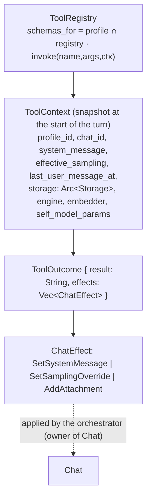

**`AddAttachment` and the turn snapshot.** Effects are applied to `Chat` when
the **turn** ends (`handle_done`), while `ToolContext.attachments` is a snapshot
taken at its start. For the scalar effects that is invisible; for an attachment
it is not, because the tool's own result tells the model to read the file with
`attachment_read` — which reads that snapshot. So the agentic loop mirrors the
round's `AddAttachment` effects into its own `ToolContext`
(`generation::sync_attachments`, once per round, applying the same
dedupe-by-source rule the orchestrator will), and the orchestrator persists them
through `insert_attachment` — the path `/file attach` takes. The loop still
never touches `Chat`: the invariant is intact, the snapshot is its own. See
spec §9.9, docs/history/youtube-transcript.md §3 F1.

The registry is built from `ToolConfig` (`standard_registry(&ToolConfig)`)
and rebuilt on `config.tools` edits. The effective tool set =
`Profile.enabled_tools` ∩ global toggles (`effective_tool_ids`); the agentic
loop **also gates the call itself** (a disabled tool is rejected).

**`ToolContext` construction** goes through `ToolContext::new(deps, params,
turn)` from three building blocks (the context's flat public fields are kept
— tool code like `ctx.storage`/`ctx.chunk_params`/… doesn't change):
`ToolDeps` (shared `Arc` dependencies — storage/engine/embedder; assembled in
the orchestrator via the `tool_deps` helper), `ToolParams` (a snapshot of
config parameters; the **only** place that maps `AppConfig` → parameters is
`ToolParams::from_config`), and `TurnInfo` (a turn snapshot: identity +
`Chat` fields). This way a new context field only touches one file
(`tools/mod.rs`) instead of every construction site. See
docs/history/refactoring-solid.md §3.

**Catalog metadata** (semantic group, short toggle label, global gate,
"enabled by default") is declared by **the tool itself** via the `Tool` trait
(`group()`/`ui_label()` — required, no default, → a new tool can't be added
without a group and label; `gate()`/`enabled_by_default()` — with defaults of
`None`/`true`). `meta.rs` carries only types (`ToolGroup`/`ToolGate`/
`ToolInfo`), not values. The UI catalog is a static `CATALOG` (a snapshot of
`ToolRegistry::infos()` on the default `ToolConfig`, since metadata doesn't
depend on config); `default_tool_ids`/`all_tool_ids`/`tool_catalog`/
`effective_tool_ids` are derived from it, and `screens/settings` consumes a
`Vec<ToolInfo>` (FSD: no live `Arc<dyn Tool>`). The catalog is ordered
alphabetically by id (the registry is a `BTreeMap`); the UI re-sorts toggles
by `ToolGroup` (`Ord`).

| Group          | Tools                                                          |
|----------------|-----------------------------------------------------------------|
| Memory/knowledge  | `note_save` (embeds + a compatibility gate), `note_recall` (semantic search + spreading activation over the graph, falls back to substring match; **hides `@self` self-notes**), `note_revise` (in-place edit), `note_link`/`note_neighbors` (typed link graph), `note_supersede`/`note_merge` (supersession with a scar / merge with link transfer; **inherit tags**, including `@self`), `consolidate_notes` (a consolidation overview), `rag_add`, `rag_search`. Notes connectivity (accumulation → integration) + auto "sleep": see [docs/notes-connectivity.md](history/notes-connectivity.md). Self-model observations are ordinary notes tagged `@self` ([docs/narrative-as-notes.md](history/narrative-as-notes.md), §9) |
| Introspection  | `get_sampling`, `set_sampling`, `get_system_message`, `set_system_message`, `get_last_user_message_time` |
| External       | `web_search` (multi-provider + anti-bot), `fetch_url` (fetch+summarize; a YouTube link → metadata + a pointer to `youtube_watch`), `youtube_watch` (what a video says **and shows** — its own Gemini slot, degrades to free metadata; `transcript: true` lands the words as a chat attachment; spec §9.9), `python_exec` (subprocess) — gated by `web_enabled`/`python_enabled` |
| Files          | `fs_read`, `fs_write`, `fs_list` — gated by `fs_enabled`, optional `fs_root` sandbox; `attachment_read` (one page of a file the user attached with `/file attach`) and `attachment_search` (by meaning, over the chat-scoped index) — **not gated and on by default**: unlike `fs_read` they *narrow* access to what the user explicitly attached, reading the stored snapshot/index rather than the disk. See spec §9.7 |
| Utilities      | `calculate` (our own expression evaluator), `current_time` (chrono) — no I/O, not gated |
| Awareness      | `call_subagent` (no history/tools, nesting forbidden) |
| Conversation control | `send_followup_message` / `rewrite_current_message` — **control flow** (optional, off by default): recognized by the agentic loop, not `Tool::invoke` |
| Self-model     | `get_self_model`, `reflect`, `update_self_model`, `update_user_model`, `add_insight` — **optional, off by default**: a per-profile "self-model" in SQLite (description + goals + a model of the interlocutor), written directly through `storage` (not via `ChatEffect`). Observations ("narrative") moved into `@self` notes — they're consolidated by note tools (`consolidate_narrative` was removed). **Details in §9** |
| Plugins (MCP)  | `mcp__<server>__<tool>` — **dynamic** `McpTool` wrappers around external MCP servers' tools (`features/tools/mcp.rs`; description/schema is a snapshot of the server, per-call timeout + `ctx.cancel` cancellation, result clipping). Not part of the static `CATALOG`: the registry is rebuilt on `McpManager` events (`rebuild_registry`), and the UI catalog rides an `McpSnapshot` inside `AppEvent::Settings`; the `effective_tool_ids` gate is by the `mcp__` prefix + `config.mcp.enabled`. Double opt-in + TOFU catalog pinning. See spec §9.6, ADR 0007 |

Implementation notes:

- **Call presentation in the feed** (`present.rs`, a pure layer with no
  ratatui) — how to show a specific tool's arguments/result instead of raw
  JSON: `present(name, arguments, result) → ToolPresentation` (a compact
  header suffix + `Code`/`Console`/`Markdown`/`Plain` blocks). `python_exec` —
  code as a highlighted Python block + a console (stdout/stderr/exit code in
  separate colors); `fs_read`/`fs_write` — content highlighted by the path's
  extension; prose tools (`web_search`/`fetch_url`/`note_recall`) — markdown,
  while the **fragment** tools (`rag_search`/`attachment_search`) deliberately
  stay `Plain`: their payload is verbatim pieces of the user's files, and
  markdown-parsing it let a block construct inside a fragment escape its list
  item (a heading on any line after the first split the fragment and rendered as
  a document heading mid-result — the common case, since `chunk_markdown`
  prepends a heading to every `*.md` chunk); short arguments — `name(value)` /
  `name(k=v, …)`. Tool-specific knowledge lives here (the tools layer); the
  `message_feed` widget stays generic and renders the blocks, reusing
  `markdown::highlight_code`. See spec §11.3–11.4.
- **`call_subagent`** — an independent single-turn request through
  `ctx.engine`: a given `system`, a single `user` message, `tools: []`
  (nesting forbidden), a token limit and a timeout.
- **Conversation control tools** (`send_followup_message` /
  `rewrite_current_message`, `features/tools/control.rs`) — not ordinary
  tools but **control flow**: recognized by the agentic loop itself
  (`generation.rs`), with the `Tool` implementations needed only for schema/
  registration/gating. `send_followup_message` starts a second message as a
  separate bubble (the `Message.new_bubble` flag); `rewrite_current_message`
  discards the started round into `Chat.deleted` and writes the reply again.
  Optional (not in `default_tool_ids`, present in the `all_tool_ids` catalog
  — profile toggles). The live stream ↔ reload cases are kept in sync via
  `AppEvent::AssistantContinue`/`AssistantRewrite`. See spec §9.3.3.
- **MCP server tools** — plugin tools over external stdio subprocesses (the
  "plugins" track, docs/research/plugin-system.md §4, ADR 0007). The protocol
  mini-client is `shared/mcp.rs` (the tools-only subset of the 2025-11-25
  revision: the `McpConnection` transport works over any `AsyncRead`/
  `AsyncWrite` — testable over a duplex; `McpClient` is a subprocess with a
  kill/exited monitor task modeled on `managed.rs` + a Job Object
  kill-on-close on Windows; the command is resolved as a shell would —
  `PATHEXT` completion, so one config works on every platform). Lifecycle is
  `McpManager` (`app/orchestrator/mcp.rs`, mirroring `EngineManager`):
  background spawn tasks send `Ready`/`Failed`/`Exited` events, epoch-guarded,
  into the loop's internal channel `run`; a restart budget (3 crashes/5 min);
  TOFU catalog pinning (sha256 of names+descriptions+schemas; a change →
  tools are held back until confirmed in settings, the pin is
  `config.mcp.servers[].pinned_catalog`, written by the orchestrator). The
  child's environment is resolved by the manager (`resolve_env`, the
  `EngineManager` precedent — decryption lives here, the spawn layer sees
  plaintext): a **stored secret** (ADR 0008, `mcp-<server>-<VAR>`) wins, the OS
  variable named in `env` is the fallback. Because a secret change alters no
  setting, `is_current` compares the **resolved environment** as well — otherwise
  the debounce would skip the re-apply and the server would keep the old value
  (docs/history/mcp-server-editor.md §9.1). Importing another client's
  `mcpServers` JSON is planned by `features/mcp_import.rs` and applied by the
  orchestrator, which is the only layer allowed to touch the literal secrets such
  a file carries. Call
  cancellation is `ToolContext.cancel` (a clone of the turn's token; the
  agentic loop additionally wraps any tool's `invoke` in a `select!` with it
  — Esc is never blocked).
- **`web_search`** — falls back across providers (DDG lite → DDG html →
  Mojeek → Ecosia); recognizes anti-bot throttling (HTTP 202/403/429) and
  switches providers instead of parsing an empty result set.
- **RAG** — smart overlapping chunking (`chunk_text`/`chunk_markdown`, sizes
  configurable via `config.rag`/`ChunkParams`); on retrieval, adjacent chunks
  are stitched together by their verbatim overlap (`stitch_hits`). Commands
  `/rag add|remove|list|rebuild`: add/remove files (background, cancellable
  indexing), view sources (chunk count+date), and reindex. Sources' original
  text is stored in `rag_sources` → `/rag rebuild` re-chunks/re-embeds
  without needing the files on disk (a chunk-size or embedding-model change;
  on a vector-dimensionality change the vector table is recreated, if no
  other profile shares the database). All isolated by profile.
- **Self-model (SelfModel)** — a per-profile "self-model" for the agent
  (description + goals + a model of the interlocutor + narrative) in SQLite;
  mutators write directly through `ctx.storage` (no `ChatEffect`), and the
  orchestrator mixes a snapshot into the system prompt. This is a separate
  cross-cutting mechanism — **covered in detail, with diagrams, in §9**
  (domain model, the read/write cycle, tool semantics, the maintenance
  protocol, auto-reflection, future directions).

---

## 9. Self-model (SelfModel)

**The "self-model"** is a per-profile, persistent representation of the
agent's sense of itself, its goals, and the interlocutor, living **across
chats**. The goal is to give the model **continuity and identity**: so that
in a second chat of the same profile it remembers who its interlocutor is,
what it's working toward, and what it's realized about itself. The mechanism
grew from an idea bank ([docs/self-model.md](history/self-model.md)) through
a shipped probe ([docs/self-model-mvp.md](history/self-model-mvp.md)) and two
rounds of fixes based on live testing on Opus 4.8 (log in
[docs/journal/self-model.md](journal/self-model.md)).

Key architectural stance: **the self-model is per-profile data in SQLite
(like notes/RAG), not `Chat` state.** So mutator tools write it **directly**
through `ctx.storage` (not via `ChatEffect`), and the "sole owner of `Chat`"
invariant (§11) isn't affected — there are no new `ChatEffect` variants. The
whole group is **optional** (off by default).

### 9.1 Domain model (`entities/self_model.rs`)

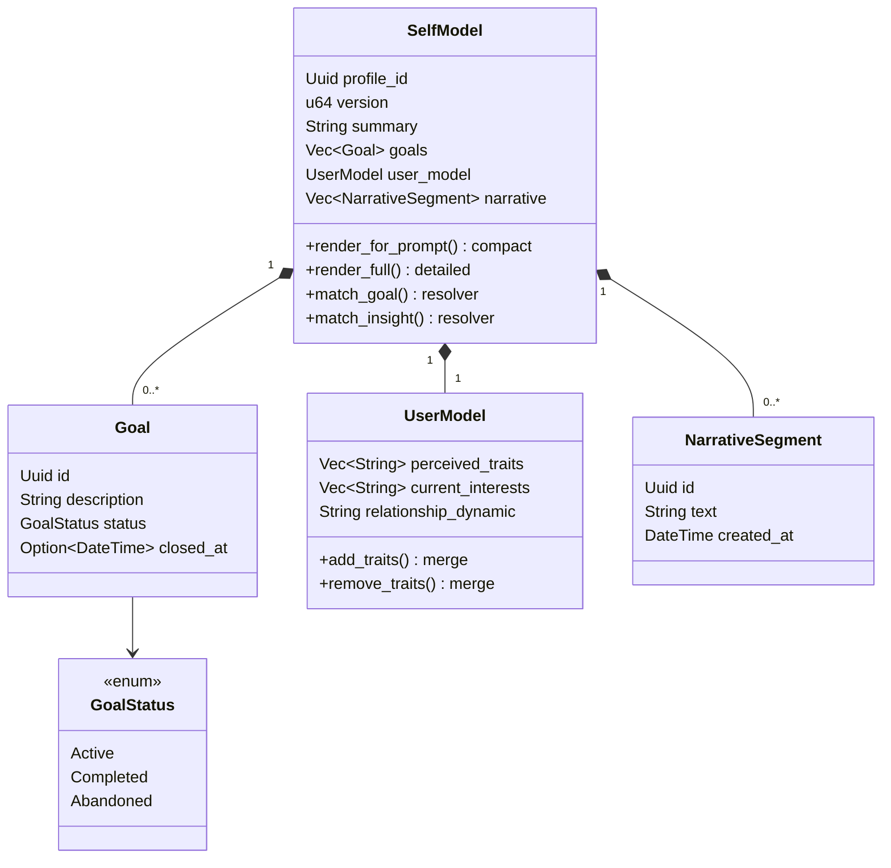

Four organs, each with its own role:

- **`summary`** — free-form "about me" text: a coherent self-description
  (who I am, what I value, how I behave). Edited by **integration** (refined),
  not overwritten from scratch.
- **`goals`** — long-term intentions with a **lifecycle** (`Active` →
  `Completed`/`Abandoned`). Closed goals are **not deleted** — kept as a
  "scar" of what was achieved/abandoned and shown in the full read.
- **`user_model`** — a stable, integrated model of the interlocutor:
  `perceived_traits`/`current_interests` (lists, edited by **merge**:
  add/remove with dedup) + `relationship_dynamic` (free text; **replacing a
  non-empty** dynamic is a significant revision, prompting a `note` scar,
  like removing traits). This is a **snapshot of current conclusions**, not a
  mood diary. It's also mixed into **impersonation** (`Ctrl+U`,
  `UserModel::render_for_impersonation`): the agent writes a reply *on behalf
  of* the human, and this is literally a model of that human — the same
  opt-in gate (`get_self_model`).
- **`narrative`** — a "biography of self over time": short insights/
  observations (including noticed contradictions and **revision scars** — in
  prose). It's the observations, not structured fields, that hold "what
  changed and why". **Observations moved into notes** (the `@self` tag, Tier
  1 [narrative-as-notes.md](history/narrative-as-notes.md)): the `narrative`
  field in the blob is kept only for one-time backfill and reconstructing the
  `F3` snapshot; writing/reading goes through notes (embeddings, duplicate
  gates, supersession, "sleep").

**Two render modes** (an important distinction found via live testing): both
take observations as a `recent: &[NarrativeSegment]` parameter (the caller
prepares self-notes via `notes::self_notes_recent`; the render is no longer
pure with respect to the narrative).

- `render_for_prompt(cap, n, now, recent)` — **compact, truncated** (per
  `prompt_cap`), active goals only, `n` recent observations. For **passive
  injection** into the system prompt (saving context window). **Per-section
  budget** (summary-as-snapshot, stage 3): the "About me" section is truncated
  to **half** the limit (`truncate_chars_word` — on a word boundary) so a
  bloated `summary` doesn't crowd goals/the interlocutor/observations out of
  the injection; a final truncation of the whole block is a backstop.
- `render_full(now, recent)` — **untruncated**: goals with a short `#id` and
  status (+ recently closed ones), all observations with a **full** id
  (observations are notes; `note_revise`/`note_supersede` rewrites/supersedes
  them by full id). For **tool reads** (`get_self_model`/`reflect`). The
  **edit echo** (`update_self_model`/`update_user_model`) does **not** use
  the full render — it's delta-compact (stage 4, §9.4 below).

**`summary` is a snapshot, not a chronicle** (summary-as-snapshot,
[docs/history/summary-as-snapshot.md](history/summary-as-snapshot.md)):
`summary` is kept a compact working snapshot ("who I am, what I value, how I
work"), while event-driven conclusions ("what I realized and when") go into
observations via `add_insight` **even the durable ones** — there they're
protected by duplicate gates, the graph, and relevance-based injection.
Discipline comes from **soft size gates** (`SelfModel::summary_fill_hint(target)`,
threshold `SelfModelSettings.summary_target_chars`, default 1000): once it
grows too large, a "shrink me, move event-driven content into observations"
hint shows up on read (`render_self_read`), in injection (a data-aware note
appended to the maintenance protocol), and in the edit echo (a size line). A
gate, not a cap — data isn't truncated; the decision to shrink is left to the
model. The routing axis in `POLICY_CORE` is "state → `summary`, event
conclusion → `add_insight`" (§9.5).

Both modes show **age labels** (`age_label(at, now)`, day-granularity:
today/yesterday/N days/weeks/months/years) on goals (closed ones from
`Goal.closed_at`) and observations. The narrative's FIFO cap is gone
(observations are notes now, no blob growth); the closed-goals cap remains —
folding the oldest into a scar observation "[goal archive] …"
(`fold_closed_goals` returns the scars, the caller writes them as @self
notes; `SelfModelSettings.max_closed_goals`).

**Short `#id`s** (`short_hex` = the first 6 hex chars of the UUID) and a
shared resolver, `resolve_handle` (behind `match_goal`/`match_insight`:
accepts an `#id` prefix or a full UUID, catches ambiguity) — low friction for
the model: it doesn't need to copy 36-character UUIDs.

### 9.2 Storage (`shared/storage/db.rs`)

One table, a JSON blob for the whole model:

```sql
CREATE TABLE IF NOT EXISTS self_models (
    profile_id TEXT PRIMARY KEY,   -- isolated by profile (like notes/RAG)
    data       TEXT NOT NULL,      -- serde JSON of the whole SelfModel
    version    INTEGER NOT NULL,   -- incremented on upsert (counted by storage)
    updated_at TEXT NOT NULL
);
```

`self_model_get(profile_id)` / `self_model_upsert(&model)` (INSERT OR REPLACE,
`version`+1). **No migrations:** the model is a JSON blob + `#[serde(default)]`
on new fields, so shape evolution (new fields/tools) reads old records
without migration — the storage shape hasn't changed at any tier.

### 9.3 The read ↔ write cycle per turn

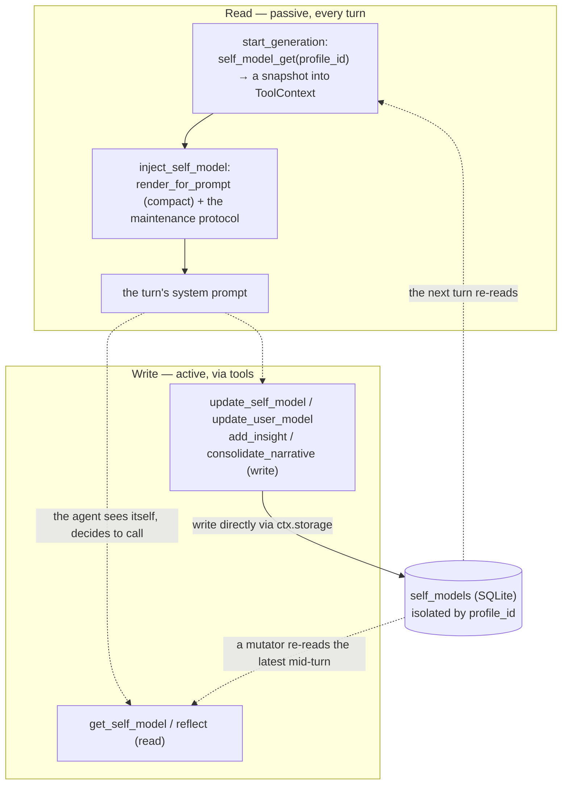

Two independent access paths:

- **Reading — passive, every turn.** The self-model is mixed **compactly**
  into the `system` prompt via `generation::inject_self_model` — but only if
  the profile has **enabled** `get_self_model` (an opt-in gate). This way the
  agent "sees itself" on every turn without an explicit tool call.
  Observations (self-notes) go into the prompt **by relevance to the user's
  last message** (embed the message → find close observations) **plus a
  guarantee of the most recent one** — an old but on-topic observation
  surfaces when the topic comes back (Tier 2,
  [narrative-as-notes.md](history/narrative-as-notes.md)):
  `notes::self_notes_relevant` + `blend_self_notes` → `injection_recent`; a
  graceful degradation to recency without an embedder. Injection **happens
  inside the generation's async task** (`spawn_generation`, not the sync
  `start_generation`) — relevance requires async embedding, and the command
  handler is synchronous.
- **Writing — active, via tools.** Mutators write directly into
  `self_models` under `ctx.profile_id`. The `ToolContext` snapshot may
  intentionally go stale within a turn (as with notes) — mutators re-read the
  latest from the DB, and the next turn picks up a fresh snapshot.

**Writes are atomic** (`Db::self_model_update(profile_id, |m| -> bool)`):
read-modify-write under a **single** connection mutex hold. This closes a
load-modify-write race between three concurrent writers — the turn's tools,
**background auto-reflection** (§9.6, runs concurrently with the user), and a
manual `F3` edit; otherwise reflection could write its own version over a
just-saved `F3` edit. The public `get`/`upsert` delegate to private `*_conn`
helpers; the `mutate` closure can't call `Db` methods (a non-reentrant
`Mutex` → deadlock) — it's a pure value edit.

**Prefix-cache trade-off (deliberate).** The self-model injection lives at
the start of the `system` prompt, so every model update changes the next
turn's `system` and the local `llama-server` reprocesses the context from
scratch. This is an **accepted cost** for the mechanism's capabilities
(decision 2026-07-03): we don't move the block to the end of history to
preserve the cache. Mitigation: age labels in the render have **day
granularity** (`age_label`), so the mere passage of time doesn't perturb the
prompt more than once a day — invalidation happens only on real model edits.

### 9.4 Tools and their semantics

Six tools (all **optional**: in `all_tool_ids`, not in `default_tool_ids`;
DB-only → pass `effective_tool_ids` through `_ => true`; toggled per
profile). Their semantics aren't "CRUD over fields" but **two derived
principles**: *integration instead of accumulation* (from notes
connectivity) and *a current snapshot + a scar in the narrative*.

| Tool | Role | Key semantics |
|---|---|---|
| `get_self_model` | read | `render_full` + a "Observation links" block (`render_self_read`) — the whole model, goals with `#id`, observations with a full id, **observation graph edges** (Tier 2), no truncation; when `summary` has grown too large — a hint to shrink it (the size gate, §9.1) |
| `reflect` | read + rubric | the current model (+ links) + a **self-consolidation overview** (similar pairs / `contradicts` / unlinked, once there are ≥2 observations) + questions (manage goals by `#id`, merge, consolidate observations via note_revise/supersede, **link related observations via note_link**, **has the description grown too large** — event-driven content into observations) |
| `update_self_model` | description + goals | `summary` — **integrate and shrink** (a snapshot, not a chronicle — §9.1); goals — lifecycle by `#id` (complete/abandon), not just add. **The echo is deltas** (stage 4): a summary size line + added/closed goals with `#id` + a count of folded ones, no full `render_full` |
| `update_user_model` | interlocutor | lists — **merge** (add_/remove_, dedup); `note` → a **scar** as an @self note; a reminder is issued when removing traits **or replacing a non-empty dynamic** without a `note`; **related-trait gate** (Tier 2/C): a topically close trait already exists → shown, the model decides "a duplicate (merge)" or "a contradiction (add_insight)"; traits embedded on the fly, threshold 0.72 — a position in the reference (bge-m3) scale, read through `Db::similarity_scale()` so it follows the active model (spec §9.3.4) — mirroring the `add_insight` gate. **The echo is deltas** (stage 4): compact final lists + a scar confirmation, no full `render_full` |
| `add_insight` | observation | `create_note(@self)` + a **gate** (similar observations → rewrite via note_revise/supersede instead of creating a duplicate) |

Observation notes are consolidated by **note tools** (`note_revise`/
`note_supersede`/`note_merge` — supersession with a scar); the former
`consolidate_narrative` was removed (Tier 1,
[narrative-as-notes.md](history/narrative-as-notes.md)). **A graph over
observations** (Tier 2): `note_link`/`note_neighbors` link related
observations (`contradicts`/`refines`/`relates`); links are shown in
`get_self_model`/`reflect` (`self_related_block`). **Cross-organ links**
(Tier 3, Path 1): a "self" observation can be linked to a user note "about
the interlocutor" — such an edge is **shown** in the self-model read
(`[note]`) and in `note_recall` (`[self]`); auto-reflection is given
`note_link`/`note_neighbors` + `note_recall` (note ids) for cross-linking
(`REFLECT_TOOL_IDS`). **Linking to RAG** (Tier 3, Path 3):
`note_cite_source(note_id, source)` binds a note/observation to a
knowledge-base source (by the source's **name** — stable across
`/rag rebuild`); bidirectional — `note_recall`/`get_self_model` show "Source
links", `rag_search` shows "Notes citing these sources".

**Self-consolidation overview** (Tier 3, deferred in Tier 2 until the value
of linking was confirmed — GO):
`notes::build_self_consolidation_overview(storage, profile_id)` — a pure DB
read over **only** `@self` observations (mirroring
`build_consolidation_overview` for user notes): similar pairs (duplicates by
cosine ≥ `CONSOLIDATE_SIMILARITY`), `contradicts` links among observations,
unlinked observations; `None` when there are < 2 observations. Mixed into
`reflect` (between the model and the rubric) and into the auto-reflection
digest — the self-memory "sleep" gets **concrete data**, not just a rubric;
`reflect_system_message` nudges merging similar pairs, checking
`contradicts`, and linking unlinked ones. Isolated by `profile_id`, no
migrations.

Why it's built this way (lessons from live testing, see
[docs/journal/self-model.md](journal/self-model.md)):

- **`get_self_model` doesn't truncate** — it used to return the same compact
  injection with a "…", and the model would complain about the "…".
- **Goals are tracked by `#id`** — ids used to not be shown anywhere, and the
  model was physically unable to close a goal (write-once → "filled it in
  once and forgot").
- **`update_user_model` merges** — it used to replace lists wholesale, and
  "mood" would overwrite what had accumulated ("kindest" ↔ "merciless").
- **The scar lives in the narrative, not on the trait** — traits are flat (a
  current snapshot), while the "biography of change" (what/why) lives in the
  narrative; a `note` on removing/replacing a trait leaves a trace,
  `remove_*` without a `note` gets a reminder.
- **Consolidation** cures the mirror-image disease of accumulation — bloat/
  drift: durable content rises into `summary`/traits, raw duplicates are
  folded. Mirrors `note_merge`/`consolidate_notes`, but **without a graph**
  (the narrative is like self-directed notes).

The goal lifecycle — a "scar" in the self-model's internal idiom (closed
ones are kept):

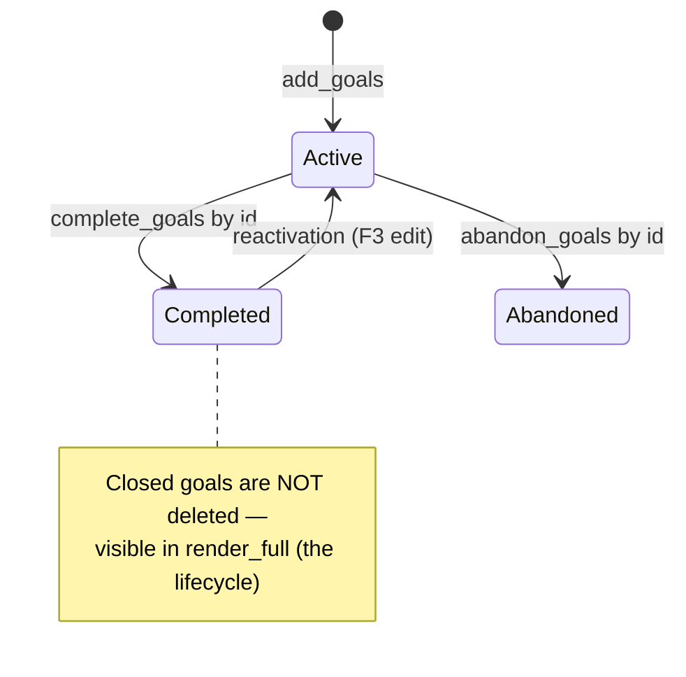

### 9.5 Maintenance protocol and predictability regardless of persona

A live-testing observation: spontaneous use of SelfModel tools **depends on
the profile's persona** (a kind, self-aware one — overuses it and flatters;
an "experimental AI" one — underuses it without reminders). Two levers
decouple behavior from the persona:

1. **A persona-neutral "maintenance protocol"** (`self_model::maintenance_protocol()`)
   is mixed into the system prompt **on top of** the profile's persona: when
   to record changes, "the fleeting goes into observations", and the key
   **"accuracy matters more than agreeableness"** (a direct counter-measure
   against a kind persona's flattery). A toggle,
   `config.self_model.maintenance_protocol` (default **on**); mixed in even
   for an empty model (bootstrapping the first entry).
2. **Background auto-reflection** (§9.6) — a deterministic writing path that
   doesn't depend on the model remembering to call the tool on its own.

**A single source of truth for the rules** (refinement stage 6): the wording
of the maintenance protocol and the auto-reflection system message are both
assembled from a single constant, `self_model::POLICY_CORE` (they used to be
duplicated and had already drifted slightly apart). `maintenance_protocol()`
= `POLICY_CORE` framed as "you maintain yourself";
`reflection::reflect_system_message()` = a reflection preamble +
`POLICY_CORE` + an explanation of behavioral signals. The interactive
`reflect` tool's rubric is deliberately **not** built from this — it's a
different genre (questions, not an imperative), but covers the same topics.

**The material-routing axis** (summary-as-snapshot, §9.1): `POLICY_CORE`
splits along **"state → `summary`, event conclusion → `add_insight`"**, not
"durable/fleeting". `summary` is a compact snapshot (who I am, what I value,
how I work); on edit, "integrate **and SHRINK**" + "read it in full before
editing (it's truncated in the prompt)"; event-driven conclusions ("what I
realized and when", answered questions, contradictions) go into observations
**even the durable ones** (there they're protected by duplicate gates, the
graph, relevance-based injection — material is retrievable by topic, and the
description doesn't bloat). This fixed the root cause of the bloat: a
durable insight used to legitimately settle as a paragraph in `summary`,
following the letter of the old rule.

### 9.6 Auto-reflection (a background mini agentic loop)

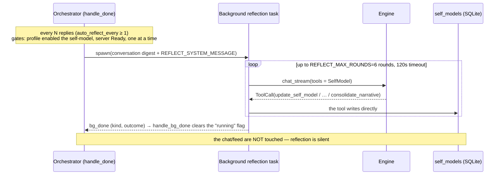

`orchestrator/reflection.rs`: every `config.self_model.auto_reflect_every`
assistant replies (0 = **off by default** — background calls to a cloud API
cost tokens), a background task asks the model to review the recent
conversation (a conversation digest) **itself** and update the self-model.
Unlike auto-titling (a single-turn request with no tools), this is a **mini
agentic loop**: the model is given SelfModel tools (`REFLECT_TOOL_IDS`,
including `consolidate_narrative`), and the loop **executes** its calls,
which write into `Storage`. The chat/feed are **not touched** — reflection is
silent. Gates: the profile has enabled the self-model tools, the server is
`Ready`, only one reflection at a time, there's enough conversation.

The mini agentic loop's body itself (stream → call accumulator → execution →
round) is **shared** between reflection and note auto-consolidation:
`tool_loop::spawn_silent_loop` (`orchestrator/tool_loop.rs`, refinement stage
6). It used to be duplicated verbatim across two modules; now both build a
`SilentLoop { backend, request, allowed, max_rounds, timeout, label,
done_tx, … }` and differ only in parameters (the tool set, limits, log
label) and the system message. The cadence predicate `tool_loop::due` is
also shared. The main generation loop (§5) was deliberately **not** folded
in — it has UI streaming, control-flow tools, Anthropic thinking signatures,
usage, effects; its complexity doesn't pay off the shared drain.

**Cadence is a watermark, not an in-memory counter** (refinement stage 3,
[refinements.md](history/refinements.md)). `Chat.reflected_upto: Option<usize>`
is a watershed index: how many of the first messages are already covered by
reflection. `reflect_window` counts assistant replies **only within the
window `messages[wm..]`** (the watermark is clamped to history length →
resilient to `Ctrl+R`/`Ctrl+E` truncation), and the digest is built over that
same window — otherwise every cycle would re-read what was already reflected
on and spawn duplicate insights. The watermark (`reflected_upto`/
`reflected_at`, `#[serde(default)]` → no migration, lives with the chat →
survives a restart) only advances **when the task is actually spawned** —
skipping on a gate (server not ready, reflection already running) doesn't
lose the accumulated cycle. `modified_at` is left untouched (reflection
doesn't bump the chat up in the list). Note auto-consolidation (below) stayed
on an in-memory counter, but got the same fix: reset only on actual spawn.

**Behavioral signals about the interlocutor in the digest** (stage 4):
`Ctrl+R` (regeneration = "the reply didn't work"), `Ctrl+E` (deleting an
exchange), and rewrite rounds are already archived into `Chat.deleted` — now
tagged with `DeletedCause`. `behavior_markers(chat, since)` (where `since` =
the previous `reflected_at`) counts these deletions within the window and
appends a "Behavioral signals about the interlocutor: …" block to the digest
— reflection gets **actual behavior**, not just self-descriptions
(regeneration/deletion are attributed to the interlocutor, rewrite — to the
agent's own behavior; entries without a `cause` — old ones — aren't counted).

**Background task observability** (stage 5): reflection and consolidation
are silent background tasks, so their failures are easy to miss (a stale
cloud key → the feature "doesn't work" for months). The internal done
channel carries an **outcome** (`Result<(), String>`); the orchestrator
counts consecutive failures and at the threshold
(`BACKGROUND_FAILURE_ALERT=3`) emits `AppEvent::Error` **once**, then stays
quiet until the first success (reset) — observability without spam; errors
are logged at `warn` level with `profile_id`. While a task is running,
`BackgroundTask{active}` draws a quiet indicator in the status bar
("✻ reflecting"/"✻ notes sleeping"). After a **successful** reflection —
`SelfModelChanged` (an open `F3` re-requests the snapshot; §9.7); the same
from `handle_done` if the model edited itself with its own tools mid-turn
(detected via `self_model::is_self_model_tool`).

### 9.7 UI: view and edit (`F3`)

The "Self-model" screen (`screens/self_model.rs`, `ActiveScreen::SelfModel`,
see §10) — viewing and **manual editing** of the description/goals/
interlocutor/narrative. The orchestrator owns the data, so `F3` doesn't open
the screen right away: `OpenSelfModel` → `AppCommand::RequestSelfModel` → a
reply `AppEvent::SelfModelView` (the active profile's model snapshot).
Edits: `SelfModelIntent::Edit` → `AppCommand::UpdateSelfModel` → the
orchestrator applies it (`SelfModel::apply_edit`), saves, and
**re-emits** `SelfModelView` (an open screen updates in place). Manual list
edits replace them wholesale — there's a human there (unlike the tools'
merge semantics). When the model changes **outside** this screen (background
reflection, tools mid-turn), a lightweight `SelfModelChanged` arrives — if
the `F3` screen is open, runtime sends `RequestSelfModel` and updates it with
a fresh snapshot; when the screen is closed, the signal is ignored (it
doesn't open the screen, unlike `SelfModelView`). Sizes/injection/protocol/
auto-reflection are fields in the "Tools" settings section (`Sm*`).

### 9.8 Invariants

- **The sole owner of `Chat` is unaffected:** mutators write per-profile
  data directly through `storage`, `ChatEffect` isn't involved.
- **Isolated by `profile_id`** — like notes/RAG (a table PK).
- **No migrations** — a JSON blob + `#[serde(default)]`.
- **Opt-in** — the whole group is off by default; injection and
  auto-reflection are gated by `get_self_model` being enabled in the
  profile.
- **A mid-turn snapshot can go stale** — the DB is the source of truth; a
  mutator re-reads the latest, the next turn picks up a fresh snapshot.

### 9.9 Future directions

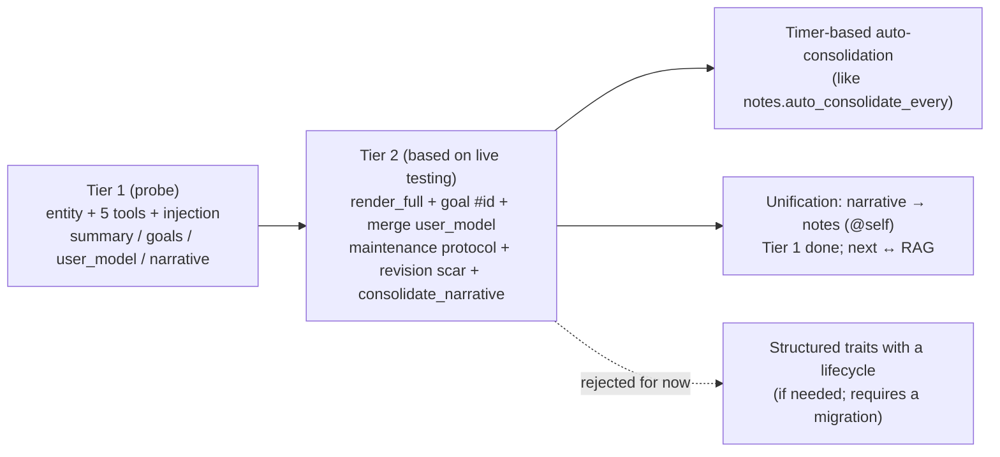

Two philosophies the mechanism stands on, and that set its direction:

- **Integration instead of accumulation** (related to
  [notes-connectivity](history/notes-connectivity.md)): both overwriting
  (loses the past) and pure accumulation (bloat/drift) are diseases; the
  answer is merge + scar + consolidation.
- **A current snapshot + a scar biography:** structured fields = a working
  snapshot of conclusions; the narrative = a biography that remembers what
  changed.

Near-term decision points (deliberately deferred):

- **Timer-based auto-consolidation of the self-model** — like
  `notes.auto_consolidate_every`: a deterministic "sleep" that folds bloat
  without an explicit call. Right now consolidation is manual / via
  auto-reflection — the latter already gets a **self-consolidation
  overview** (`build_self_consolidation_overview`: similar pairs /
  `contradicts` / unlinked), so "sleep" already has concrete data to work
  with; there's no separate timer yet.
- **Unifying the memory organs** — the narrative used to be a **second,
  weaker copy of notes** (append-only, a FIFO cap, no graph). **Tier 1
  done**: observations moved into `@self` notes
  ([narrative-as-notes.md](history/narrative-as-notes.md)) — gaining
  embeddings, duplicate gates, supersession with a scar, "sleep". **Tier 2
  done** (structure): injecting observations **by relevance** to the message
  (`injection_recent`), a **graph** over observations
  (`note_link`/`note_neighbors` + an "Observation links" block, the graph
  smoke test — GO), **semantic gates for related `user_model` traits** (step
  C, threshold 0.72). **Tier 3 done in full** (Paths 1–3, all GO). **Path 1**
  (cross-organ links): self-note ↔ user-note edges are **shown** in results
  with `[self]`/`[note]` markers, and `note_recall` outputs ids
  (addressability); the graph mechanics were already cross-organ, Tier 3
  just removed the filters on the results. **Path 2** (mixed results): the
  `notes.recall_includes_self` toggle (off by default) shows self-notes in
  general `note_recall` results with a `[self]` marker — live testing shows
  no contamination (the model cleanly separates "about self"/"about the
  interlocutor" by the marker). **Path 3** (RAG ↔ notes): a note/observation
  cites a RAG **source** (`note_cite_source`, by the source's name — stable
  across reindexing), and search works through both organs
  (`note_recall`/`get_self_model` → "Source links"; `rag_search` → "Notes
  citing these sources"). The organs remain SEPARATE in storage — linked by
  explicit edges/citations. The "narrative as notes" track is **complete**.
- **Structured traits with a lifecycle** (like goals: `active`/`retired` +
  a reason) — considered and **rejected** in favor of "flat traits + a scar
  in the narrative": a trait's change is, in form, a small story, and prose
  suits it more naturally. Worth revisiting only if there's a need for
  machine traversal of trait history (would require migrating
  `Vec<String>` → `Vec<Trait>`).
- **Deliberately NOT doing** (a leftover from the idea bank): `beliefs` with
  numeric `strength`, `contradictions` with `severity`/detect/resolve —
  these invite meaningless numbers; contradictions live as prose in the
  narrative.

---

## 10. UI: screens, widgets, rendering

`runtime.rs` holds one base `ChatScreen` (feed/generation/input) and an
`ActiveScreen { Chat | ChatList | Settings | SelfModel | Search }` enum — the
screen open on top of the chat. An open list/settings/view gets input and is drawn
instead of the chat; the `OpenChatList`/`OpenSettings` event from the chat
creates them, `Close` (Esc) returns to `Chat`. The chat list keeps its
snapshot current via `AppEvent::ChatList` (`app` applies it both to the chat
and to an open list). **`Search`** (the message-level results, `Ctrl+G` in the
list's content mode) follows the self-model pattern — the orchestrator owns the
index, so the screen is created on the reply `AppEvent::MessageSearchResults`, not
on the key; `Esc` returns to the chat list **with the query restored**, so the
search that got you there isn't thrown away. **Adding a variant is not free:**
`ActiveScreen` has 4 exhaustive match sites that force a compile error and about
nine more that compile silently (`_ =>`/`if let`/`matches!`). Two of those were
real bugs when `Search` was added — the `SelfModelView` arm would have *replaced*
the results with a self-model snapshot, and the `Settings` broadcast would have
left the new screen's theme and UI language frozen — so both are now exhaustive by
variant, which forces the next screen to decide too.

**Going back from a jump — a one-deep back-stack** (`SearchReturn`, a local of
`run_loop` beside `active` rather than a variant of it: it has to survive while
another screen is in front). Opening a hit stashes the **live `SearchScreen`**, not
the query — re-running the search would lose the selection and scroll, which is
exactly what coming back is for — and `ChatIntent::OpenChatList` consumes it:
`Esc` in that chat restores the results whole, the next `Esc` goes on to the list
as before. The chat screen learns nothing about searching (FSD: `screens` may not
depend on `app`) — `OpenChatList` already means "go back" from its point of view,
and *where* back is, is app-layer knowledge, resolved in `dispatch`. It is cleared
in **one funnel**, the `ChatActivated` arm of `apply_event`, because that event is
where every chat-opening route ends (the list, `Ctrl+N`, a clone, a jump, restoring
the last chat at startup); enumerating those routes by hand is what would rot
silently as routes are added. The test is a **different** chat: `activate()` also
re-emits for the same chat after a regeneration or `Ctrl+E`, and clearing there
would drop the way back for no reason. It is session state, never persisted.
The status bar's `Esc` hint (`status_bar::EscTarget`) is **derived** from this
stack by a pure function called once per frame in the draw path, not mirrored into
a flag — mirroring would mean writing the same rule at each set/clear site to keep
one word honest, which is how a hint drifts from the key it describes.

**"Self-model"** (`F3`, view+edit) — the orchestrator
owns the data, so `OpenSelfModel` doesn't open the screen right away; it
sends `AppCommand::RequestSelfModel`; the screen is created on the reply
event `AppEvent::SelfModelView` (the active profile's model snapshot).
Edits are handed off by the screen as `SelfModelIntent::Edit` →
`AppCommand::UpdateSelfModel`; the orchestrator applies it, saves, and
**re-emits** `SelfModelView` — the open screen updates in place (`set_model`,
selection is preserved). See [docs/self-model-mvp.md](history/self-model-mvp.md).

**Interface language (axis B, i18n).** The UI locale, `&'static Locale`
(from `config.interface.language`, independent of the agents' language
`Profile.language`)
**mirrors the `Palette` plumbing** (docs/history/i18n-ui.md): stored as a
field in the screens (`ChatScreen`/`ChatListScreen`/`SelfModelScreen`,
updated in `set_settings`/`set_loc` from the `Settings` event), broadcast to
open overlay screens by a single `ActiveScreen::set_theme(palette, loc)`;
stateless widgets (`status_bar`/`message_feed`/`chat_list`/…) take `loc` as a
render parameter. The settings screen computes `self.loc()` from its config
snapshot. The orchestrator resolves the UI locale (`ui_locale()`) for error/
notification text and `chat_export`. Text lives as `ui.*` keys in
`locales/{ru,en}.json` (the same mechanism as axis A). Tool results and the
self-model render in the feed follow the **agent's** language (axis A).

**External locales (Tier 3, docs/history/i18n-external-locales.md).** `Lang` is an
enum `Ru`/`En`/`Ext(&'static str)` (external codes are interned via
`Box::leak`). At startup, `i18n::init(paths.locales_dir())` (in `main.rs`,
before `Storage::open`) populates the registry (`OnceLock`): built-in bundles
+ `data/locales/*.json` layered on top (an override by keys of the same code
/ a new language; a corrupt file → warn+skip). Without `init` (tests) — only
the built-ins (`BUILTIN` LazyLock), behavior unchanged. UI language selectors
and `present.rs::exit_labels` use the registry-aware `Lang::all()`; gate
tests use the built-in `Lang::ALL`.

Screen enumerations are consolidated into **canonical places**: broadcasting
the palette/locale (a theme/language change) — `ActiveScreen::set_theme`,
routing a clipboard paste — `ActiveScreen::handle_paste` (methods next to
the enum); an intent taken from the active screen is dispatched through a
single `AnyIntent` + `dispatch_any` (single ownership instead of 4 parallel
`Option`s); a clipboard write — `deliver_clipboard` (`apply_event` doesn't
know about `arboard`). The status line receives a `status_bar::StatusModel`
snapshot (assembled by `ChatScreen::status_model`) — a new indicator adds a
field instead of extending the `render`/`height` signatures. The per-event
`match` in `apply_event` itself deliberately stays as is (enum dispatch is
idiomatic here). See docs/history/refactoring-solid.md §6.

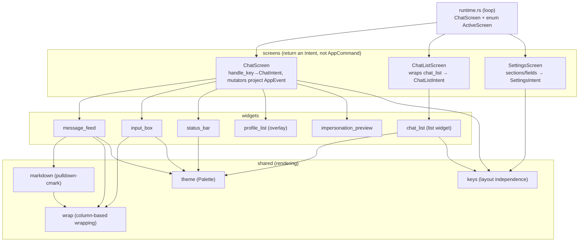

Decisions recorded in ADRs:

- **Our own `InputBox`** ([ADR 0001](decisions/0001-ui-crates-ratatui-030.md)):
  `tui-textarea`/`ratatui-textarea` are incompatible with ratatui 0.30 and
  don't support highlighting arbitrary ranges. Our own widget gives full
  control over `Enter`/`Shift+Enter`, scrolling, spellcheck underlining
  (per-span `UNDERLINED`), visual `↑/↓` navigation across wrapped rows, and a
  single-line mode for settings fields.
- **Our own markdown renderer** ([ADR 0003](decisions/0003-own-markdown-renderer.md)):
  a walker over `pulldown-cmark` events (`render(input, width, palette)`).
  Supports tables (box-drawing, "water-fill" column layout), delimiter-scoped
  LaTeX→unicode (only inside `$…$`/`$$…$$`), the theme (`Palette`), code
  highlighting (`syntect` + `ansi-to-tui`).
- **Word wrap** (`shared/wrap.rs`) is computed **before** `Paragraph` (width
  in columns via `unicode-width`) — this preserves row-based scroll/"tail"
  behavior in the feed and exact cursor mapping in the input. `Paragraph::wrap`
  is deliberately not used.
- **Spellcheck** (`features/spellcheck`): Hunspell (`spellbook`) + our own
  segmenter + a personal dictionary; a word is correct if accepted by at
  least one active dictionary; dictionaries are loaded in the background per
  interface settings.
- **Layout independence** (`shared/keys.rs::hotkey_char`): a Ctrl character is
  normalized to a "physical" Latin key, so shortcuts work under a non-Latin
  layout too. Tiers, first hit wins: (1) **Windows** — resolution through the
  **active layout** (`VkKeyScanExW` → `MapVirtualKeyExW` → scan code → the
  QWERTY letter at that position), the exact inverse of the `ToUnicodeEx`
  lookup crossterm used to produce the character, hence *any* installed layout
  with no per-language data; (2) a static **JCUKEN** table (unix, and Windows
  under conhost where the foreground window's layout can't be queried);
  (3) Windows — any other installed layout, for characters outside the table;
  (4) pass-through. ASCII is never remapped by position (label semantics on
  AZERTY/QWERTZ/Dvorak). On unix the equivalent of tier 1 is the kitty
  protocol's *base layout key*, which crossterm 0.29 doesn't expose
  (crossterm-rs/crossterm#968) — the tier slot is reserved. See
  [docs/research/layout-independent-hotkeys.md](research/layout-independent-hotkeys.md).

---

## 11. Concurrency and ownership

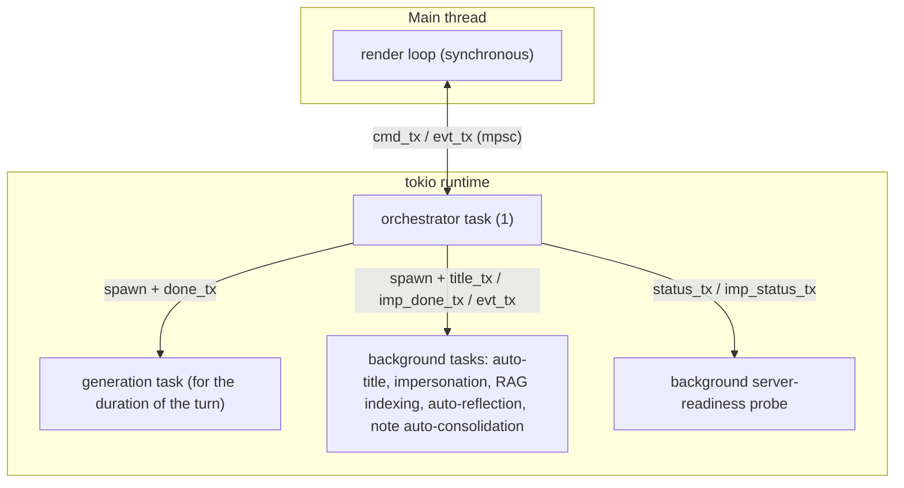

Principles:

- **The sole owner of `Chat`** is the orchestrator. Tools get an immutable
  snapshot (`ToolContext`) and return `effects` by value; there's no
  `ChatEffect` channel and no reentrant locks — deadlock is impossible by
  construction (a simplification relative to the server-side agentic loop of
  attempt #1).
- **Internal channels** of the orchestrator (`done_tx`, `status_tx`,
  `title_tx`, `imp_done_tx`, `imp_status_tx`, `bg_done_tx`) feed the results
  of background tasks back into the main `select!` loop, keeping a single
  point of state writes.
- **One channel runs the other way** (`confirm`, spec §9.8): dangerous-tool
  confirmation needs an answer *inside* the running generation task, so the
  orchestrator holds the in-flight turn's sender and routes
  `AppCommand::ConfirmTool` into it. It is deliberately the only one — it exists
  because the loop must **park**, which no result-reporting channel can express.
  Two staleness guards, both of which would otherwise run a tool the user never
  looked at: a reply whose `generation_id` is not the turn in flight is dropped,
  and within a turn a reply is matched to its `call_id`. The wait is a `select!`
  against the turn's cancellation token, so `Esc` still works while the popup is
  open.
- **The "silent" background task family** (auto-reflection/consolidation — a
  mini agentic loop with no UI, sharing a runner,
  `tool_loop::spawn_silent_loop`) is served by a **slot registry**,
  `bg: HashMap<BackgroundKind, BgSlot>` (`orchestrator/background.rs`): a
  slot = the active run's token ("running", one at a time) + a failure
  streak. One channel `bg_done_tx` carries `(kind, outcome)`, one `select!`
  branch calls `handle_bg_done` (the shared lifecycle: clearing the
  indicator, a failure streak → a single error at the threshold, for
  reflection a success → `SelfModelChanged`); `Quit` cancels all slots via
  `cancel_all_bg`. This way the family's 3rd task (self-model
  auto-consolidation, §9.9) doesn't touch the `run()`/`Quit` scaffold.
  Consolidation cadence (`consolidate_counts`) is separate data, not
  lifecycle. See docs/history/refactoring-solid.md §4.
- **Cancellation** — a `CancellationToken` interrupts an HTTP stream/
  background task; a partial reply is preserved; a new task of the same kind
  cancels the previous one (RAG, impersonation).
- **Terminal restoration** — `ratatui::init` installs a panic hook; mouse
  capture is always released on exit and on panic. `panic = "unwind"` is
  kept deliberately in the release profile, for drop guards.

---

## 12. Entry point, configuration, build

- **`main.rs`** — thin: loads `AppConfig`, seeds it with env variables
  (`apply_env_overrides` — a dev workflow), checks single-instance,
  initializes logging (to a file) and `tokio`, brings up `ratatui`, starts
  the orchestrator and the loop. **The CLI is our own micro-parser,
  `features/cli.rs`** (not `clap`), so that all CLI text (help, parse
  errors, command messages) lives in i18n locale bundles (axis B,
  docs/history/i18n-cli.md): `import <file>` (import from the neutral
  mindfork-import format, `features/import.rs`; the former
  `import-lamellama` was removed — it hints at the replacement),
  `backup [-o FILE] [-c 0..9]`/`restore <archive>` (backup/restore,
  `features/backup.rs`; take single-instance), `sandbox setup [--force]`,
  `locales export <code> -o FILE`. Subcommands run without the TUI and exit
  the process.
  - **A "peek" phase before argument parsing.** `Paths::resolve()` computes
    the root/language **without creating directories** (`--help`/
    `--version` never touch the disk); `ensure_dirs` creates directories
    only on paths that work with data. The CLI language is
    `cli_lang(settings→defaults→En)`: `settings.json`.`interface.language`,
    otherwise `defaults.json`.`default_language` (if the file is present),
    otherwise **English** (full uncertainty → an international default).
    External locales (`i18n::init`) are scanned before parsing, so `--help`
    honors their override; `init` returns warnings (there's no log
    subscriber yet) — they're logged later.
  - **`main() -> ExitCode`.** It prints errors itself
    (`{localized prefix}: {err:#}`, a single-line chain) instead of std/
    anyhow's English `Error:`/`Caused by:`. `Paths::resolve` contexts (before
    the language is known) are in English (the boundary noted in §7 above).
- **Configuration** (`shared/config.rs`): `AppConfig` with sections
  `EngineSettings`, `EmbedSettings`, `ToolSettings`, `InterfaceSettings`,
  `ImpersonationEngineSettings`, `impersonation_sampling`, global sampling.
  All fields under `#[serde(default)]` — old `settings.json` files are read
  without migration. Backend choice via settings or env
  (`MINDFORK_ENGINE_URL` external / `MINDFORK_LLAMA_BIN` + `MINDFORK_MODEL`…
  managed; similarly `MINDFORK_EMBED_*`).
  - **The engine config is nested by mode/provider:** `EngineSettings`/
    `ImpersonationEngineSettings`/`EmbedSettings` carry `mode` + subsections
    `managed: ManagedSettings`, `external: ExternalSettings`, and one
    `CloudSettings` per cloud provider (`openai`/`gemini`/`claude`; for
    embeddings' managed mode — `ManagedEmbedSettings`). Each mode has its
    own fields, so switching mode/provider doesn't lose the other's values.
    `cloud()`/`cloud_mut()` accessors return the active cloud substructure
    by `mode`. The settings screen shows only the fields of the selected
    mode and hides sampling parameters the cloud doesn't support (the
    `cloud_supported_param` filter; values are kept for local models). The
    chat header (`screens/chat::model_meta`) shows the active mode's model.
    See ADR 0004. `ManagedSettings` additionally carries
    `flash_attn: FlashAttn` (`--flash-attn`) and speculative-decoding
    fields (`spec_type: SpecType` + `draft_model`/`draft_gpu_layers`/
    `draft_n_max`/`draft_n_min`); draft fields are only shown in the UI for
    `draft-*` types — for MTP models (`mtp-gemma-…`) that's `draft-mtp`.
- **Cloud API keys** (`shared/secrets.rs`, docs/research/api-key-storage.md):
  a key can be **entered in settings** — it's encrypted with a **machine
  key** and stored in `settings.json` (`AppConfig::api_keys`) as ciphertext.
  Records are **per-machine**: the config is portable, on another machine
  the record won't decrypt (the key must be re-entered as its own record),
  and it reads back on returning to the original machine. Schemes: **DPAPI**
  (Windows, a user key managed by the OS) and **`machine-key-v1`** (Linux:
  HKDF-SHA256 over `/etc/machine-id` + ChaCha20-Poly1305, per-user binding
  via `info`); "our" record is recognized by decrypting the `check` probe
  (we never store the machine id itself in the file). Resolution happens in
  `EngineManager` (`stored_key`); the supervisor gets an already-decrypted
  `stored_key: Option<&str>`; the order is **stored → env fallback**
  (`api_key_env` remains for CI/power users and an external proxy). Only
  the orchestrator writes keys (`AppCommand::SetApiKey`); they never land
  in the config snapshot sent to the UI. This protects the **file**
  (transfer/backup/sync), not the machine: local code running as the same
  user can derive the same key — as with Chrome/Git Credential Manager.
- **Data location** (`shared/paths.rs`): **portable** by default — in a
  `data/` subdirectory next to the binary (in dev, `target/debug/data/`; the
  subdirectory separates data from build artifacts/caches): `settings.json`,
  `profiles.json`, `chats/`, `data.db`, `personal_dictionary.txt`,
  `dictionaries/`, `backups/`, `logs/`. A `defaults.json` file next to the
  binary (always outside `data/`; `Defaults` = `DataLocation`
  `portable`/`system`/`path` + `default_language`) switches the root to a
  standard OS folder (the `directories` crate) or a custom directory, and
  sets the scaffold language for new profiles (axis A —
  docs/history/i18n.md); no file → portable mode + `ru` (the old
  `location.json` is read for backward compatibility). **Backups**
  (`features/backup.rs`): a zip with configurable compression (chats/
  dictionaries/data.db/profiles/settings/personal + `*.bak` + `fs_root` if
  it's inside the root); restore is transactional (validation → a
  pre-restore copy in `backups/` → cleanup → extraction → rollback on
  failure). The archive is **optionally AES-256 encrypted** with a password
  from `--password` or from the settings (stored via `shared/secrets.rs`,
  same as an API key); `manifest.json` stays plain so the "newer version"
  warning works without it, validation rejects a missing/wrong password
  before the destructive phase, and the pre-restore and pre-migration copies
  inherit the password. See spec §12.3, docs/history/backup-password.md. `data.db` is **compacted** on both paths (`VACUUM`, see the
  storage section above): the archive carries a compacted copy instead of
  the live file (sidecars folded in), and a restore compacts what it
  unpacked; best effort, and the backup never modifies the source.
- **Dependencies** (see [Cargo.toml](../Cargo.toml)): `ratatui` 0.30 +
  `crossterm`, `tokio`, `reqwest` (rustls), `rusqlite` (bundled) +
  `sqlite-vec`, `pulldown-cmark` + `syntect` + `ansi-to-tui`, `spellbook`,
  `arboard`, `scraper`, `serde`/`serde_json`, `uuid`, `chrono`, `tracing`,
  `zip` + `directories` (backups and the storage mode), `chacha20poly1305`
  + `hkdf` (encrypting stored API keys; on Windows — the system DPAPI via
  `windows-sys`). The CLI is parsed by **our own** parser
  (`features/cli.rs`), not a crate — `clap` was removed
  (docs/history/i18n-cli.md). The application **doesn't depend on an ML
  stack** — that's a key build simplification.
- **Release**: `[profile.release]` with LTO/strip/`opt-level=3`,
  `panic=unwind`.

---

## 13. Testability

The architecture is designed to be testable without a server/GPU/network:

- **The engine** — behind the `EngineBackend` trait; tests use `MockBackend`
  (replaying a stream of chunks). The real server — `#[ignore]` smoke tests
  (anti-self-abort, tool calling, "thoughts" — verified against Gemma 4 and
  Qwen).
- **Tools** — against `MockEmbedder` (bag-of-chars + L2) and a mock
  `Storage`: result correctness, returning `effects` (not mutation), JSON
  schema validity.
- **Storage** — `tempfile` + an in-memory SQLite: isolation by
  `profile_id` (negative tests), soft delete/cascade, atomicity, kNN.
- **The orchestrator** — no UI or model: the state machine, races (spamming
  Send, Stop→Send, dropping by `generation_id`), the agentic loop,
  `max_tool_rounds`, sampling priorities, "delete the last exchange" logic.
- **UI** — pure logic: applying an `AppEvent` sequence to the projection,
  markdown/LaTeX rendering, pure functions (`chunk_batch`,
  `format_conversation`, `rag_command::parse`, word wrap).

Status (CLAUDE.md): the M0–M9 plan plus extensive post-M9 work is done;
**729 unit tests green**, **25 `#[ignore]` smoke tests** run against a live
Gemma 4 31B + bge-m3 stack (`llama-server`) — 25/25 green (basic Gemma smoke
tests + end-to-end self-model/notes/narrative tests).

---

*This document describes the implementation of `mindfork-rs`. The source of
truth for "what/why" is [spec.md](../spec.md); recorded decisions are in
[ADR](decisions/); the implementation log is in [docs/journal/](journal/) and
the current status in [CLAUDE.md](../CLAUDE.md).*
