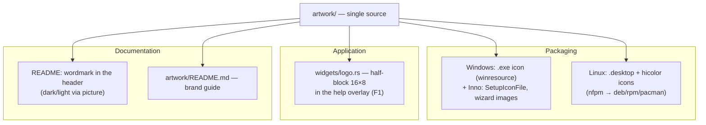

# Design plan: logo and wordmark integration

Track: bring the newly created `artwork/` directory to a full-fledged identity —
make the assets portable, set up a brand guide, embed the icon into packaging
(Windows exe/installer, Linux menu) and into the TUI itself, and put the
wordmark into the documentation.

Project reference — [CLAUDE.md](../CLAUDE.md), code map —
[architecture.md](architecture.md), process — [AGENTS.md](../AGENTS.md).
Packaging precedent — [installers.md](history/installers.md).

---

## 1. What's already there (`artwork/` inventory)

| File | What it is | Usable as-is |
|---|---|---|
| `mindfork-icon.svg` | icon on a 16×16 grid over a dark rounded square | yes |
| `mindfork-icon-transparent.svg` | the same icon without the plate | yes |
| `mindfork-icon-{16,32,48,64,128,256}.png` | raster icons | yes |
| `mindfork.ico` | 6 sizes (16–128 BMP + 256 PNG), 32bpp | yes, valid |
| `mindfork-wordmark.svg` (+`-dark`/`-light`/`-mono`/`-stacked`/`-tagline`) | the "mind**fork**" wordmark | yes — **fixed**, see §2 |
| `wordmark-example.png` | wordmark reference (raster) | as a reference — yes |
| `build-wordmarks.py` | wordmark generator (text → outlines) | — |

**Brand palette** (from the SVG):

| Role | HEX |
|---|---|
| Accent ("fork", the glyph's stem) | `#c25a27` |
| Glyph branches | `#5c6370` |
| Icon plate | `#09090b` |
| Text on dark | `#e4e4e7` |
| Text on light | `#18181b` |
| Tagline (muted) | `#71717a` |

**Glyph geometry** — 5 rectangles on a 16×16 grid (the ink occupies
x=3…13, y=2…14):

| x | y | w | h | color |
|---|---|---|---|---|
| 7 | 2 | 2 | 12 | `#c25a27` |
| 11 | 2 | 2 | 5 | `#5c6370` |
| 9 | 5 | 2 | 2 | `#5c6370` |
| 3 | 7 | 2 | 5 | `#5c6370` |
| 5 | 10 | 2 | 2 | `#5c6370` |

The fact that the icon is **natively pixel-art 16×16** is a key fact for §5: it
can be drawn directly in the terminal using cells, with no rasterization.

---

## 2. Wordmark-SVG blocker — resolved

**Before.** All six `mindfork-wordmark*.svg` files contained

```xml
<text x="58" y="55" class="wm">…</text>
```

but with **no `<style>`, `font-family`, or `font-size`** — the classes
`wm`/`tag` were never defined anywhere (an empty line remained after `<svg>`:
the style block had apparently been lost during export). The files rendered in
a default serif font — not the one from the reference. Adding `font-family`
wouldn't have helped: the viewer (GitHub, someone else's browser, a Linux
viewer) doesn't have the needed monospace font.

**Now.** The text was converted to outlines (`<path>`) — the SVGs are
self-contained. The font was reconstructed from the reference
`wordmark-example.png` by fitting metrics: **JetBrains Mono ExtraBold** (SIL
OFL 1.1), size 277.7 px, tracking −0.035 em. The reconstruction matches the
reference **pixel-for-pixel** — total word width 1249 px and the "icon → text"
gap 213 px in both; a confirming detail — the descender of `o`/`d` (−10 font
units) predicts their bottom edge exactly at the measured 348 px.

The assets are reproducible: `artwork/build-wordmarks.py` (palette, tracking,
and lockup proportions as constants), provenance and usage rules —
`artwork/README.md`. Side effect: `viewBox` values were tightened to the
actual content (horizontal — `219.9×48`, vertical — `128×99.4`, with the
tagline — `238.2×57.9`) instead of the previous values, which never rendered
correctly.

---

## 3. Integration surfaces



Status: **documentation is closed** (stage 1 — assets in git, brand guide,
wordmark in the README header). What remains is code and packaging: the `.exe`
has no icon at all (Explorer/taskbar show the default), Linux packages don't
ship a `.desktop` file or theme icons, and there's no logo in the TUI.

---

## 4. Packaging

### 4.1 Windows — executable icon

The icon resource is embedded into the `.exe` at build time by the
**`winresource`** crate (a maintained fork of the abandoned `winres`), from
the already-ready `mindfork.ico`. The project already has a `build.rs` (it
copies dictionaries) — `embed_windows_icon()` is added, in two host-specific
variants (why exactly this way — below):

```rust
#[cfg(windows)] // Windows host: the crate is available
fn embed_windows_icon() {
    if env::var("CARGO_CFG_TARGET_OS").as_deref() != Ok("windows") {
        return; // Windows host, but a different target — the resource doesn't apply
    }
    let mut res = winresource::WindowsResource::new();
    res.set_icon(".../artwork/mindfork.ico");
    if let Err(err) = res.compile() {
        println!("cargo:warning=не удалось вшить иконку в .exe: {err}");
    }
}

#[cfg(not(windows))] // Linux/macOS host: the crate isn't available
fn embed_windows_icon() { /* warn if the target is Windows */ }
```

Side effect: `UninstallDisplayIcon={app}\mindfork-rs.exe` in
`packaging/windows/mindfork.iss` (already set) and the `[Icons]` shortcuts
**automatically** start showing the icon — no edits needed there.

Separately, `[Setup]` got `SetupIconFile` (the icon of `setup.exe` itself) and
`WizardSmallImageFile` — a logo in the header of the wizard pages
(`artwork/mindfork-wizard-small.png`, 138×140 — the modern-style size at 100%
DPI, a white background under Inno's white header). We **don't** do a large
`WizardImageFile` (a panel on the "Finished" page) — that's a separate
composition, and the welcome page is disabled by default in Inno 6; future
work.

**A double gate in `build.rs` is required (important).** `winresource` is
declared in `[target.'cfg(windows)'.build-dependencies]`, and for **build**
dependencies `cfg` is evaluated by the **host** (the script runs on it) — on a
Linux host the crate is absent and referencing it wouldn't compile. Hence both
gates are needed: `#[cfg(windows)]` by host (is the crate present) and
`CARGO_CFG_TARGET_OS` by target (is the icon needed). Consequence:
cross-compiling Linux → Windows won't embed the icon — a `cargo:warning` is
printed there, so as not to silently ship a `.exe` with no icon. The normal
path is unaffected: the release workflow builds Windows on a Windows runner.

**Verified (2026-07-18):**
- `rc.exe` from the Windows SDK was found, the build produced no warnings; the
  icon was extracted from the built `.exe` and `setup.exe` — both identical,
  carrying exactly the brand colors `#09090b`/`#5c6370`/`#c25a27`.
- `cargo deny check` — `advisories/bans/licenses/sources ok` (winresource
  pulls in 7 build-only crates: the toml stack + winnow).
- **Inno 6 accepts PNG** for `WizardSmallImageFile` (verified by
  test-compiling both formats) — the previous worry "only BMP" wasn't
  confirmed; PNG was chosen, it's 35× lighter (1.6 KB vs. 58 KB).
- Live wizard: the icon in the window title bar and the logo in the page
  header render correctly (screenshot; the install wasn't actually run).

A failure to embed deliberately **doesn't break the build**, but goes into a
`cargo:warning` — the icon is cosmetic, the app must still build without the
Windows SDK.

### 4.2 Linux — application menu entry and theme icons

Added to `packaging/nfpm.yaml`:

- `packaging/linux/mindfork-rs.desktop` → `/usr/share/applications/`;
- PNG icons → `/usr/share/icons/hicolor/<N>x<N>/apps/mindfork-rs.png`
  (16/32/48/64/128/256 — all already exist) and `mindfork-icon.svg` →
  `/usr/share/icons/hicolor/scalable/apps/mindfork-rs.svg`.

The `.desktop` file for a **TUI** application must carry `Terminal=true`
(otherwise launching from the menu gives no terminal and the app crashes
instantly — stdout is occupied by the TUI):

```ini
[Desktop Entry]
Type=Application
Name=mindfork-rs
Comment=Console AI chat with local and cloud models
Exec=mindfork-rs
Icon=mindfork-rs
Terminal=true
Categories=Utility;ConsoleOnly;
```

`Chat` is **deliberately absent** from the categories: per the spec, this
additional category requires a primary `Network` category, otherwise
`desktop-file-validate` issues a warning. The file also carries localized
`GenericName[ru]`/`Comment[ru]`/`Keywords[ru]` — the interface is bilingual,
so it makes sense for the menu to be too.

The install smoke in `packaging.yml` (Ubuntu/Fedora/Arch containers) was
extended with checks: `.desktop` is present and carries
`Terminal=true`/`Exec=`/`Icon=`; all six raster icons and the `scalable` one
sit under the name `mindfork-rs` (must match the `Icon=` key). The stock
`desktop-file-validate` is installed on Ubuntu/Fedora (`desktop-file-utils` —
free, alongside the package itself) and run; on Arch it's skipped via
`command -v`.

**We don't add cache-refresh scriptlets**: both Debian (the
`update-icon-caches` trigger) and Fedora (a file trigger on
`/usr/share/icons/hicolor`) handle it themselves — extra code in the package
would only add risk.

**Verified locally (2026-07-18)**, as far as possible on Windows: the YAML
(`nfpm.yaml`/`packaging.yml`/`release.yml`) is valid; every `src` in
`contents` exists (except `dist/stage/mindfork-rs` — created by
`build-packages.sh`); the `.desktop` file is UTF-8 without a BOM, LF-only, has
the primary category `Utility`, no additional category lacks its own primary,
`Categories` ends with `;`. Real `nfpm` runs and container installs aren't
reproducible on Windows — `packaging.yml` validates them on the PR (as with
stage 2 of "installers").

---

## 5. TUI: a logo drawn in terminal cells

The icon is 16×16 pixel art, so it can be drawn **natively**, with no images:
each terminal cell = two vertical pixels via `▀` (U+2580, upper half block),
where `fg` is the top pixel and `bg` is the bottom one. Result — **16 columns
× 8 rows**; since a cell is roughly twice as tall as it is wide, on screen
this comes out approximately square.

Compatibility was worked out: `▀` is part of WGL4, and block glyphs are
already used in the project (`█` — the scrollbar, `▌` — role rails), i.e. the
old-terminal compatibility mode (conhost) is unaffected and needs no separate
compat glyph.

Implementation — `widgets/logo.rs` (the `widgets` layer, pure rendering per
FSD):

- the **transparent** variant is used (`mindfork-icon-transparent.svg`): the
  plate isn't drawn, the glyph sits on the terminal's background, so the logo
  is equally at home in dark and light themes;
- the glyph's colors are **fixed brand RGB**, not from the palette: the logo
  isn't retinted by the theme (that's a property of it as a mark). The only
  exception is degenerate terminals;
- **a gate against drifting from the asset**: a test parses the `<rect>`
  elements from `artwork/mindfork-icon-transparent.svg` and cross-checks them
  against the constants table in the code. The same technique as the existing
  gates (i18n key-parity, "labels fit within `LABEL_CAP`") — the asset and the
  code won't silently drift apart.

**Where to place it (done).** The logo is the first content block of the help
overlay (`F1`) — it already carries the version in the title, i.e. it's de
facto "About", and no new key was needed. But the hotkey list is long (**33
entries**, a popup ~35 rows), so the mark is drawn **only when the terminal
has enough height for it and the whole list**, and the popup width is enough
for the lockup; otherwise it isn't drawn at all — the hotkeys aren't shifted
and no extra scroll appears. The width for the lockup is deliberately **not
stretched**: the popup is sized by the hotkey list, the mark either fits or is
skipped. The same degradation as the scrollbar (no overflow → don't draw) and
Mermaid (doesn't fit → fall back to the source).

**Size — bounded by the ink, not the whole grid.** The ink occupies x 3…13,
y 2…14, i.e. 10×12 pixels → **10 columns × 6 rows** (the ink height is even,
so the half-blocks land exactly). The full 16×16 grid would have given 16×8
with empty margins. Encoding a pair of pixels: both halves the same color —
`█`; different — `▀` (top in `fg`, bottom in `bg`); one half — `▀`/`▄` **with
no background**, so the logo doesn't drag along a plate rectangle.

### 5.1 Wordmark and horizontal lockup

The word `mindfork` is drawn next to the glyph — not via one of the SVG
wordmarks (there the text is converted to outlines, §2, and there's nothing to
rasterize them with in the terminal), but with an **own pixel font** in
`widgets/logo.rs`: a `#`/`.` matrix per letter, the same half-blocks. The
lettering mirrors the brand (JetBrains Mono ExtraBold): lowercase, descenders
on `d`/`f`/`k`, and **2-pixel strokes** — exactly the weight of the glyph's
bars (in its grid they're also 2 units).

Proportions are taken from the horizontal lockup (metrics —
`artwork/README.md`), not eyeballed:

| Quantity | Brand | In the terminal |
|---|---|---|
| Word height | `0.5227 × S`, where `S` is the **icon size** (16) | `≈ 8` pixels = **4 rows** vs. 6 rows for the glyph |
| Baseline | `0.7418 × S` from the top of the icon | the bottom of the word is **one row above** the bottom of the glyph |
| "Icon → text" gap | `0.3608 × S` from the edge of the **box** | `0.3608 × 16 − 3` (the empty margin to the right of the ink) ≈ **3 columns** |

The key subtlety of the first row: the fractions are taken from the **icon
size** `S = 16`, not from the height of its ink (12). The first version of the
font computed "half the ink" → 6 pixels, and 2-pixel strokes didn't fit within
that height (an x-height of 4 leaves no gap inside `o`/`d`), which made the
word come out light-weight — next to a chunky glyph, no less. The correct 8
pixels give an x-height of 6: two pixels of stroke, two of gap, two of stroke.

A separate compromise — **`f`**. Between its hook (at ascender height) and
crossbar (at x-height), the pixel budget leaves no separating row, so the
2-pixel hook merged with the crossbar into a solid block. The hook was made
**1-pixel**: it lands in the top half of the cell (`▀`), the bottom half stays
empty — a gap shows, and the crossbar sits at x-height, on the same row as the
top bars of `n`/`o`/`r`. The alternative (dropping the crossbar to the middle
of the x-height for the sake of a 2-pixel hook) would have broken this shared
line.

Result — **65 columns × 6 rows**. Colors: `fork` — the brand accent, as
everywhere; `mind`, however, is taken from the palette (`text`). This is
**not a violation of R3**, but its direct consequence: in the brand, `mind` is
"text on dark"/"text on light" (that's exactly why separate `-dark`/`-light`
variants exist), i.e. a color derived from the background. So a single lockup
works in both themes, while the signature colors stay on-brand.

**Left alignment, on the same margin as the hotkey list** (the same two
spaces), with breathing room above and below. A centered mark would read as a
standalone image; left-aligned, it works as a block header and sets the same
vertical axis as the hotkeys below.

There are two gates against drift: a test cross-checks `GLYPH` against the SVG
(see above), and the word's height and offset are checked by a `const`
assertion — editing the font or `WORDMARK_TOP_ROW` in a way that would make
the word stop fitting within the glyph's height **fails the build**, rather
than silently clipping the picture.

A startup splash screen is **deliberately not done**: in a TUI it delays the
first frame and gets annoying with frequent launches.

---

## 6. Documentation

- **README** — the wordmark instead of/above the plain-text `# mindfork-rs`,
  with separate dark and light variants via `<picture>`:

  ```html
  <picture>
    <source media="(prefers-color-scheme: dark)" srcset="artwork/mindfork-wordmark-dark.svg">
    
  </picture>
  ```

  Condition R1 (text as outlines) is met — §2. We keep `alt` as text: the
  heading stays accessible for screen readers and for those with images
  disabled.
- **`artwork/README.md`** — a brand guide: palette with HEX codes, the purpose
  of each file, which variant to use where, clear space, what and how to use
  to regenerate the assets (otherwise in six months nobody will remember where
  the `.ico` came from).
- **install.md** — mention the application-menu entry (after §4.2).
- **CHANGELOG** — the "Added" rubric (app icon, menu entry, logo in help).

---

## 7. Decision points

**User's decisions (2026-07-18):** R1 — (a) outlines; **R2 — (a) in the `F1`
header**; **R3 — (a) leave the theme alone**; **R4 — (a) `.desktop` with
`Terminal=true`**. R5–R7 stay per the recommendation (don't do it /
`artwork/` as the source / future work).

| # | Question | Options | Decision |
|---|---|---|---|
| **R1** | ~~Wordmark text~~ | ~~(a) convert to outlines; (b) `font-family` with a stack; (c) leave as-is~~ | **✅ closed — (a)**, done (§2): outlines + generator + brand guide |
| **R2** | Logo in the TUI | (a) in the `F1` header if there's room; (b) a separate "About" screen; (c) in an empty chat; (d) don't do it | ✅ **(a)** — reuses the existing "About" (it already has the version), introduces no new keys |
| **R3** | Brand orange `#c25a27` as the theme accent | (a) leave the theme alone; (b) replace `accent`; (c) a new "brand" theme | ✅ **(a)** — `accent` carries the meaning "activity" (generation, the token counter); retinting would break the semantics for the sake of cosmetics. The logo is already drawn in the brand colors anyway |
| **R4** | `.desktop` for a TUI application | (a) yes, `Terminal=true`; (b) no | ✅ **(a)** — standard practice for console programs (htop and the like); without it, theme icons are pointless |
| **R5** | A CLI banner (`--version`/help) | (a) no; (b) ASCII-art wordmark | **(a)** — would need a separate ASCII asset and its upkeep; the payoff is cosmetic |
| **R6** | Where the build assets live | (a) `artwork/` as the single source, packaging references it; (b) copies in `packaging/` | **(a)** — copies drift apart |
| **R7** | AppStream metainfo (GNOME/KDE software centers) | (a) future work; (b) now | **(a)** — software centers give little benefit for a `Terminal=true` application; revisit when the repository goes public |

---

## 8. Stages

A linear stack (as in the "installers" track): stages 2–3 both touch
packaging and CI, parallel branches would conflict on files.

| Stage | Branch | Content | Live run |
|---|---|---|---|
| **1** | `feat/brand-assets` | assets in git; ~~R1 (text to outlines)~~ ✅; ~~`artwork/README.md`~~ ✅; what remains — wordmark in the README header | not required (assets/docs). SVGs verified by rasterization and comparison against the reference (§2) |
| **2** ✅ | `feat/windows-icon` | `winresource` in `build.rs`; `SetupIconFile` + `WizardSmallImageFile` in `.iss`; `cargo deny` for the new dependency | **done**: the icon extracted from `.exe` and `setup.exe` (colors cross-checked), `.iss` compiled, the wizard screenshotted |
| **3** ✅ | `feat/linux-desktop-entry` | `.desktop` + hicolor icons in `nfpm.yaml`; checks in the `packaging.yml` smoke | **done**: YAML/paths/`.desktop` structure verified locally; container installs — up to `packaging.yml` on the PR |
| **4** ✅ | `feat/tui-logo` | `widgets/logo.rs` (half-block 10×6) + the `F1` header + a "code ≡ SVG" gate test | **done**; no live run needed (pure UI, covered by `TestBackend`) |

Stage 1 goes first: until the wordmark is fixed and `artwork/` is in git, the
other stages have nothing to build on.

**Each stage's DoD** — standard (AGENTS.md): `fmt`/`clippy -D warnings`/`test`
green, an entry in the CLAUDE.md journal, a CHANGELOG item for user-visible
effects (stages 2–4), an architecture.md §3 update for the new
`widgets/logo.rs`.

---

## 9. Out of scope (future work)

- AppStream metainfo (R7);
- code signing — remains deferred ([installers.md](history/installers.md)
  §8); having an icon doesn't affect SmartScreen reputation;
- favicon/project page — there's no website;
- a winget manifest — blocked on signing;
- an animated splash screen, a "brand" theme (R3-c).
