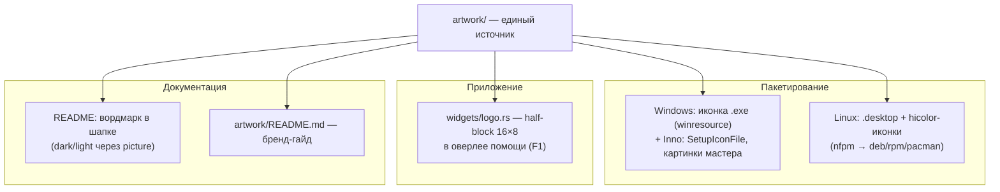

# Дизайн-план: интеграция логотипа и вордмарка

Направление: довести новосозданный каталог `artwork/` до полноценной айдентики —
привести ассеты в переносимый вид, завести бренд-гайд, встроить иконку в
пакетирование (Windows-exe/инсталлятор, Linux-меню) и в сам TUI, поставить
вордмарк в документацию.

Ориентир по проекту — [CLAUDE.md](../CLAUDE.md), карта кода —
[architecture.md](architecture.md), процесс — [AGENTS.md](../AGENTS.md).
Прецедент по пакетированию — [installers.md](history/installers.md).

---

## 1. Что уже есть (инвентаризация `artwork/`)

| Файл | Что это | Годен как есть |
|---|---|---|
| `mindfork-icon.svg` | иконка 16×16-сетка на тёмном скруглённом квадрате | да |
| `mindfork-icon-transparent.svg` | та же иконка без подложки | да |
| `mindfork-icon-{16,32,48,64,128,256}.png` | растровые иконки | да |
| `mindfork.ico` | 6 размеров (16–128 BMP + 256 PNG), 32bpp | да, валиден |
| `mindfork-wordmark.svg` (+`-dark`/`-light`/`-mono`/`-stacked`/`-tagline`) | вордмарк «mind**fork**» | да — **починены**, см. §2 |
| `wordmark-example.png` | эталон вордмарка (растр) | как эталон — да |
| `build-wordmarks.py` | генератор вордмарков (текст → кривые) | — |

**Палитра бренда** (из SVG):

| Роль | HEX |
|---|---|
| Акцент («fork», ствол глифа) | `#c25a27` |
| Ветви глифа | `#5c6370` |
| Подложка иконки | `#09090b` |
| Текст на тёмном | `#e4e4e7` |
| Текст на светлом | `#18181b` |
| Тэглайн (muted) | `#71717a` |

**Геометрия глифа** — 5 прямоугольников на сетке 16×16 (чернила занимают
x=3…13, y=2…14):

| x | y | w | h | цвет |
|---|---|---|---|---|
| 7 | 2 | 2 | 12 | `#c25a27` |
| 11 | 2 | 2 | 5 | `#5c6370` |
| 9 | 5 | 2 | 2 | `#5c6370` |
| 3 | 7 | 2 | 5 | `#5c6370` |
| 5 | 10 | 2 | 2 | `#5c6370` |

То, что иконка **нативно пиксельная 16×16**, — ключевой факт для §5: её можно
рисовать прямо в терминале ячейками, без растрирования.

---

## 2. Блокер вордмарк-SVG — устранён

**Было.** Все шесть `mindfork-wordmark*.svg` содержали

```xml
<text x="58" y="55" class="wm">…</text>
```

при этом **без `<style>`, `font-family` и `font-size`** — классы `wm`/`tag` нигде
не определялись (после `<svg>` оставалась пустая строка: блок стилей, судя по
всему, потерялся при экспорте). Файлы рендерились дефолтным шрифтом с засечками —
не тем, что на эталоне. Дописать `font-family` не помогло бы: у зрителя (GitHub,
чужой браузер, просмотрщик в Linux) нужного моноширинного шрифта нет.

**Стало.** Текст переведён в кривые (`<path>`) — SVG самодостаточны. Шрифт
восстановлен по эталону `wordmark-example.png` подгонкой метрик: **JetBrains Mono
ExtraBold** (SIL OFL 1.1), кегль 277.7 px, трекинг −0.035 em. Реконструкция
совпадает с эталоном **попиксельно** — суммарная ширина слова 1249 px и зазор
«иконка → текст» 213 px в обоих; подтверждающая деталь — выносной вылет `o`/`d`
(−10 единиц шрифта) предсказывает их нижнюю кромку ровно на измеренные 348 px.

Ассеты воспроизводимы: `artwork/build-wordmarks.py` (палитра, трекинг и пропорции
лockup'а — константами), провенанс и правила применения — `artwork/README.md`.
Побочный эффект: `viewBox` подтянуты под фактическое содержимое
(горизонтальный — `219.9×48`, вертикальный — `128×99.4`, с тэглайном —
`238.2×57.9`) вместо прежних значений, которые никогда корректно не рендерились.

---

## 3. Поверхности интеграции



Состояние: **документация закрыта** (этап 1 — ассеты в git, бренд-гайд, вордмарк в
шапке README). Остаётся код и пакетирование: у `.exe` нет иконки вовсе (в
Проводнике/таскбаре — дефолтная), Linux-пакеты не кладут ни `.desktop`, ни иконок
темы, в TUI логотипа нет.

---

## 4. Пакетирование

### 4.1 Windows — иконка исполняемого файла

Ресурс иконки вшивается в `.exe` на этапе сборки крейтом **`winresource`**
(поддерживаемый форк заброшенного `winres`), из уже готового `mindfork.ico`.
`build.rs` в проекте есть (копирует словари) — добавляется `embed_windows_icon()`
в двух вариантах по хосту (почему именно так — ниже):

```rust
#[cfg(windows)] // Windows-хост: крейт доступен
fn embed_windows_icon() {
    if env::var("CARGO_CFG_TARGET_OS").as_deref() != Ok("windows") {
        return; // хост Windows, но таргет другой — ресурс неприменим
    }
    let mut res = winresource::WindowsResource::new();
    res.set_icon(".../artwork/mindfork.ico");
    if let Err(err) = res.compile() {
        println!("cargo:warning=не удалось вшить иконку в .exe: {err}");
    }
}

#[cfg(not(windows))] // Linux/macOS-хост: крейта нет
fn embed_windows_icon() { /* предупреждаем, если таргет — Windows */ }
```

Побочный эффект: `UninstallDisplayIcon={app}\mindfork-rs.exe` в
`packaging/windows/mindfork.iss` (уже прописан) и ярлыки из `[Icons]`
**автоматически** начинают показывать иконку — правок там не нужно.

Отдельно в `[Setup]` добавлены `SetupIconFile` (иконка самого `setup.exe`) и
`WizardSmallImageFile` — логотип в шапке страниц мастера
(`artwork/mindfork-wizard-small.png`, 138×140 — размер modern-стиля при 100% DPI,
белый фон под белую шапку Inno). Большой `WizardImageFile` (панель на странице
«Завершение») **не делаем** — это отдельная композиция, а welcome-страница в Inno 6
по умолчанию отключена; задел.

**Двойной гейт в `build.rs` (важно).** `winresource` объявлен в
`[target.'cfg(windows)'.build-dependencies]`, а у **build**-зависимостей `cfg`
вычисляется по **хосту** (скрипт исполняется на нём) — на Linux-хосте крейта нет и
обращение к нему не скомпилируется. Поэтому нужны оба гейта: `#[cfg(windows)]` по
хосту (есть ли крейт) и `CARGO_CFG_TARGET_OS` по таргету (нужна ли иконка).
Следствие: кросс-сборка Linux → Windows иконку не вошьёт — там печатается
`cargo:warning`, чтобы не выдать `.exe` без иконки молча. Штатный путь не страдает:
релизный workflow собирает Windows на windows-раннере.

**Проверено (2026-07-18):**
- `rc.exe` из Windows SDK нашёлся, сборка без предупреждений; иконка извлечена из
  собранного `.exe` и `setup.exe` — обе идентичны и несут ровно брендовые
  `#09090b`/`#5c6370`/`#c25a27`.
- `cargo deny check` — `advisories/bans/licenses/sources ok` (winresource тянет 7
  build-only крейтов: toml-стек + winnow).
- **Inno 6 принимает PNG** для `WizardSmallImageFile` (проверено тест-компиляцией
  обоих форматов) — прежнее опасение «только BMP» не подтвердилось; PNG выбран, он
  в 35 раз легче (1.6 КБ против 58 КБ).
- Живой мастер: иконка в заголовке окна и логотип в шапке страницы рисуются
  (скриншот, установка не выполнялась).

Сбой вшивания намеренно **не валит сборку**, а уходит в `cargo:warning` — иконка
косметическая, приложение должно собираться и без Windows SDK.

### 4.2 Linux — запись в меню приложений и иконки темы

В `packaging/nfpm.yaml` добавляются:

- `packaging/linux/mindfork-rs.desktop` → `/usr/share/applications/`;
- PNG-иконки → `/usr/share/icons/hicolor/<N>x<N>/apps/mindfork-rs.png`
  (16/32/48/64/128/256 — все уже есть) и `mindfork-icon.svg` →
  `/usr/share/icons/hicolor/scalable/apps/mindfork-rs.svg`.

`.desktop` для **TUI**-приложения обязан нести `Terminal=true` (иначе запуск из
меню не даст терминала и приложение мгновенно упадёт — stdout занят TUI):

```ini
[Desktop Entry]
Type=Application
Name=mindfork-rs
Comment=Console AI chat with local and cloud models
Exec=mindfork-rs
Icon=mindfork-rs
Terminal=true
Categories=Utility;ConsoleOnly;
```

`Chat` в категориях **намеренно нет**: по спецификации эта additional-категория
требует основной `Network`, иначе `desktop-file-validate` выдаёт предупреждение.
Файл несёт ещё локализованные `GenericName[ru]`/`Comment[ru]`/`Keywords[ru]` —
интерфейс двуязычный, меню логично тоже.

Смоук установки в `packaging.yml` (контейнеры Ubuntu/Fedora/Arch) расширен
проверками: `.desktop` на месте и несёт `Terminal=true`/`Exec=`/`Icon=`; все шесть
растровых иконок и `scalable` лежат под именем `mindfork-rs` (обязано совпадать с
ключом `Icon=`). Штатный `desktop-file-validate` ставится в Ubuntu/Fedora
(`desktop-file-utils` — рядом с самим пакетом, бесплатно) и прогоняется; в Arch
пропускается по `command -v`.

**Скриптлеты обновления кэшей не добавляем**: и Debian (триггер
`update-icon-caches`), и Fedora (file trigger на `/usr/share/icons/hicolor`)
делают это сами — лишний код в пакете только добавил бы риска.

**Проверено локально (2026-07-18)**, насколько это возможно на Windows: YAML
`nfpm.yaml`/`packaging.yml`/`release.yml` валиден; все `src` из `contents`
существуют (кроме `dist/stage/mindfork-rs` — его создаёт `build-packages.sh`);
`.desktop` — UTF-8 без BOM, только LF, есть основная категория `Utility`,
additional-категорий без своей основной нет, `Categories` оканчивается на `;`.
Настоящие `nfpm` и установка в контейнерах на Windows невоспроизводимы —
их валидирует `packaging.yml` на PR (как и в этапе 2 «инсталляторов»).

---

## 5. TUI: логотип ячейками терминала

Иконка — пиксель-арт 16×16, значит её можно нарисовать **нативно**, без картинок:
каждая ячейка терминала = два вертикальных пикселя через `▀` (U+2580, верхняя
половина блока), где `fg` — верхний пиксель, `bg` — нижний. Итог — **16 колонок ×
8 строк**; поскольку ячейка примерно вдвое выше своей ширины, на экране это
получается приблизительно квадрат.

Совместимость просчитана: `▀` входит в WGL4, а блочные символы в проекте уже
используются (`█` — скроллбар, `▌` — рейлы ролей), т.е. режим совместимости со
старым терминалом (conhost) не страдает и отдельного компат-глифа не требует.

Реализация — `widgets/logo.rs` (слой `widgets`, чистый рендер по FSD):

- берётся **прозрачный** вариант (`mindfork-icon-transparent.svg`): подложка не
  рисуется, глиф ложится на фон терминала, поэтому логотип одинаково уместен в
  тёмной и светлой темах;
- цвета глифа — **фирменные RGB**, не из палитры: логотип не перекрашивается темой
  (это его свойство как знака). Единственное исключение — вырожденные терминалы;
- **защита от расхождения с ассетом**: тест парсит `<rect>` из
  `artwork/mindfork-icon-transparent.svg` и сверяет с таблицей констант в коде.
  Приём тот же, что у существующих гейтов (`i18n` key-parity, «подписи влезают в
  `LABEL_CAP`») — ассет и код не разъедутся молча.

**Куда поставить (сделано).** Логотип идёт первым блоком содержимого оверлея
помощи (`F1`) — он уже несёт версию в титуле, т.е. де-факто «About», и новых клавиш
не потребовалось. Но список клавиш длинный (**33 записи**, попап ~35 строк), поэтому
логотип рисуется **только когда в терминале хватает высоты и на глиф, и на весь
список**; иначе не рисуется вовсе — клавиши не сдвигаются и лишней прокрутки не
появляется. Та же деградация, что у скроллбара (нет переполнения → не рисуем) и
Mermaid (не влезло → фолбэк на исходник).

**Размер — по границам чернил, а не по всей сетке.** Чернила занимают x 3…13,
y 2…14, т.е. 10×12 пикселей → **10 колонок × 6 строк** (высота чернил чётная, поэтому
половинные блоки ложатся ровно). Полная сетка 16×16 дала бы 16×8 с пустыми полями.
Кодирование пары пикселей: обе половины одного цвета — `█`; разные — `▀` (верхняя в
`fg`, нижняя в `bg`); одна половина — `▀`/`▄` **без фона**, чтобы логотип не тащил за
собой прямоугольник подложки.

Заставку при старте предлагается **не делать**: в TUI она задерживает первый кадр
и раздражает при частых запусках.

---

## 6. Документация

- **README** — вордмарк вместо/над текстовым `# mindfork-rs`, с раздельными
  тёмным и светлым вариантами через `<picture>`:

  ```html
  <picture>
    <source media="(prefers-color-scheme: dark)" srcset="artwork/mindfork-wordmark-dark.svg">
    
  </picture>
  ```

  Условие Р1 (текст в кривых) выполнено — §2. `alt` держим текстовым: заголовок
  остаётся доступным для чтения с экрана и для тех, у кого картинки отключены.
- **`artwork/README.md`** — бренд-гайд: палитра с HEX, назначение каждого файла,
  какой вариант где применять, охранное поле, чем и как ассеты
  перегенерировать (иначе через полгода никто не вспомнит, откуда взялся `.ico`).
- **install.md** — упомянуть запись в меню приложений (после §4.2).
- **CHANGELOG** — рубрика «Добавлено» (иконка приложения, запись в меню,
  логотип в справке).

---

## 7. Развилки

**Решения пользователя (2026-07-18):** Р1 — (а) кривые; **Р2 — (а) в шапке `F1`**;
**Р3 — (а) тему не трогать**; **Р4 — (а) `.desktop` с `Terminal=true`**. Р5–Р7
остаются по рекомендации (не делаем / `artwork/` как источник / задел).

| # | Вопрос | Варианты | Решение |
|---|---|---|---|
| **Р1** | ~~Текст вордмарка~~ | ~~(а) перевести в кривые; (б) `font-family` со стеком; (в) оставить~~ | **✅ закрыта — (а)**, сделано (§2): кривые + генератор + бренд-гайд |
| **Р2** | Логотип в TUI | (а) в шапке `F1` при наличии места; (б) отдельный экран «О программе»; (в) в пустом чате; (г) не делать | ✅ **(а)** — переиспользует существующий «About» (там версия), новых клавиш не вводит |
| **Р3** | Бренд-оранжевый `#c25a27` как акцент темы | (а) не трогать тему; (б) заменить `accent`; (в) новая тема «brand» | ✅ **(а)** — `accent` несёт смысл «активность» (генерация, счётчик токенов); перекраска ломает семантику ради косметики. Логотип и так рисуется фирменными цветами |
| **Р4** | `.desktop` для TUI-приложения | (а) да, `Terminal=true`; (б) нет | ✅ **(а)** — обычная практика для консольных программ (htop и подобные); без него иконки в теме бессмысленны |
| **Р5** | Баннер в CLI (`--version`/справка) | (а) нет; (б) ASCII-арт вордмарка | **(а)** — потребовал бы отдельного ASCII-ассета и его сопровождения; выигрыш косметический |
| **Р6** | Где лежат ассеты для сборки | (а) `artwork/` как единственный источник, пакетирование ссылается туда; (б) копии в `packaging/` | **(а)** — копии разъезжаются |
| **Р7** | AppStream metainfo (витрины ПО GNOME/KDE) | (а) задел; (б) сейчас | **(а)** — для `Terminal=true`-приложения витрины дают мало; вернуться при публичном открытии репозитория |

---

## 8. Этапы

Линейный стек (как в направлении «инсталляторы»): этапы 2–3 оба задевают
пакетирование и CI, параллельные ветки конфликтовали бы по файлам.

| Этап | Ветка | Содержание | Живой прогон |
|---|---|---|---|
| **1** | `feat/brand-assets` | ассеты в git; ~~Р1 (текст в кривые)~~ ✅; ~~`artwork/README.md`~~ ✅; остаётся — вордмарк в шапке README | не требуется (ассеты/доки). SVG проверены растеризацией и сверкой с эталоном (§2) |
| **2** ✅ | `feat/windows-icon` | `winresource` в `build.rs`; `SetupIconFile` + `WizardSmallImageFile` в `.iss`; `cargo deny` на новую зависимость | **сделано**: иконка извлечена из `.exe` и `setup.exe` (цвета сверены), `.iss` скомпилирован, мастер снят скриншотом |
| **3** ✅ | `feat/linux-desktop-entry` | `.desktop` + hicolor-иконки в `nfpm.yaml`; проверки в смоуке `packaging.yml` | **сделано**: локально проверены YAML/пути/структура `.desktop`; установка в контейнерах — за `packaging.yml` на PR |
| **4** ✅ | `feat/tui-logo` | `widgets/logo.rs` (half-block 10×6) + шапка `F1` + гейт-тест «код ≡ SVG» | **сделано**; живой прогон не требуется (чистый UI, покрыт `TestBackend`) |

Этап 1 идёт первым: пока вордмарк не переносим, а `artwork/` не в git, остальные
этапы не на что опереть.

**DoD каждого этапа** — стандартный (AGENTS.md): `fmt`/`clippy -D warnings`/`test`
зелёные, запись в журнале CLAUDE.md, пункт CHANGELOG для пользовательски видимых
эффектов (этапы 2–4), обновление architecture.md §3 для нового `widgets/logo.rs`.

---

## 9. Вне объёма (заделы)

- AppStream metainfo (Р7);
- подпись кода — остаётся отложенной ([installers.md](history/installers.md) §8);
  наличие иконки на репутацию SmartScreen не влияет;
- favicon/страница проекта — нет сайта;
- winget-манифест — упирается в подпись;
- анимированная заставка, тема «brand» (Р3-в).
